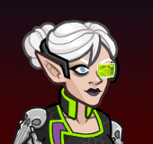
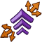
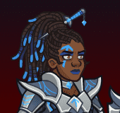
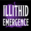
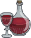
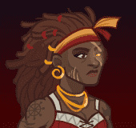
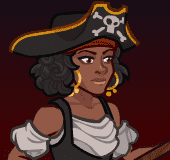
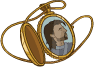
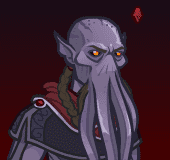
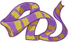

# Idle Champions Roster Tables

Some roster tables that detail various bits of information for champions and even a tab for when known exclusivity periods will end.

{::nomarkdown}

{:/nomarkdown}

{::nomarkdown}
<input onClick="setHash('patronsTab')" type="radio" class="tabsRadio" name="rosterTabs" id="patronsTab" checked><label for="patronsTab" class="tabsLabel">Patrons</label>

{:/nomarkdown}

# Patrons Roster

A list of all champions and the patrons they are available for.

<table><thead><tr><th style="text-align:right;width:25px;">ID</th><th style="width:80px;">Champion</th><th style="text-align:right;width:25px;">Seat</th><th style="width:90px;">Mirt</th><th style="width:90px;">Vajra</th><th style="width:90px;">Strahd</th><th style="width:90px;">Zariel</th><th style="width:142px;">Elminster</th></tr></thead>
<tbody><tr><td style="text-align:right">1</td><td>Bruenor</td><td style="text-align:right">1</td><td><label class="cblabel"><input type="checkbox" disabled checked></label></td><td><label class="cblabel"><input type="checkbox" disabled checked></label></td><td><label class="cblabel"><input type="checkbox" disabled></label></td><td><label class="cblabel"><input type="checkbox" disabled checked>w/ Feats</label></td><td><label class="cblabel"><input type="checkbox" disabled></label></td></tr>
<tr><td style="text-align:right">2</td><td>Celeste</td><td style="text-align:right">2</td><td><label class="cblabel"><input type="checkbox" disabled checked></label></td><td><label class="cblabel"><input type="checkbox" disabled checked>w/ Feats</label></td><td><label class="cblabel"><input type="checkbox" disabled checked>w/ Feats</label></td><td><label class="cblabel"><input type="checkbox" disabled></label></td><td><label class="cblabel"><input type="checkbox" disabled></label></td></tr>
<tr><td style="text-align:right">3</td><td>Nayeli</td><td style="text-align:right">3</td><td><label class="cblabel"><input type="checkbox" disabled checked></label></td><td><label class="cblabel"><input type="checkbox" disabled checked></label></td><td><label class="cblabel"><input type="checkbox" disabled></label></td><td><label class="cblabel"><input type="checkbox" disabled checked></label></td><td><label class="cblabel"><input type="checkbox" disabled></label></td></tr>
<tr><td style="text-align:right">4</td><td>Jarlaxle</td><td style="text-align:right">4</td><td><label class="cblabel"><input type="checkbox" disabled checked></label></td><td><label class="cblabel"><input type="checkbox" disabled></label></td><td><label class="cblabel"><input type="checkbox" disabled checked></label></td><td><label class="cblabel"><input type="checkbox" disabled checked></label></td><td><label class="cblabel"><input type="checkbox" disabled></label></td></tr>
<tr><td style="text-align:right">5</td><td>Calliope</td><td style="text-align:right">5</td><td><label class="cblabel"><input type="checkbox" disabled checked></label></td><td><label class="cblabel"><input type="checkbox" disabled checked></label></td><td><label class="cblabel"><input type="checkbox" disabled></label></td><td><label class="cblabel"><input type="checkbox" disabled checked></label></td><td><label class="cblabel"><input type="checkbox" disabled></label></td></tr>
<tr><td style="text-align:right">6</td><td>Asharra</td><td style="text-align:right">6</td><td><label class="cblabel"><input type="checkbox" disabled></label></td><td><label class="cblabel"><input type="checkbox" disabled></label></td><td><label class="cblabel"><input type="checkbox" disabled checked></label></td><td><label class="cblabel"><input type="checkbox" disabled checked></label></td><td><label class="cblabel"><input type="checkbox" disabled></label></td></tr>
<tr><td style="text-align:right">7</td><td>Minsc</td><td style="text-align:right">7</td><td><label class="cblabel"><input type="checkbox" disabled checked></label></td><td><label class="cblabel"><input type="checkbox" disabled checked></label></td><td><label class="cblabel"><input type="checkbox" disabled></label></td><td><label class="cblabel"><input type="checkbox" disabled></label></td><td><label class="cblabel"><input type="checkbox" disabled></label></td></tr>
<tr><td style="text-align:right">8</td><td>Delina</td><td style="text-align:right">8</td><td><label class="cblabel"><input type="checkbox" disabled checked></label></td><td><label class="cblabel"><input type="checkbox" disabled checked></label></td><td><label class="cblabel"><input type="checkbox" disabled checked></label></td><td><label class="cblabel"><input type="checkbox" disabled></label></td><td><label class="cblabel"><input type="checkbox" disabled></label></td></tr>
<tr><td style="text-align:right">9</td><td>Makos</td><td style="text-align:right">9</td><td><label class="cblabel"><input type="checkbox" disabled checked></label></td><td><label class="cblabel"><input type="checkbox" disabled checked></label></td><td><label class="cblabel"><input type="checkbox" disabled checked></label></td><td><label class="cblabel"><input type="checkbox" disabled checked></label></td><td><label class="cblabel"><input type="checkbox" disabled></label></td></tr>
<tr><td style="text-align:right">10</td><td>Tyril</td><td style="text-align:right">10</td><td><label class="cblabel"><input type="checkbox" disabled checked></label></td><td><label class="cblabel"><input type="checkbox" disabled checked></label></td><td><label class="cblabel"><input type="checkbox" disabled checked></label></td><td><label class="cblabel"><input type="checkbox" disabled checked></label></td><td><label class="cblabel"><input type="checkbox" disabled></label></td></tr>
<tr><td style="text-align:right">11</td><td>Jamilah</td><td style="text-align:right">11</td><td><label class="cblabel"><input type="checkbox" disabled></label></td><td><label class="cblabel"><input type="checkbox" disabled checked></label></td><td><label class="cblabel"><input type="checkbox" disabled></label></td><td><label class="cblabel"><input type="checkbox" disabled checked></label></td><td><label class="cblabel"><input type="checkbox" disabled></label></td></tr>
<tr><td style="text-align:right">12</td><td>Arkhan</td><td style="text-align:right">12</td><td><label class="cblabel"><input type="checkbox" disabled checked></label></td><td><label class="cblabel"><input type="checkbox" disabled checked></label></td><td><label class="cblabel"><input type="checkbox" disabled></label></td><td><label class="cblabel"><input type="checkbox" disabled checked></label></td><td><label class="cblabel"><input type="checkbox" disabled></label></td></tr>
<tr><td style="text-align:right">13</td><td>Hitch</td><td style="text-align:right">8</td><td><label class="cblabel"><input type="checkbox" disabled checked></label></td><td><label class="cblabel"><input type="checkbox" disabled></label></td><td><label class="cblabel"><input type="checkbox" disabled checked></label></td><td><label class="cblabel"><input type="checkbox" disabled checked></label></td><td><label class="cblabel"><input type="checkbox" disabled></label></td></tr>
<tr><td style="text-align:right">14</td><td>Stoki</td><td style="text-align:right">4</td><td><label class="cblabel"><input type="checkbox" disabled></label></td><td><label class="cblabel"><input type="checkbox" disabled checked></label></td><td><label class="cblabel"><input type="checkbox" disabled checked></label></td><td><label class="cblabel"><input type="checkbox" disabled></label></td><td><label class="cblabel"><input type="checkbox" disabled></label></td></tr>
<tr><td style="text-align:right">15</td><td>Krond</td><td style="text-align:right">6</td><td><label class="cblabel"><input type="checkbox" disabled checked></label></td><td><label class="cblabel"><input type="checkbox" disabled checked></label></td><td><label class="cblabel"><input type="checkbox" disabled checked></label></td><td><label class="cblabel"><input type="checkbox" disabled></label></td><td><label class="cblabel"><input type="checkbox" disabled></label></td></tr>
<tr><td style="text-align:right">16</td><td>Gromma</td><td style="text-align:right">3</td><td><label class="cblabel"><input type="checkbox" disabled></label></td><td><label class="cblabel"><input type="checkbox" disabled checked></label></td><td><label class="cblabel"><input type="checkbox" disabled checked>w/ Feats</label></td><td><label class="cblabel"><input type="checkbox" disabled checked></label></td><td><label class="cblabel"><input type="checkbox" disabled checked>Until 2027-05-01</label></td></tr>
<tr><td style="text-align:right">17</td><td>Dhadius</td><td style="text-align:right">5</td><td><label class="cblabel"><input type="checkbox" disabled></label></td><td><label class="cblabel"><input type="checkbox" disabled></label></td><td><label class="cblabel"><input type="checkbox" disabled checked></label></td><td><label class="cblabel"><input type="checkbox" disabled></label></td><td><label class="cblabel"><input type="checkbox" disabled checked>Until 2027-03-06</label></td></tr>
<tr><td style="text-align:right">18</td><td>Drizzt</td><td style="text-align:right">9</td><td><label class="cblabel"><input type="checkbox" disabled checked></label></td><td><label class="cblabel"><input type="checkbox" disabled checked></label></td><td><label class="cblabel"><input type="checkbox" disabled checked>w/ Feats</label></td><td><label class="cblabel"><input type="checkbox" disabled checked>w/ Feats</label></td><td><label class="cblabel"><input type="checkbox" disabled></label></td></tr>
<tr><td style="text-align:right">19</td><td>Barrowin</td><td style="text-align:right">10</td><td><label class="cblabel"><input type="checkbox" disabled checked></label></td><td><label class="cblabel"><input type="checkbox" disabled checked></label></td><td><label class="cblabel"><input type="checkbox" disabled checked>w/ Feats</label></td><td><label class="cblabel"><input type="checkbox" disabled></label></td><td><label class="cblabel"><input type="checkbox" disabled></label></td></tr>
<tr><td style="text-align:right">20</td><td>Regis</td><td style="text-align:right">2</td><td><label class="cblabel"><input type="checkbox" disabled></label></td><td><label class="cblabel"><input type="checkbox" disabled checked></label></td><td><label class="cblabel"><input type="checkbox" disabled checked></label></td><td><label class="cblabel"><input type="checkbox" disabled checked>w/ Feats</label></td><td><label class="cblabel"><input type="checkbox" disabled></label></td></tr>
<tr><td style="text-align:right">21</td><td>Birdsong</td><td style="text-align:right">9</td><td><label class="cblabel"><input type="checkbox" disabled></label></td><td><label class="cblabel"><input type="checkbox" disabled checked>w/ Feats</label></td><td><label class="cblabel"><input type="checkbox" disabled checked></label></td><td><label class="cblabel"><input type="checkbox" disabled checked>w/ Feats</label></td><td><label class="cblabel"><input type="checkbox" disabled></label></td></tr>
<tr><td style="text-align:right">22</td><td>Zorbu</td><td style="text-align:right">12</td><td><label class="cblabel"><input type="checkbox" disabled checked></label></td><td><label class="cblabel"><input type="checkbox" disabled checked></label></td><td><label class="cblabel"><input type="checkbox" disabled checked>w/ Feats</label></td><td><label class="cblabel"><input type="checkbox" disabled checked>w/ Feats</label></td><td><label class="cblabel"><input type="checkbox" disabled></label></td></tr>
<tr><td style="text-align:right">23</td><td>Strix</td><td style="text-align:right">11</td><td><label class="cblabel"><input type="checkbox" disabled checked></label></td><td><label class="cblabel"><input type="checkbox" disabled checked></label></td><td><label class="cblabel"><input type="checkbox" disabled checked></label></td><td><label class="cblabel"><input type="checkbox" disabled checked></label></td><td><label class="cblabel"><input type="checkbox" disabled></label></td></tr>
<tr><td style="text-align:right">24</td><td>Nrakk</td><td style="text-align:right">8</td><td><label class="cblabel"><input type="checkbox" disabled></label></td><td><label class="cblabel"><input type="checkbox" disabled checked></label></td><td><label class="cblabel"><input type="checkbox" disabled checked>w/ Feats</label></td><td><label class="cblabel"><input type="checkbox" disabled checked>w/ Feats</label></td><td><label class="cblabel"><input type="checkbox" disabled></label></td></tr>
<tr><td style="text-align:right">25</td><td>Catti-brie</td><td style="text-align:right">7</td><td><label class="cblabel"><input type="checkbox" disabled checked></label></td><td><label class="cblabel"><input type="checkbox" disabled checked></label></td><td><label class="cblabel"><input type="checkbox" disabled checked></label></td><td><label class="cblabel"><input type="checkbox" disabled checked></label></td><td><label class="cblabel"><input type="checkbox" disabled></label></td></tr>
<tr><td style="text-align:right">26</td><td>Evelyn</td><td style="text-align:right">6</td><td><label class="cblabel"><input type="checkbox" disabled checked></label></td><td><label class="cblabel"><input type="checkbox" disabled checked></label></td><td><label class="cblabel"><input type="checkbox" disabled checked>w/ Feats</label></td><td><label class="cblabel"><input type="checkbox" disabled checked></label></td><td><label class="cblabel"><input type="checkbox" disabled></label></td></tr>
<tr><td style="text-align:right">27</td><td>Binwin</td><td style="text-align:right">3</td><td><label class="cblabel"><input type="checkbox" disabled checked></label></td><td><label class="cblabel"><input type="checkbox" disabled checked></label></td><td><label class="cblabel"><input type="checkbox" disabled></label></td><td><label class="cblabel"><input type="checkbox" disabled checked></label></td><td><label class="cblabel"><input type="checkbox" disabled></label></td></tr>
<tr><td style="text-align:right">28</td><td>Deekin</td><td style="text-align:right">1</td><td><label class="cblabel"><input type="checkbox" disabled></label></td><td><label class="cblabel"><input type="checkbox" disabled checked></label></td><td><label class="cblabel"><input type="checkbox" disabled></label></td><td><label class="cblabel"><input type="checkbox" disabled checked>w/ Feats</label></td><td><label class="cblabel"><input type="checkbox" disabled></label></td></tr>
<tr><td style="text-align:right">29</td><td>Xander</td><td style="text-align:right">5</td><td><label class="cblabel"><input type="checkbox" disabled checked></label></td><td><label class="cblabel"><input type="checkbox" disabled></label></td><td><label class="cblabel"><input type="checkbox" disabled checked></label></td><td><label class="cblabel"><input type="checkbox" disabled></label></td><td><label class="cblabel"><input type="checkbox" disabled></label></td></tr>
<tr><td style="text-align:right">30</td><td>Azaka</td><td style="text-align:right">12</td><td><label class="cblabel"><input type="checkbox" disabled></label></td><td><label class="cblabel"><input type="checkbox" disabled checked></label></td><td><label class="cblabel"><input type="checkbox" disabled></label></td><td><label class="cblabel"><input type="checkbox" disabled checked></label></td><td><label class="cblabel"><input type="checkbox" disabled></label></td></tr>
<tr><td style="text-align:right">31</td><td>Ishi</td><td style="text-align:right">4</td><td><label class="cblabel"><input type="checkbox" disabled checked></label></td><td><label class="cblabel"><input type="checkbox" disabled checked></label></td><td><label class="cblabel"><input type="checkbox" disabled></label></td><td><label class="cblabel"><input type="checkbox" disabled checked></label></td><td><label class="cblabel"><input type="checkbox" disabled></label></td></tr>
<tr><td style="text-align:right">32</td><td>Wulfgar</td><td style="text-align:right">10</td><td><label class="cblabel"><input type="checkbox" disabled checked></label></td><td><label class="cblabel"><input type="checkbox" disabled checked></label></td><td><label class="cblabel"><input type="checkbox" disabled></label></td><td><label class="cblabel"><input type="checkbox" disabled checked></label></td><td><label class="cblabel"><input type="checkbox" disabled></label></td></tr>
<tr><td style="text-align:right">33</td><td>Farideh</td><td style="text-align:right">7</td><td><label class="cblabel"><input type="checkbox" disabled checked></label></td><td><label class="cblabel"><input type="checkbox" disabled checked></label></td><td><label class="cblabel"><input type="checkbox" disabled checked></label></td><td><label class="cblabel"><input type="checkbox" disabled checked></label></td><td><label class="cblabel"><input type="checkbox" disabled></label></td></tr>
<tr><td style="text-align:right">34</td><td>Donaar</td><td style="text-align:right">2</td><td><label class="cblabel"><input type="checkbox" disabled checked></label></td><td><label class="cblabel"><input type="checkbox" disabled checked></label></td><td><label class="cblabel"><input type="checkbox" disabled></label></td><td><label class="cblabel"><input type="checkbox" disabled checked></label></td><td><label class="cblabel"><input type="checkbox" disabled></label></td></tr>
<tr><td style="text-align:right">35</td><td>Vlahnya</td><td style="text-align:right">8</td><td><label class="cblabel"><input type="checkbox" disabled checked></label></td><td><label class="cblabel"><input type="checkbox" disabled></label></td><td><label class="cblabel"><input type="checkbox" disabled checked></label></td><td><label class="cblabel"><input type="checkbox" disabled></label></td><td><label class="cblabel"><input type="checkbox" disabled></label></td></tr>
<tr><td style="text-align:right">36</td><td>Warden</td><td style="text-align:right">11</td><td><label class="cblabel"><input type="checkbox" disabled checked></label></td><td><label class="cblabel"><input type="checkbox" disabled checked>w/ Feats</label></td><td><label class="cblabel"><input type="checkbox" disabled></label></td><td><label class="cblabel"><input type="checkbox" disabled checked></label></td><td><label class="cblabel"><input type="checkbox" disabled></label></td></tr>
<tr><td style="text-align:right">37</td><td>Nerys</td><td style="text-align:right">12</td><td><label class="cblabel"><input type="checkbox" disabled checked></label></td><td><label class="cblabel"><input type="checkbox" disabled checked></label></td><td><label class="cblabel"><input type="checkbox" disabled checked>w/ Feats</label></td><td><label class="cblabel"><input type="checkbox" disabled checked></label></td><td><label class="cblabel"><input type="checkbox" disabled></label></td></tr>
<tr><td style="text-align:right">38</td><td>K'thriss</td><td style="text-align:right">1</td><td><label class="cblabel"><input type="checkbox" disabled></label></td><td><label class="cblabel"><input type="checkbox" disabled></label></td><td><label class="cblabel"><input type="checkbox" disabled checked></label></td><td><label class="cblabel"><input type="checkbox" disabled checked>w/ Feats</label></td><td><label class="cblabel"><input type="checkbox" disabled></label></td></tr>
<tr><td style="text-align:right">39</td><td>Paultin</td><td style="text-align:right">4</td><td><label class="cblabel"><input type="checkbox" disabled></label></td><td><label class="cblabel"><input type="checkbox" disabled checked></label></td><td><label class="cblabel"><input type="checkbox" disabled checked></label></td><td><label class="cblabel"><input type="checkbox" disabled checked></label></td><td><label class="cblabel"><input type="checkbox" disabled></label></td></tr>
<tr><td style="text-align:right">40</td><td>Black Viper</td><td style="text-align:right">7</td><td><label class="cblabel"><input type="checkbox" disabled></label></td><td><label class="cblabel"><input type="checkbox" disabled checked></label></td><td><label class="cblabel"><input type="checkbox" disabled checked>w/ Feats</label></td><td><label class="cblabel"><input type="checkbox" disabled checked></label></td><td><label class="cblabel"><input type="checkbox" disabled></label></td></tr>
<tr><td style="text-align:right">41</td><td>Rosie</td><td style="text-align:right">10</td><td><label class="cblabel"><input type="checkbox" disabled checked></label></td><td><label class="cblabel"><input type="checkbox" disabled></label></td><td><label class="cblabel"><input type="checkbox" disabled checked>w/ Feats</label></td><td><label class="cblabel"><input type="checkbox" disabled></label></td><td><label class="cblabel"><input type="checkbox" disabled></label></td></tr>
<tr><td style="text-align:right">42</td><td>Aila</td><td style="text-align:right">9</td><td><label class="cblabel"><input type="checkbox" disabled></label></td><td><label class="cblabel"><input type="checkbox" disabled checked></label></td><td><label class="cblabel"><input type="checkbox" disabled></label></td><td><label class="cblabel"><input type="checkbox" disabled></label></td><td><label class="cblabel"><input type="checkbox" disabled></label></td></tr>
<tr><td style="text-align:right">43</td><td>Spurt</td><td style="text-align:right">3</td><td><label class="cblabel"><input type="checkbox" disabled checked></label></td><td><label class="cblabel"><input type="checkbox" disabled checked>w/ Feats</label></td><td><label class="cblabel"><input type="checkbox" disabled></label></td><td><label class="cblabel"><input type="checkbox" disabled></label></td><td><label class="cblabel"><input type="checkbox" disabled></label></td></tr>
<tr><td style="text-align:right">44</td><td>Qillek</td><td style="text-align:right">5</td><td><label class="cblabel"><input type="checkbox" disabled checked></label></td><td><label class="cblabel"><input type="checkbox" disabled></label></td><td><label class="cblabel"><input type="checkbox" disabled checked></label></td><td><label class="cblabel"><input type="checkbox" disabled checked></label></td><td><label class="cblabel"><input type="checkbox" disabled></label></td></tr>
<tr><td style="text-align:right">45</td><td>Korth</td><td style="text-align:right">2</td><td><label class="cblabel"><input type="checkbox" disabled checked></label></td><td><label class="cblabel"><input type="checkbox" disabled checked></label></td><td><label class="cblabel"><input type="checkbox" disabled></label></td><td><label class="cblabel"><input type="checkbox" disabled checked>w/ Feats</label></td><td><label class="cblabel"><input type="checkbox" disabled></label></td></tr>
<tr><td style="text-align:right">46</td><td>Walnut</td><td style="text-align:right">8</td><td><label class="cblabel"><input type="checkbox" disabled></label></td><td><label class="cblabel"><input type="checkbox" disabled checked></label></td><td><label class="cblabel"><input type="checkbox" disabled></label></td><td><label class="cblabel"><input type="checkbox" disabled></label></td><td><label class="cblabel"><input type="checkbox" disabled></label></td></tr>
<tr><td style="text-align:right">47</td><td>Shandie</td><td style="text-align:right">6</td><td><label class="cblabel"><input type="checkbox" disabled checked></label></td><td><label class="cblabel"><input type="checkbox" disabled checked></label></td><td><label class="cblabel"><input type="checkbox" disabled checked></label></td><td><label class="cblabel"><input type="checkbox" disabled checked></label></td><td><label class="cblabel"><input type="checkbox" disabled></label></td></tr>
<tr><td style="text-align:right">48</td><td>Jim</td><td style="text-align:right">7</td><td><label class="cblabel"><input type="checkbox" disabled></label></td><td><label class="cblabel"><input type="checkbox" disabled></label></td><td><label class="cblabel"><input type="checkbox" disabled checked></label></td><td><label class="cblabel"><input type="checkbox" disabled checked>w/ Feats</label></td><td><label class="cblabel"><input type="checkbox" disabled></label></td></tr>
<tr><td style="text-align:right">49</td><td>Turiel</td><td style="text-align:right">1</td><td><label class="cblabel"><input type="checkbox" disabled checked></label></td><td><label class="cblabel"><input type="checkbox" disabled checked></label></td><td><label class="cblabel"><input type="checkbox" disabled checked></label></td><td><label class="cblabel"><input type="checkbox" disabled checked>w/ Feats</label></td><td><label class="cblabel"><input type="checkbox" disabled></label></td></tr>
<tr><td style="text-align:right">50</td><td>Pwent</td><td style="text-align:right">5</td><td><label class="cblabel"><input type="checkbox" disabled checked></label></td><td><label class="cblabel"><input type="checkbox" disabled checked></label></td><td><label class="cblabel"><input type="checkbox" disabled></label></td><td><label class="cblabel"><input type="checkbox" disabled></label></td><td><label class="cblabel"><input type="checkbox" disabled></label></td></tr>
<tr><td style="text-align:right">51</td><td>Avren</td><td style="text-align:right">11</td><td><label class="cblabel"><input type="checkbox" disabled></label></td><td><label class="cblabel"><input type="checkbox" disabled checked></label></td><td><label class="cblabel"><input type="checkbox" disabled checked></label></td><td><label class="cblabel"><input type="checkbox" disabled checked>w/ Feats</label></td><td><label class="cblabel"><input type="checkbox" disabled></label></td></tr>
<tr><td style="text-align:right">52</td><td>Sentry</td><td style="text-align:right">4</td><td><label class="cblabel"><input type="checkbox" disabled checked></label></td><td><label class="cblabel"><input type="checkbox" disabled checked></label></td><td><label class="cblabel"><input type="checkbox" disabled></label></td><td><label class="cblabel"><input type="checkbox" disabled checked></label></td><td><label class="cblabel"><input type="checkbox" disabled></label></td></tr>
<tr><td style="text-align:right">53</td><td>Krull</td><td style="text-align:right">6</td><td><label class="cblabel"><input type="checkbox" disabled checked></label></td><td><label class="cblabel"><input type="checkbox" disabled checked></label></td><td><label class="cblabel"><input type="checkbox" disabled></label></td><td><label class="cblabel"><input type="checkbox" disabled></label></td><td><label class="cblabel"><input type="checkbox" disabled></label></td></tr>
<tr><td style="text-align:right">54</td><td>Artemis</td><td style="text-align:right">3</td><td><label class="cblabel"><input type="checkbox" disabled checked></label></td><td><label class="cblabel"><input type="checkbox" disabled checked></label></td><td><label class="cblabel"><input type="checkbox" disabled checked></label></td><td><label class="cblabel"><input type="checkbox" disabled checked></label></td><td><label class="cblabel"><input type="checkbox" disabled></label></td></tr>
<tr><td style="text-align:right">55</td><td>Môrgæn</td><td style="text-align:right">9</td><td><label class="cblabel"><input type="checkbox" disabled></label></td><td><label class="cblabel"><input type="checkbox" disabled></label></td><td><label class="cblabel"><input type="checkbox" disabled checked></label></td><td><label class="cblabel"><input type="checkbox" disabled></label></td><td><label class="cblabel"><input type="checkbox" disabled></label></td></tr>
<tr><td style="text-align:right">56</td><td>Havilar</td><td style="text-align:right">10</td><td><label class="cblabel"><input type="checkbox" disabled checked></label></td><td><label class="cblabel"><input type="checkbox" disabled checked>w/ Feats</label></td><td><label class="cblabel"><input type="checkbox" disabled></label></td><td><label class="cblabel"><input type="checkbox" disabled checked>w/ Feats</label></td><td><label class="cblabel"><input type="checkbox" disabled></label></td></tr>
<tr><td style="text-align:right">57</td><td>Sisaspia</td><td style="text-align:right">1</td><td><label class="cblabel"><input type="checkbox" disabled checked></label></td><td><label class="cblabel"><input type="checkbox" disabled checked></label></td><td><label class="cblabel"><input type="checkbox" disabled checked></label></td><td><label class="cblabel"><input type="checkbox" disabled checked></label></td><td><label class="cblabel"><input type="checkbox" disabled></label></td></tr>
<tr><td style="text-align:right">58</td><td>Briv</td><td style="text-align:right">5</td><td><label class="cblabel"><input type="checkbox" disabled checked></label></td><td><label class="cblabel"><input type="checkbox" disabled checked></label></td><td><label class="cblabel"><input type="checkbox" disabled></label></td><td><label class="cblabel"><input type="checkbox" disabled checked></label></td><td><label class="cblabel"><input type="checkbox" disabled></label></td></tr>
<tr><td style="text-align:right">59</td><td>Melf</td><td style="text-align:right">12</td><td><label class="cblabel"><input type="checkbox" disabled checked></label></td><td><label class="cblabel"><input type="checkbox" disabled checked></label></td><td><label class="cblabel"><input type="checkbox" disabled checked></label></td><td><label class="cblabel"><input type="checkbox" disabled></label></td><td><label class="cblabel"><input type="checkbox" disabled></label></td></tr>
<tr><td style="text-align:right">60</td><td>Krydle</td><td style="text-align:right">2</td><td><label class="cblabel"><input type="checkbox" disabled checked></label></td><td><label class="cblabel"><input type="checkbox" disabled checked></label></td><td><label class="cblabel"><input type="checkbox" disabled checked></label></td><td><label class="cblabel"><input type="checkbox" disabled checked></label></td><td><label class="cblabel"><input type="checkbox" disabled></label></td></tr>
<tr><td style="text-align:right">61</td><td>Jaheira</td><td style="text-align:right">9</td><td><label class="cblabel"><input type="checkbox" disabled></label></td><td><label class="cblabel"><input type="checkbox" disabled checked></label></td><td><label class="cblabel"><input type="checkbox" disabled></label></td><td><label class="cblabel"><input type="checkbox" disabled checked></label></td><td><label class="cblabel"><input type="checkbox" disabled></label></td></tr>
<tr><td style="text-align:right">62</td><td>Nova</td><td style="text-align:right">11</td><td><label class="cblabel"><input type="checkbox" disabled checked></label></td><td><label class="cblabel"><input type="checkbox" disabled checked></label></td><td><label class="cblabel"><input type="checkbox" disabled checked></label></td><td><label class="cblabel"><input type="checkbox" disabled></label></td><td><label class="cblabel"><input type="checkbox" disabled></label></td></tr>
<tr><td style="text-align:right">63</td><td>Freely</td><td style="text-align:right">7</td><td><label class="cblabel"><input type="checkbox" disabled checked></label></td><td><label class="cblabel"><input type="checkbox" disabled></label></td><td><label class="cblabel"><input type="checkbox" disabled></label></td><td><label class="cblabel"><input type="checkbox" disabled checked></label></td><td><label class="cblabel"><input type="checkbox" disabled></label></td></tr>
<tr><td style="text-align:right">64</td><td>B&G</td><td style="text-align:right">8</td><td><label class="cblabel"><input type="checkbox" disabled checked></label></td><td><label class="cblabel"><input type="checkbox" disabled checked></label></td><td><label class="cblabel"><input type="checkbox" disabled></label></td><td><label class="cblabel"><input type="checkbox" disabled checked></label></td><td><label class="cblabel"><input type="checkbox" disabled></label></td></tr>
<tr><td style="text-align:right">65</td><td>Omin</td><td style="text-align:right">3</td><td><label class="cblabel"><input type="checkbox" disabled></label></td><td><label class="cblabel"><input type="checkbox" disabled checked></label></td><td><label class="cblabel"><input type="checkbox" disabled></label></td><td><label class="cblabel"><input type="checkbox" disabled></label></td><td><label class="cblabel"><input type="checkbox" disabled></label></td></tr>
<tr><td style="text-align:right">66</td><td>Lazaapz</td><td style="text-align:right">9</td><td><label class="cblabel"><input type="checkbox" disabled checked></label></td><td><label class="cblabel"><input type="checkbox" disabled checked></label></td><td><label class="cblabel"><input type="checkbox" disabled checked></label></td><td><label class="cblabel"><input type="checkbox" disabled></label></td><td><label class="cblabel"><input type="checkbox" disabled></label></td></tr>
<tr><td style="text-align:right">67</td><td>Dragonbait</td><td style="text-align:right">11</td><td><label class="cblabel"><input type="checkbox" disabled checked></label></td><td><label class="cblabel"><input type="checkbox" disabled checked></label></td><td><label class="cblabel"><input type="checkbox" disabled checked></label></td><td><label class="cblabel"><input type="checkbox" disabled checked></label></td><td><label class="cblabel"><input type="checkbox" disabled></label></td></tr>
<tr><td style="text-align:right">68</td><td>Ulkoria</td><td style="text-align:right">10</td><td><label class="cblabel"><input type="checkbox" disabled checked></label></td><td><label class="cblabel"><input type="checkbox" disabled></label></td><td><label class="cblabel"><input type="checkbox" disabled checked></label></td><td><label class="cblabel"><input type="checkbox" disabled checked></label></td><td><label class="cblabel"><input type="checkbox" disabled></label></td></tr>
<tr><td style="text-align:right">69</td><td>Torogar</td><td style="text-align:right">10</td><td><label class="cblabel"><input type="checkbox" disabled checked></label></td><td><label class="cblabel"><input type="checkbox" disabled checked></label></td><td><label class="cblabel"><input type="checkbox" disabled></label></td><td><label class="cblabel"><input type="checkbox" disabled checked></label></td><td><label class="cblabel"><input type="checkbox" disabled></label></td></tr>
<tr><td style="text-align:right">70</td><td>Ezmerelda</td><td style="text-align:right">1</td><td><label class="cblabel"><input type="checkbox" disabled checked></label></td><td><label class="cblabel"><input type="checkbox" disabled checked></label></td><td><label class="cblabel"><input type="checkbox" disabled checked></label></td><td><label class="cblabel"><input type="checkbox" disabled checked></label></td><td><label class="cblabel"><input type="checkbox" disabled></label></td></tr>
<tr><td style="text-align:right">71</td><td>Penelope</td><td style="text-align:right">12</td><td><label class="cblabel"><input type="checkbox" disabled checked></label></td><td><label class="cblabel"><input type="checkbox" disabled checked></label></td><td><label class="cblabel"><input type="checkbox" disabled></label></td><td><label class="cblabel"><input type="checkbox" disabled checked></label></td><td><label class="cblabel"><input type="checkbox" disabled checked>Until 2027-04-03</label></td></tr>
<tr><td style="text-align:right">72</td><td>Lucius</td><td style="text-align:right">7</td><td><label class="cblabel"><input type="checkbox" disabled></label></td><td><label class="cblabel"><input type="checkbox" disabled checked>w/ Feats</label></td><td><label class="cblabel"><input type="checkbox" disabled checked>w/ Feats</label></td><td><label class="cblabel"><input type="checkbox" disabled checked></label></td><td><label class="cblabel"><input type="checkbox" disabled></label></td></tr>
<tr><td style="text-align:right">73</td><td>Baeloth</td><td style="text-align:right">4</td><td><label class="cblabel"><input type="checkbox" disabled checked></label></td><td><label class="cblabel"><input type="checkbox" disabled checked></label></td><td><label class="cblabel"><input type="checkbox" disabled checked></label></td><td><label class="cblabel"><input type="checkbox" disabled checked></label></td><td><label class="cblabel"><input type="checkbox" disabled></label></td></tr>
<tr><td style="text-align:right">74</td><td>Talin</td><td style="text-align:right">2</td><td><label class="cblabel"><input type="checkbox" disabled checked></label></td><td><label class="cblabel"><input type="checkbox" disabled></label></td><td><label class="cblabel"><input type="checkbox" disabled checked></label></td><td><label class="cblabel"><input type="checkbox" disabled checked></label></td><td><label class="cblabel"><input type="checkbox" disabled></label></td></tr>
<tr><td style="text-align:right">75</td><td>Hew Maan</td><td style="text-align:right">8</td><td><label class="cblabel"><input type="checkbox" disabled checked></label></td><td><label class="cblabel"><input type="checkbox" disabled checked></label></td><td><label class="cblabel"><input type="checkbox" disabled checked>w/ Feats</label></td><td><label class="cblabel"><input type="checkbox" disabled checked></label></td><td><label class="cblabel"><input type="checkbox" disabled></label></td></tr>
<tr><td style="text-align:right">76</td><td>Orisha</td><td style="text-align:right">11</td><td><label class="cblabel"><input type="checkbox" disabled checked></label></td><td><label class="cblabel"><input type="checkbox" disabled></label></td><td><label class="cblabel"><input type="checkbox" disabled checked></label></td><td><label class="cblabel"><input type="checkbox" disabled checked></label></td><td><label class="cblabel"><input type="checkbox" disabled></label></td></tr>
<tr><td style="text-align:right">77</td><td>Alyndra</td><td style="text-align:right">6</td><td><label class="cblabel"><input type="checkbox" disabled></label></td><td><label class="cblabel"><input type="checkbox" disabled checked></label></td><td><label class="cblabel"><input type="checkbox" disabled checked></label></td><td><label class="cblabel"><input type="checkbox" disabled></label></td><td><label class="cblabel"><input type="checkbox" disabled></label></td></tr>
<tr><td style="text-align:right">78</td><td>Orkira</td><td style="text-align:right">1</td><td><label class="cblabel"><input type="checkbox" disabled checked></label></td><td><label class="cblabel"><input type="checkbox" disabled checked></label></td><td><label class="cblabel"><input type="checkbox" disabled></label></td><td><label class="cblabel"><input type="checkbox" disabled checked></label></td><td><label class="cblabel"><input type="checkbox" disabled></label></td></tr>
<tr><td style="text-align:right">79</td><td>Shaka</td><td style="text-align:right">9</td><td><label class="cblabel"><input type="checkbox" disabled checked></label></td><td><label class="cblabel"><input type="checkbox" disabled checked></label></td><td><label class="cblabel"><input type="checkbox" disabled checked></label></td><td><label class="cblabel"><input type="checkbox" disabled checked></label></td><td><label class="cblabel"><input type="checkbox" disabled></label></td></tr>
<tr><td style="text-align:right">80</td><td>Mehen</td><td style="text-align:right">3</td><td><label class="cblabel"><input type="checkbox" disabled checked></label></td><td><label class="cblabel"><input type="checkbox" disabled checked></label></td><td><label class="cblabel"><input type="checkbox" disabled checked></label></td><td><label class="cblabel"><input type="checkbox" disabled checked></label></td><td><label class="cblabel"><input type="checkbox" disabled></label></td></tr>
<tr><td style="text-align:right">81</td><td>Selise</td><td style="text-align:right">12</td><td><label class="cblabel"><input type="checkbox" disabled></label></td><td><label class="cblabel"><input type="checkbox" disabled></label></td><td><label class="cblabel"><input type="checkbox" disabled checked></label></td><td><label class="cblabel"><input type="checkbox" disabled checked></label></td><td><label class="cblabel"><input type="checkbox" disabled checked>Until 2024-06-08</label></td></tr>
<tr><td style="text-align:right">82</td><td>Sgt. Knox</td><td style="text-align:right">6</td><td><label class="cblabel"><input type="checkbox" disabled checked></label></td><td><label class="cblabel"><input type="checkbox" disabled checked></label></td><td><label class="cblabel"><input type="checkbox" disabled checked>w/ Feats</label></td><td><label class="cblabel"><input type="checkbox" disabled checked></label></td><td><label class="cblabel"><input type="checkbox" disabled checked>Until 2024-06-29</label></td></tr>
<tr><td style="text-align:right">83</td><td>Ellywick</td><td style="text-align:right">10</td><td><label class="cblabel"><input type="checkbox" disabled></label></td><td><label class="cblabel"><input type="checkbox" disabled checked></label></td><td><label class="cblabel"><input type="checkbox" disabled checked></label></td><td><label class="cblabel"><input type="checkbox" disabled checked></label></td><td><label class="cblabel"><input type="checkbox" disabled checked>Until 2024-07-20</label></td></tr>
<tr><td style="text-align:right">84</td><td>Prudence</td><td style="text-align:right">5</td><td><label class="cblabel"><input type="checkbox" disabled checked></label></td><td><label class="cblabel"><input type="checkbox" disabled checked></label></td><td><label class="cblabel"><input type="checkbox" disabled checked></label></td><td><label class="cblabel"><input type="checkbox" disabled checked></label></td><td><label class="cblabel"><input type="checkbox" disabled checked>Until 2024-08-10</label></td></tr>
<tr><td style="text-align:right">85</td><td>Corazón</td><td style="text-align:right">8</td><td><label class="cblabel"><input type="checkbox" disabled></label></td><td><label class="cblabel"><input type="checkbox" disabled checked>w/ Feats</label></td><td><label class="cblabel"><input type="checkbox" disabled checked></label></td><td><label class="cblabel"><input type="checkbox" disabled checked></label></td><td><label class="cblabel"><input type="checkbox" disabled checked>Until 2024-08-31</label></td></tr>
<tr><td style="text-align:right">86</td><td>Reya</td><td style="text-align:right">6</td><td><label class="cblabel"><input type="checkbox" disabled checked></label></td><td><label class="cblabel"><input type="checkbox" disabled checked></label></td><td><label class="cblabel"><input type="checkbox" disabled checked></label></td><td><label class="cblabel"><input type="checkbox" disabled checked></label></td><td><label class="cblabel"><input type="checkbox" disabled></label></td></tr>
<tr><td style="text-align:right">87</td><td>NERDS</td><td style="text-align:right">1</td><td><label class="cblabel"><input type="checkbox" disabled></label></td><td><label class="cblabel"><input type="checkbox" disabled></label></td><td><label class="cblabel"><input type="checkbox" disabled></label></td><td><label class="cblabel"><input type="checkbox" disabled></label></td><td><label class="cblabel"><input type="checkbox" disabled checked>Until 2024-08-31</label></td></tr>
<tr><td style="text-align:right">88</td><td>Xerophon</td><td style="text-align:right">7</td><td><label class="cblabel"><input type="checkbox" disabled></label></td><td><label class="cblabel"><input type="checkbox" disabled checked>w/ Feats</label></td><td><label class="cblabel"><input type="checkbox" disabled checked>w/ Feats</label></td><td><label class="cblabel"><input type="checkbox" disabled checked>w/ Feats</label></td><td><label class="cblabel"><input type="checkbox" disabled checked>Until 2024-11-30</label></td></tr>
<tr><td style="text-align:right">89</td><td>D'hani</td><td style="text-align:right">1</td><td><label class="cblabel"><input type="checkbox" disabled checked></label></td><td><label class="cblabel"><input type="checkbox" disabled checked></label></td><td><label class="cblabel"><input type="checkbox" disabled checked>w/ Feats</label></td><td><label class="cblabel"><input type="checkbox" disabled></label></td><td><label class="cblabel"><input type="checkbox" disabled checked>Until 2024-09-28</label></td></tr>
<tr><td style="text-align:right">90</td><td>Brig</td><td style="text-align:right">3</td><td><label class="cblabel"><input type="checkbox" disabled checked></label></td><td><label class="cblabel"><input type="checkbox" disabled></label></td><td><label class="cblabel"><input type="checkbox" disabled checked>w/ Feats</label></td><td><label class="cblabel"><input type="checkbox" disabled checked></label></td><td><label class="cblabel"><input type="checkbox" disabled checked>Until 2024-10-19</label></td></tr>
<tr><td style="text-align:right">91</td><td>Widdle</td><td style="text-align:right">2</td><td><label class="cblabel"><input type="checkbox" disabled></label></td><td><label class="cblabel"><input type="checkbox" disabled checked>w/ Feats</label></td><td><label class="cblabel"><input type="checkbox" disabled checked></label></td><td><label class="cblabel"><input type="checkbox" disabled></label></td><td><label class="cblabel"><input type="checkbox" disabled checked>Until 2024-11-09</label></td></tr>
<tr><td style="text-align:right">92</td><td>Yorven</td><td style="text-align:right">10</td><td><label class="cblabel"><input type="checkbox" disabled></label></td><td><label class="cblabel"><input type="checkbox" disabled checked></label></td><td><label class="cblabel"><input type="checkbox" disabled></label></td><td><label class="cblabel"><input type="checkbox" disabled checked>w/ Feats</label></td><td><label class="cblabel"><input type="checkbox" disabled checked>Until 2024-12-07</label></td></tr>
<tr><td style="text-align:right">93</td><td>Viconia</td><td style="text-align:right">5</td><td><label class="cblabel"><input type="checkbox" disabled checked></label></td><td><label class="cblabel"><input type="checkbox" disabled></label></td><td><label class="cblabel"><input type="checkbox" disabled checked></label></td><td><label class="cblabel"><input type="checkbox" disabled checked></label></td><td><label class="cblabel"><input type="checkbox" disabled checked>Until 2024-12-21</label></td></tr>
<tr><td style="text-align:right">94</td><td>Rust</td><td style="text-align:right">11</td><td><label class="cblabel"><input type="checkbox" disabled></label></td><td><label class="cblabel"><input type="checkbox" disabled checked></label></td><td><label class="cblabel"><input type="checkbox" disabled></label></td><td><label class="cblabel"><input type="checkbox" disabled checked></label></td><td><label class="cblabel"><input type="checkbox" disabled checked>Until 2025-01-11</label></td></tr>
<tr><td style="text-align:right">95</td><td>Vi</td><td style="text-align:right">12</td><td><label class="cblabel"><input type="checkbox" disabled checked></label></td><td><label class="cblabel"><input type="checkbox" disabled checked></label></td><td><label class="cblabel"><input type="checkbox" disabled checked></label></td><td><label class="cblabel"><input type="checkbox" disabled></label></td><td><label class="cblabel"><input type="checkbox" disabled checked>Until 2025-02-01</label></td></tr>
<tr><td style="text-align:right">96</td><td>Desmond</td><td style="text-align:right">4</td><td><label class="cblabel"><input type="checkbox" disabled checked></label></td><td><label class="cblabel"><input type="checkbox" disabled></label></td><td><label class="cblabel"><input type="checkbox" disabled></label></td><td><label class="cblabel"><input type="checkbox" disabled checked></label></td><td><label class="cblabel"><input type="checkbox" disabled checked>Until 2025-02-22</label></td></tr>
<tr><td style="text-align:right">97</td><td>Tatyana</td><td style="text-align:right">8</td><td><label class="cblabel"><input type="checkbox" disabled></label></td><td><label class="cblabel"><input type="checkbox" disabled checked></label></td><td><label class="cblabel"><input type="checkbox" disabled></label></td><td><label class="cblabel"><input type="checkbox" disabled checked>w/ Feats</label></td><td><label class="cblabel"><input type="checkbox" disabled checked>Until 2025-03-08</label></td></tr>
<tr><td style="text-align:right">98</td><td>Gazrick</td><td style="text-align:right">7</td><td><label class="cblabel"><input type="checkbox" disabled checked></label></td><td><label class="cblabel"><input type="checkbox" disabled checked>w/ Feats</label></td><td><label class="cblabel"><input type="checkbox" disabled checked></label></td><td><label class="cblabel"><input type="checkbox" disabled checked>w/ Feats</label></td><td><label class="cblabel"><input type="checkbox" disabled checked>Until 2025-04-05</label></td></tr>
<tr><td style="text-align:right">99</td><td>DM</td><td style="text-align:right">6</td><td><label class="cblabel"><input type="checkbox" disabled checked>Always</label></td><td><label class="cblabel"><input type="checkbox" disabled checked>Always</label></td><td><label class="cblabel"><input type="checkbox" disabled checked>Always</label></td><td><label class="cblabel"><input type="checkbox" disabled checked>Always</label></td><td><label class="cblabel"><input type="checkbox" disabled checked>Always</label></td></tr>
<tr><td style="text-align:right">100</td><td>Nordom</td><td style="text-align:right">9</td><td><label class="cblabel"><input type="checkbox" disabled></label></td><td><label class="cblabel"><input type="checkbox" disabled checked></label></td><td><label class="cblabel"><input type="checkbox" disabled checked></label></td><td><label class="cblabel"><input type="checkbox" disabled></label></td><td><label class="cblabel"><input type="checkbox" disabled checked>Until 2025-05-17</label></td></tr>
<tr><td style="text-align:right">101</td><td>Merilwen</td><td style="text-align:right">2</td><td><label class="cblabel"><input type="checkbox" disabled></label></td><td><label class="cblabel"><input type="checkbox" disabled checked></label></td><td><label class="cblabel"><input type="checkbox" disabled checked></label></td><td><label class="cblabel"><input type="checkbox" disabled checked>w/ Feats</label></td><td><label class="cblabel"><input type="checkbox" disabled checked>Until 2025-06-07</label></td></tr>
<tr><td style="text-align:right">102</td><td>Nahara</td><td style="text-align:right">3</td><td><label class="cblabel"><input type="checkbox" disabled></label></td><td><label class="cblabel"><input type="checkbox" disabled checked>w/ Feats</label></td><td><label class="cblabel"><input type="checkbox" disabled checked>Always</label></td><td><label class="cblabel"><input type="checkbox" disabled checked>w/ Feats</label></td><td><label class="cblabel"><input type="checkbox" disabled checked>Until 2025-06-28</label></td></tr>
<tr><td style="text-align:right">103</td><td>Valentine</td><td style="text-align:right">5</td><td><label class="cblabel"><input type="checkbox" disabled></label></td><td><label class="cblabel"><input type="checkbox" disabled checked></label></td><td><label class="cblabel"><input type="checkbox" disabled checked>w/ Feats</label></td><td><label class="cblabel"><input type="checkbox" disabled checked>w/ Feats</label></td><td><label class="cblabel"><input type="checkbox" disabled checked>Until 2025-07-19</label></td></tr>
<tr><td style="text-align:right">104</td><td>Voronika</td><td style="text-align:right">1</td><td><label class="cblabel"><input type="checkbox" disabled checked></label></td><td><label class="cblabel"><input type="checkbox" disabled checked></label></td><td><label class="cblabel"><input type="checkbox" disabled checked>w/ Feats</label></td><td><label class="cblabel"><input type="checkbox" disabled checked></label></td><td><label class="cblabel"><input type="checkbox" disabled checked>Until 2025-08-09</label></td></tr>
<tr><td style="text-align:right">105</td><td>Dob</td><td style="text-align:right">12</td><td><label class="cblabel"><input type="checkbox" disabled checked></label></td><td><label class="cblabel"><input type="checkbox" disabled checked></label></td><td><label class="cblabel"><input type="checkbox" disabled checked></label></td><td><label class="cblabel"><input type="checkbox" disabled checked></label></td><td><label class="cblabel"><input type="checkbox" disabled checked>Until 2025-08-30</label></td></tr>
<tr><td style="text-align:right">106</td><td>Blooshi</td><td style="text-align:right">2</td><td><label class="cblabel"><input type="checkbox" disabled checked></label></td><td><label class="cblabel"><input type="checkbox" disabled checked></label></td><td><label class="cblabel"><input type="checkbox" disabled checked></label></td><td><label class="cblabel"><input type="checkbox" disabled checked></label></td><td><label class="cblabel"><input type="checkbox" disabled checked>Until 2025-03-22</label></td></tr>
<tr><td style="text-align:right">113</td><td>Egbert</td><td style="text-align:right">7</td><td><label class="cblabel"><input type="checkbox" disabled checked></label></td><td><label class="cblabel"><input type="checkbox" disabled checked></label></td><td><label class="cblabel"><input type="checkbox" disabled></label></td><td><label class="cblabel"><input type="checkbox" disabled checked></label></td><td><label class="cblabel"><input type="checkbox" disabled checked>Until 2025-09-27</label></td></tr>
<tr><td style="text-align:right">114</td><td>Kent</td><td style="text-align:right">4</td><td><label class="cblabel"><input type="checkbox" disabled checked></label></td><td><label class="cblabel"><input type="checkbox" disabled checked></label></td><td><label class="cblabel"><input type="checkbox" disabled checked></label></td><td><label class="cblabel"><input type="checkbox" disabled></label></td><td><label class="cblabel"><input type="checkbox" disabled checked>Until 2025-10-18</label></td></tr>
<tr><td style="text-align:right">115</td><td>Virgil</td><td style="text-align:right">10</td><td><label class="cblabel"><input type="checkbox" disabled checked></label></td><td><label class="cblabel"><input type="checkbox" disabled checked></label></td><td><label class="cblabel"><input type="checkbox" disabled checked></label></td><td><label class="cblabel"><input type="checkbox" disabled checked>w/ Feats</label></td><td><label class="cblabel"><input type="checkbox" disabled checked>Until 2025-11-08</label></td></tr>
<tr><td style="text-align:right">116</td><td>Warduke</td><td style="text-align:right">8</td><td><label class="cblabel"><input type="checkbox" disabled checked></label></td><td><label class="cblabel"><input type="checkbox" disabled checked></label></td><td><label class="cblabel"><input type="checkbox" disabled></label></td><td><label class="cblabel"><input type="checkbox" disabled checked>w/ Feats</label></td><td><label class="cblabel"><input type="checkbox" disabled checked>Until 2025-11-29</label></td></tr>
<tr><td style="text-align:right">117</td><td>Imoen</td><td style="text-align:right">11</td><td><label class="cblabel"><input type="checkbox" disabled checked></label></td><td><label class="cblabel"><input type="checkbox" disabled checked></label></td><td><label class="cblabel"><input type="checkbox" disabled checked></label></td><td><label class="cblabel"><input type="checkbox" disabled checked>w/ Feats</label></td><td><label class="cblabel"><input type="checkbox" disabled checked>Until 2025-12-20</label></td></tr>
<tr><td style="text-align:right">118</td><td>Fen</td><td style="text-align:right">6</td><td><label class="cblabel"><input type="checkbox" disabled checked></label></td><td><label class="cblabel"><input type="checkbox" disabled checked></label></td><td><label class="cblabel"><input type="checkbox" disabled checked></label></td><td><label class="cblabel"><input type="checkbox" disabled checked></label></td><td><label class="cblabel"><input type="checkbox" disabled checked>Until 2026-01-10</label></td></tr>
<tr><td style="text-align:right">119</td><td>Uriah</td><td style="text-align:right">9</td><td><label class="cblabel"><input type="checkbox" disabled checked></label></td><td><label class="cblabel"><input type="checkbox" disabled></label></td><td><label class="cblabel"><input type="checkbox" disabled></label></td><td><label class="cblabel"><input type="checkbox" disabled checked></label></td><td><label class="cblabel"><input type="checkbox" disabled checked>Until 2026-02-07</label></td></tr>
<tr><td style="text-align:right">120</td><td>Solaak</td><td style="text-align:right">2</td><td><label class="cblabel"><input type="checkbox" disabled checked></label></td><td><label class="cblabel"><input type="checkbox" disabled checked></label></td><td><label class="cblabel"><input type="checkbox" disabled checked></label></td><td><label class="cblabel"><input type="checkbox" disabled checked></label></td><td><label class="cblabel"><input type="checkbox" disabled checked>Until 2026-02-21</label></td></tr>
<tr><td style="text-align:right">121</td><td>Miria</td><td style="text-align:right">12</td><td><label class="cblabel"><input type="checkbox" disabled checked></label></td><td><label class="cblabel"><input type="checkbox" disabled checked></label></td><td><label class="cblabel"><input type="checkbox" disabled checked></label></td><td><label class="cblabel"><input type="checkbox" disabled checked>w/ Feats</label></td><td><label class="cblabel"><input type="checkbox" disabled checked>Until 2026-03-14</label></td></tr>
<tr><td style="text-align:right">122</td><td>Antrius</td><td style="text-align:right">4</td><td><label class="cblabel"><input type="checkbox" disabled checked></label></td><td><label class="cblabel"><input type="checkbox" disabled checked>w/ Feats</label></td><td><label class="cblabel"><input type="checkbox" disabled></label></td><td><label class="cblabel"><input type="checkbox" disabled checked></label></td><td><label class="cblabel"><input type="checkbox" disabled checked>Until 2026-04-11</label></td></tr>
<tr><td style="text-align:right">123</td><td>Nixie</td><td style="text-align:right">1</td><td><label class="cblabel"><input type="checkbox" disabled></label></td><td><label class="cblabel"><input type="checkbox" disabled checked></label></td><td><label class="cblabel"><input type="checkbox" disabled></label></td><td><label class="cblabel"><input type="checkbox" disabled checked>w/ Feats</label></td><td><label class="cblabel"><input type="checkbox" disabled checked>Until 2026-05-02</label></td></tr>
<tr><td style="text-align:right">124</td><td>Evandra</td><td style="text-align:right">5</td><td><label class="cblabel"><input type="checkbox" disabled></label></td><td><label class="cblabel"><input type="checkbox" disabled checked></label></td><td><label class="cblabel"><input type="checkbox" disabled checked>w/ Feats</label></td><td><label class="cblabel"><input type="checkbox" disabled checked>w/ Feats</label></td><td><label class="cblabel"><input type="checkbox" disabled checked>Until 2026-05-23</label></td></tr>
<tr><td style="text-align:right">125</td><td>BBEG</td><td style="text-align:right">3</td><td><label class="cblabel"><input type="checkbox" disabled checked></label></td><td><label class="cblabel"><input type="checkbox" disabled></label></td><td><label class="cblabel"><input type="checkbox" disabled checked></label></td><td><label class="cblabel"><input type="checkbox" disabled checked>w/ Feats</label></td><td><label class="cblabel"><input type="checkbox" disabled checked>Until 2026-06-06</label></td></tr>
<tr><td style="text-align:right">126</td><td>Strongheart</td><td style="text-align:right">11</td><td><label class="cblabel"><input type="checkbox" disabled checked></label></td><td><label class="cblabel"><input type="checkbox" disabled checked>w/ Feats</label></td><td><label class="cblabel"><input type="checkbox" disabled checked>w/ Feats</label></td><td><label class="cblabel"><input type="checkbox" disabled checked></label></td><td><label class="cblabel"><input type="checkbox" disabled checked>Until 2026-06-27</label></td></tr>
<tr><td style="text-align:right">127</td><td>Vin Ursa</td><td style="text-align:right">7</td><td><label class="cblabel"><input type="checkbox" disabled checked></label></td><td><label class="cblabel"><input type="checkbox" disabled></label></td><td><label class="cblabel"><input type="checkbox" disabled checked></label></td><td><label class="cblabel"><input type="checkbox" disabled></label></td><td><label class="cblabel"><input type="checkbox" disabled checked>Until 2026-07-25</label></td></tr>
<tr><td style="text-align:right">128</td><td>Lae'zel</td><td style="text-align:right">2</td><td><label class="cblabel"><input type="checkbox" disabled checked></label></td><td><label class="cblabel"><input type="checkbox" disabled checked></label></td><td><label class="cblabel"><input type="checkbox" disabled></label></td><td><label class="cblabel"><input type="checkbox" disabled></label></td><td><label class="cblabel"><input type="checkbox" disabled checked>Until 2026-08-15</label></td></tr>
<tr><td style="text-align:right">129</td><td>Astarion</td><td style="text-align:right">10</td><td><label class="cblabel"><input type="checkbox" disabled checked></label></td><td><label class="cblabel"><input type="checkbox" disabled checked></label></td><td><label class="cblabel"><input type="checkbox" disabled checked></label></td><td><label class="cblabel"><input type="checkbox" disabled></label></td><td><label class="cblabel"><input type="checkbox" disabled checked>Until 2026-09-03</label></td></tr>
<tr><td style="text-align:right">136</td><td>Krux</td><td style="text-align:right">4</td><td><label class="cblabel"><input type="checkbox" disabled checked></label></td><td><label class="cblabel"><input type="checkbox" disabled checked></label></td><td><label class="cblabel"><input type="checkbox" disabled></label></td><td><label class="cblabel"><input type="checkbox" disabled></label></td><td><label class="cblabel"><input type="checkbox" disabled checked>Until 2026-07-18</label></td></tr>
<tr><td style="text-align:right">138</td><td>Certainty</td><td style="text-align:right">5</td><td><label class="cblabel"><input type="checkbox" disabled checked></label></td><td><label class="cblabel"><input type="checkbox" disabled></label></td><td><label class="cblabel"><input type="checkbox" disabled checked></label></td><td><label class="cblabel"><input type="checkbox" disabled checked></label></td><td><label class="cblabel"><input type="checkbox" disabled checked>Until 2026-09-26</label></td></tr>
<tr><td style="text-align:right">139</td><td>Thellora</td><td style="text-align:right">1</td><td><label class="cblabel"><input type="checkbox" disabled></label></td><td><label class="cblabel"><input type="checkbox" disabled checked>w/ Feats</label></td><td><label class="cblabel"><input type="checkbox" disabled></label></td><td><label class="cblabel"><input type="checkbox" disabled checked></label></td><td><label class="cblabel"><input type="checkbox" disabled checked>Until 2026-10-17</label></td></tr>
<tr><td style="text-align:right">140</td><td>Jang Sao</td><td style="text-align:right">8</td><td><label class="cblabel"><input type="checkbox" disabled></label></td><td><label class="cblabel"><input type="checkbox" disabled></label></td><td><label class="cblabel"><input type="checkbox" disabled checked></label></td><td><label class="cblabel"><input type="checkbox" disabled></label></td><td><label class="cblabel"><input type="checkbox" disabled checked>Until 2026-11-07</label></td></tr>
<tr><td style="text-align:right">141</td><td>Shadowheart</td><td style="text-align:right">6</td><td><label class="cblabel"><input type="checkbox" disabled></label></td><td><label class="cblabel"><input type="checkbox" disabled checked></label></td><td><label class="cblabel"><input type="checkbox" disabled></label></td><td><label class="cblabel"><input type="checkbox" disabled></label></td><td><label class="cblabel"><input type="checkbox" disabled checked>Until 2026-11-28</label></td></tr>
<tr><td style="text-align:right">142</td><td>Wyll</td><td style="text-align:right">12</td><td><label class="cblabel"><input type="checkbox" disabled checked></label></td><td><label class="cblabel"><input type="checkbox" disabled checked></label></td><td><label class="cblabel"><input type="checkbox" disabled checked></label></td><td><label class="cblabel"><input type="checkbox" disabled checked>w/ Feats</label></td><td><label class="cblabel"><input type="checkbox" disabled checked>Until 2026-12-19</label></td></tr>
<tr><td style="text-align:right">143</td><td>Karlach</td><td style="text-align:right">4</td><td><label class="cblabel"><input type="checkbox" disabled checked></label></td><td><label class="cblabel"><input type="checkbox" disabled checked></label></td><td><label class="cblabel"><input type="checkbox" disabled></label></td><td><label class="cblabel"><input type="checkbox" disabled checked>Always</label></td><td><label class="cblabel"><input type="checkbox" disabled checked>Until 2027-01-09</label></td></tr>
<tr><td style="text-align:right">144</td><td>Presto</td><td style="text-align:right">2</td><td><label class="cblabel"><input type="checkbox" disabled checked></label></td><td><label class="cblabel"><input type="checkbox" disabled></label></td><td><label class="cblabel"><input type="checkbox" disabled checked></label></td><td><label class="cblabel"><input type="checkbox" disabled checked>w/ Feats</label></td><td><label class="cblabel"><input type="checkbox" disabled checked>Until 2027-01-30</label></td></tr>
<tr><td style="text-align:right">145</td><td>Dynaheir</td><td style="text-align:right">3</td><td><label class="cblabel"><input type="checkbox" disabled checked></label></td><td><label class="cblabel"><input type="checkbox" disabled checked></label></td><td><label class="cblabel"><input type="checkbox" disabled checked></label></td><td><label class="cblabel"><input type="checkbox" disabled checked>w/ Feats</label></td><td><label class="cblabel"><input type="checkbox" disabled checked>Until 2027-02-20</label></td></tr>
<tr><td style="text-align:right">146</td><td>Dark Urge</td><td style="text-align:right">11</td><td><label class="cblabel"><input type="checkbox" disabled checked>Always</label></td><td><label class="cblabel"><input type="checkbox" disabled checked>Always</label></td><td><label class="cblabel"><input type="checkbox" disabled checked>Always</label></td><td><label class="cblabel"><input type="checkbox" disabled checked>Always</label></td><td><label class="cblabel"><input type="checkbox" disabled checked>Always</label></td></tr>
<tr><td style="text-align:right">147</td><td>Gale</td><td style="text-align:right">1</td><td><label class="cblabel"><input type="checkbox" disabled checked>w/ Feats</label></td><td><label class="cblabel"><input type="checkbox" disabled checked></label></td><td><label class="cblabel"><input type="checkbox" disabled checked></label></td><td><label class="cblabel"><input type="checkbox" disabled></label></td><td><label class="cblabel"><input type="checkbox" disabled checked>Always</label></td></tr>
<tr><td style="text-align:right">148</td><td>Diana</td><td style="text-align:right">9</td><td><label class="cblabel"><input type="checkbox" disabled checked></label></td><td><label class="cblabel"><input type="checkbox" disabled></label></td><td><label class="cblabel"><input type="checkbox" disabled></label></td><td><label class="cblabel"><input type="checkbox" disabled></label></td><td><label class="cblabel"><input type="checkbox" disabled checked>Until 2027-05-01</label></td></tr>
<tr><td style="text-align:right">149</td><td>Ravengard</td><td style="text-align:right">8</td><td><label class="cblabel"><input type="checkbox" disabled></label></td><td><label class="cblabel"><input type="checkbox" disabled checked></label></td><td><label class="cblabel"><input type="checkbox" disabled checked>w/ Feats</label></td><td><label class="cblabel"><input type="checkbox" disabled checked></label></td><td><label class="cblabel"><input type="checkbox" disabled checked>Until 2027-06-05</label></td></tr>
</tbody></table>
 

{::nomarkdown}

{:/nomarkdown}

{::nomarkdown}
<input onClick="setHash('eventsTab')" type="radio" class="tabsRadio" name="rosterTabs" id="eventsTab"><label for="eventsTab" class="tabsLabel">Events</label>

{:/nomarkdown}

# Events Roster

A list of events and what champions are in them - to the best of our knowledge.

ⓘ  *Note: This does **not** include reworked champions as they can be moved wherever CNE want for their rework.*

# Dragondown - June

{::nomarkdown}

Binwin (3)
Korth (2)
Nova (11)
Shaka (9)
Selise (12)
DM (6)
Merilwen (2)
BBEG (3)
Ravengard (8)

{:/nomarkdown}

# Founders' Day - July

{::nomarkdown}

Deekin (1)
Xander (5)
Walnut (8)
Freely (7)
Sgt. Knox (6)
Nahara (3)
Strongheart (11)
Vin Ursa (7)

{:/nomarkdown}

# Ahghairon's Day - August

{::nomarkdown}

Ishi (4)
Shandie (6)
Jim (7)
B&G (8)
Omin (3)
Ellywick (10)
Prudence (5)
Valentine (5)
Voronika (1)
Lae'zel (2)

{:/nomarkdown}

# Highharvestide - September

{::nomarkdown}

Stoki (4)
Wulfgar (10)
Farideh (7)
Pwent (5)
Torogar (10)
Corazón (8)
D'hani (1)
Egbert (7)
Certainty (5)

{:/nomarkdown}

# Liars' Night - October

{::nomarkdown}

Krond (6)
Donaar (2)
Avren (11)
Ezmerelda (1)
Brig (3)
Dob (12)
Kent (4)
Astarion (10)
Thellora (1)

{:/nomarkdown}

# Feast of the Moon - November

{::nomarkdown}

Gromma (3)
Vlahnya (8)
Turiel (1)
Sentry (4)
Lazaapz (9)
Penelope (12)
Widdle (2)
Virgil (10)
Jang Sao (8)

{:/nomarkdown}

# Simril - December

{::nomarkdown}

Dhadius (5)
Warden (11)
Krull (6)
Lucius (7)
Talin (2)
Yorven (10)
Warduke (8)
Shadowheart (6)

{:/nomarkdown}

# Wintershield - January

{::nomarkdown}

Barrowin (10)
Nerys (12)
Artemis (3)
Môrgæn (9)
Baeloth (4)
Viconia (5)
Rust (11)
Gazrick (7)
Imoen (11)
Wyll (12)

{:/nomarkdown}

# Grand Revel - February

{::nomarkdown}

Birdsong (9)
Paultin (4)
Havilar (10)
Hew Maan (8)
Vi (12)
Fen (6)
Uriah (9)
Karlach (4)
Presto (2)

{:/nomarkdown}

# Fleetswake - March

{::nomarkdown}

Zorbu (12)
Black Viper (7)
Sisaspia (1)
Orisha (11)
Desmond (4)
Solaak (2)
Dynaheir (3)

{:/nomarkdown}

# Festival of Fools - April

{::nomarkdown}

Regis (2)
Strix (11)
Catti-brie (7)
K'thriss (1)
Rosie (10)
Spurt (3)
Briv (5)
Alyndra (6)
Tatyana (8)
Miria (12)
Dark Urge (11)

{:/nomarkdown}

# The Great Modron March - May

{::nomarkdown}

Evelyn (6)
Qillek (5)
Krydle (2)
Jaheira (9)
Mehen (3)
Nordom (9)
Nixie (1)
Evandra (5)
Diana (9)

{:/nomarkdown}

# Unknown

{::nomarkdown}

Nrakk (8)
Aila (9)
Melf (12)
Orkira (1)
Antrius (4)
Gale (1)

{:/nomarkdown}

 

{::nomarkdown}

{:/nomarkdown}

{::nomarkdown}
<input onClick="setHash('exclusivesTab')" type="radio" class="tabsRadio" name="rosterTabs" id="exclusivesTab"><label for="exclusivesTab" class="tabsLabel">Exclusivities</label>

{:/nomarkdown}

# Exclusivity Dates

When a season ends - most of the items that were available in the season pass track become exclusive and unavailable for a period of six months - at which point they become available again. Usually this means everything goes into Wild Offers (including the feats) while feats also become available for gems.

Modron cores that were in the season pass are added to Wild Offers - and ones that were in the free track become available for gems the same way the Strong Core is.

For Emergences - the items added will remain in the Thayan Enclave until the following Emergence ends. Then it will remain exclusive for another 3 months. Because of this - I have set the End Date for Emergences as the date the items leave the shop (not the date the emergence actually ended).

For platform giveaways we've been told the exclusivity period is 3 months from the moment the giveaway ends.

<a id="showHideAll" onClick="exclusiveToggleAllContents()" style="cursor:pointer">[show all contents]</a>
    
        
            
                <a id="e5a" onclick="exclusiveToggleContent(`e5`)">
                    [show contents]
                </a>
                **Emergence 5** - Astral Elves
            
        
        
            
                
                    
                        
                    
                    
                        **Feat**
                        Fields of Green
                        D'hani (80% Chance to Apply Stroke of Green)
                    
                
                
                    
                        
                    
                    
                        **Feat**
                        Prodigal Leader
                        Gazrick (50% All Champion Damage)
                    
                
                
                    
                        
                    
                    
                        **Feat**
                        Caged Dreams
                        Miria (80% Soul Cage)
                    
                
                
                    
                        
                    
                    
                        **Feat**
                        Fiery Tempest
                        Karlach (80% The Fury of Avernus)
                    
                
                
                    
                        
                    
                    
                        **Skin**
                        Spelljammer Pilot Strix
                    
                
                
                    
                        
                    
                    
                        **Skin**
                        Spelljammer Pilot Miria
                    
                
                
                    
                        
                    
                    
                        **Golden Epic**
                        Rapid Fire
                        Virgil (Slot 5)
                    
                
                
                    
                        
                    
                    
                        **Golden Epic**
                        Health
                        Karlach (Slot 2)
                    
                
            
        
        
            
                **Start Date**
            
            
                **End Date**
            
            
                **Exclusive Date**
            
        
        
            
                24 January 2024
            
            
                08 March 2024
            
            
                08 June 2024 (Guess)
            
        
    
    
        
            
                <a id="s6a" onclick="exclusiveToggleContent(`s6`)">
                    [show contents]
                </a>
                **Season 6** - Elemental Rebirth
            
        
        
            
                
                    
                        
                    
                    
                        **Feat**
                        Research
                        Zorbu (40% Know Your Enemy)
                    
                
                
                    
                        
                    
                    
                        **Feat**
                        Chosen of Gith
                        Nrakk (40% All Specialisations)
                    
                
                
                    
                        
                    
                    
                        **Feat**
                        Hunter's Hex
                        Warden (+2 Max Hex Stacks)
                    
                
                
                    
                        
                    
                    
                        **Feat**
                        Actor
                        Korth (Stat: +1 Charisma)
                    
                
                
                    
                        
                    
                    
                        **Feat**
                        Nimble
                        Sisaspia (Stat: +1 Dexterity)
                    
                
                
                    
                        
                    
                    
                        **Feat**
                        Wolf Pack
                        Zorbu (Stat: +1 Dexterity & 400% Hunter's Pack)
                    
                
                
                    
                        
                    
                    
                        **Feat**
                        Centered
                        Nrakk (80% Ki Master (Prestack))
                    
                
                
                    
                        
                    
                    
                        **Feat**
                        Beguiling Hex
                        Warden (+4 Max Hex Stacks)
                    
                
                
                    
                        
                    
                    
                        **Feat**
                        Iaido
                        Korth (+1 Extra Dex to Samurai Training)
                    
                
                
                    
                        
                    
                    
                        **Feat**
                        Fungal Colony
                        Sisaspia (+10 Max Spore Reserve)
                    
                
                
                    
                        
                    
                    
                        **Skin**
                        Elemental Zorbu
                    
                
                
                    
                        
                    
                    
                        **Skin**
                        Elemental Nrakk
                    
                
                
                    
                        
                    
                    
                        **Skin**
                        Elemental Warden
                    
                
                
                    
                        
                    
                    
                        **Skin**
                        Elemental Korth
                    
                
                
                    
                        
                    
                    
                        **Skin**
                        Elemental Sisaspia
                    
                
                
                    
                        
                    
                    
                        **Golden Epic**
                        All Champion Damage
                        Nrakk (Slot 1)
                    
                
                
                    
                        
                    
                    
                        **Modron Core**
                        Dexterous Core
                    
                
                
                    
                        
                    
                    
                        **Familiar**
                        Bash the Earth Elemental
                    
                
            
        
        
            
                **Start Date**
            
            
                **End Date**
            
            
                **Exclusive Date**
            
        
        
            
                08 November 2023
            
            
                03 January 2024
            
            
                03 July 2024 (Guess)
            
        
    
    
        
            
                <a id="g1a" onclick="exclusiveToggleContent(`g1`)">
                    [show contents]
                </a>
                **Steam Giveaway** - Absolute Champions of Renown Pack
            
        
        
            
                
                    
                        
                    
                    
                        **Skin**
                        Robe of the Weave Gale
                    
                
                
                    
                        
                    
                    
                        **Familiar**
                        Owlbear Cub
                    
                
            
        
        
            
                **Start Date**
            
            
                **End Date**
            
            
                **Exclusive Date**
            
        
        
            
                08 April 2024
            
            
                15 April 2024
            
            
                15 July 2024 (Guess)
            
        
    
    
        
            
                <a id="g2a" onclick="exclusiveToggleContent(`g2`)">
                    [show contents]
                </a>
                **Spring2024 Giveaway** - Spring Celebration 2024
            
        
        
            
                
                    
                        
                    
                    
                        **Feat**
                        Prodigal Leader
                        Astarion (50% All Champion Damage)
                    
                
                
                    
                        
                    
                    
                        **Skin**
                        Elegant Astarion
                    
                
            
        
        
            
                **Start Date**
            
            
                **End Date**
            
            
                **Exclusive Date**
            
        
        
            
                08 April 2024
            
            
                15 April 2024
            
            
                15 July 2024 (Guess)
            
        
    
    
        
            
                <a id="s7a" onclick="exclusiveToggleContent(`s7`)">
                    [show contents]
                </a>
                **Season 7** - The Rivals
            
        
        
            
                
                    
                        
                    
                    
                        **Feat**
                        Puzzling Answers
                        Shaka (40% Riddling Rivals (Prestack))
                    
                
                
                    
                        
                    
                    
                        **Feat**
                        Fresh Palette
                        D'hani (40% All Specialisations)
                    
                
                
                    
                        
                    
                    
                        **Feat**
                        Darting Weapon
                        Kent (-0.5s Base Attack Cooldown)
                    
                
                
                    
                        
                    
                    
                        **Feat**
                        Form Up!
                        Virgil (20% All Champion Damage per Rivals of Waterdeep Champion (Additive))
                    
                
                
                    
                        
                    
                    
                        **Feat**
                        Riddles Within Riddles
                        Shaka (80% Riddling Rivals (Prestack))
                    
                
                
                    
                        
                    
                    
                        **Feat**
                        Champion of Tyr
                        Selise (100% Ultimate Damage & Blocks Roaming Ultimate Bar Familiars)
                    
                
                
                    
                        
                    
                    
                        **Feat**
                        Taunt
                        Selise (400% Self DPS & 50% Taunt)
                    
                
                
                    
                        
                    
                    
                        **Feat**
                        Color Theory
                        D'hani (80% All Specialisations)
                    
                
                
                    
                        
                    
                    
                        **Feat**
                        Vicious Damage
                        Kent (400% Self DPS & Prevent Healing for 10s)
                    
                
                
                    
                        
                    
                    
                        **Feat**
                        It's time!
                        Virgil (40% All Champion Damage per Rivals of Waterdeep Champion (Additive))
                    
                
                
                    
                        
                    
                    
                        **Skin**
                        Waterdhavian Shaka
                    
                
                
                    
                        
                    
                    
                        **Skin**
                        Waterdhavian Selise
                    
                
                
                    
                        
                    
                    
                        **Skin**
                        Waterdhavian D'hani
                    
                
                
                    
                        
                    
                    
                        **Skin**
                        Waterdhavian Kent
                    
                
                
                    
                        
                    
                    
                        **Skin**
                        Waterdhavian Virgil
                    
                
                
                    
                        
                    
                    
                        **Golden Epic**
                        Feast or Famine (Prestack)
                        Shaka (Slot 5)
                    
                
                
                    
                        
                    
                    
                        **Familiar**
                        The Hawk Man
                    
                
                
                    
                        
                    
                    
                        **Click Damage Skin**
                        Rivals Attack
                    
                
            
        
        
            
                **Start Date**
            
            
                **End Date**
            
            
                **Exclusive Date**
            
        
        
            
                03 January 2024
            
            
                28 February 2024
            
            
                28 August 2024 (Guess)
            
        
    
    
        
            
                <a id="e6a" onclick="exclusiveToggleContent(`e6`)">
                    [show contents]
                </a>
                **Emergence 6** - Illithids
            
        
        
            
                
                    
                        
                    
                    
                        **Feat**
                        Illithid Tadpole
                        Minsc (25% All Champion Damage & +1 Ceremorphosis Stack)
                    
                
                
                    
                        
                    
                    
                        **Feat**
                        Prodigal Leader
                        Solaak (50% All Champion Damage)
                    
                
                
                    
                        
                    
                    
                        **Feat**
                        Tenacious
                        Presto (Stat: +2 Constitution)
                    
                
                
                    
                        
                    
                    
                        **Feat**
                        Illithid Tadpole
                        Dynaheir (25% All Champion Damage & +1 Ceremorphosis Stack)
                    
                
                
                    
                        
                    
                    
                        **Skin**
                        Mind Flayer Celeste
                    
                
                
                    
                        
                    
                    
                        **Skin**
                        Mind Flayer Dynaheir
                    
                
                
                    
                        
                    
                    
                        **Golden Epic**
                        Fighter
                        NERDS (Slot 1)
                    
                
                
                    
                        
                    
                    
                        **Golden Epic**
                        All Specialisations (Prestack)
                        Dynaheir (Slot 5)
                    
                
            
        
        
            
                **Start Date**
            
            
                **End Date**
            
            
                **Exclusive Date**
            
        
        
            
                28 February 2024
            
            
                31 May 2024
            
            
                31 August 2024 (Guess)
            
        
    
    
        
            
                <a id="e7a" onclick="exclusiveToggleContent(`e7`)">
                    [show contents]
                </a>
                **Emergence 7** - Vecna Cultists
            
        
        
            
                
                    
                        
                    
                    
                        **Feat**
                        Courage in Battle
                        Drizzt (+1 Mithral Hall Stacks)
                    
                
                
                    
                        
                    
                    
                        **Feat**
                        Quick Friends
                        Evelyn (80% Conduit of the Light)
                    
                
                
                    
                        
                    
                    
                        **Feat**
                        Heavily Armored
                        Krydle (60% Health)
                    
                
                
                    
                        
                    
                    
                        **Feat**
                        Scholar
                        Diana (Stat: +2 Intelligence)
                    
                
                
                    
                        
                    
                    
                        **Skin**
                        Pirate Azaka
                    
                
                
                    
                        
                    
                    
                        **Skin**
                        Pirate Diana
                    
                
                
                    
                        
                    
                    
                        **Golden Epic**
                        Guiding Hand
                        Azaka (Slot 3)
                    
                
                
                    
                        
                    
                    
                        **Golden Epic**
                        Ultimate Damage
                        Diana (Slot 5)
                    
                
            
        
        
            
                **Start Date**
            
            
                **End Date**
            
            
                **Exclusive Date**
            
        
        
            
                22 May 2024
            
            
                02 August 2024
            
            
                02 November 2024 (Guess)
            
        
    

# Old Exclusives

This is the list of recurring events that have had their exclusivity period end. This means their contents are available again. This list does not include platform giveaways.

ⓘ *Note: They're sorted by the date at which they stopped being exclusive - with the most recent at the bottom. Ties sort by start date.*

    
        
            
                <a id="s1a" onclick="exclusiveToggleContent(`s1`)">
                    [show contents]
                </a>
                **Season 1** - Heroes of Aerois
            
        
        
            
                
                    
                        
                    
                    
                        **Feat**
                        Everything's a Nail
                        Aila (80% Aerois Synergy)
                    
                
                
                    
                        
                    
                    
                        **Feat**
                        Eye of the Storm
                        Qillek (80% Aerois Synergy)
                    
                
                
                    
                        
                    
                    
                        **Feat**
                        Sentinel Prime
                        Sentry (80% Aerois Synergy)
                    
                
                
                    
                        
                    
                    
                        **Feat**
                        Merry Crew
                        Nova (80% Aerois Synergy)
                    
                
                
                    
                        
                    
                    
                        **Feat**
                        Privileged Background
                        Lucius (80% Aerois Synergy)
                    
                
                
                    
                        
                    
                    
                        **Skin**
                        Champion of Aerois Aila
                    
                
                
                    
                        
                    
                    
                        **Skin**
                        H'esper's Avatar Qillek
                    
                
                
                    
                        
                    
                    
                        **Skin**
                        Prime's Hope Sentry
                    
                
                
                    
                        
                    
                    
                        **Skin**
                        Tiangong Nova
                    
                
                
                    
                        
                    
                    
                        **Skin**
                        Prism Lucius
                    
                
                
                    
                        
                    
                    
                        **Modron Core**
                        Aerois Core
                    
                
                
                    
                        
                    
                    
                        **Familiar**
                        Tiangong
                    
                
            
        
        
            
                **Start Date**
            
            
                **End Date**
            
            
                **Exclusive Date**
            
        
        
            
                14 September 2022
            
            
                23 November 2022
            
            
                23 May 2023
            
        
    
    
        
            
                <a id="s2a" onclick="exclusiveToggleContent(`s2`)">
                    [show contents]
                </a>
                **Season 2** - The Flayer Hunters
            
        
        
            
                
                    
                        
                    
                    
                        **Feat**
                        Judge of the Dead
                        Nerys (80% Sanctify)
                    
                
                
                    
                        
                    
                    
                        **Feat**
                        Second Wind
                        Shandie (30s->10s Dash Timer)
                    
                
                
                    
                        
                    
                    
                        **Feat**
                        Prodigal Leader
                        Krydle (50% All Champion Damage)
                    
                
                
                    
                        
                    
                    
                        **Feat**
                        Thrill of the Hunt
                        Jaheira (80% Fierce Hunter)
                    
                
                
                    
                        
                    
                    
                        **Feat**
                        The Grave Rejects You
                        Viconia (150% Yesterday's Undead)
                    
                
                
                    
                        
                    
                    
                        **Skin**
                        Flayer Hunter Nerys
                    
                
                
                    
                        
                    
                    
                        **Skin**
                        Flayer Hunter Shandie
                    
                
                
                    
                        
                    
                    
                        **Skin**
                        Flayer Hunter Krydle
                    
                
                
                    
                        
                    
                    
                        **Skin**
                        Flayer Hunter Jaheira
                    
                
                
                    
                        
                    
                    
                        **Skin**
                        Flayer Hunter Viconia
                    
                
                
                    
                        
                    
                    
                        **Golden Epic**
                        From The Shadows
                        Krydle (Slot 3)
                    
                
                
                    
                        
                    
                    
                        **Familiar**
                        Intellect Devourer
                    
                
            
        
        
            
                **Start Date**
            
            
                **End Date**
            
            
                **Exclusive Date**
            
        
        
            
                21 December 2022
            
            
                01 March 2023
            
            
                01 September 2023
            
        
    
    
        
            
                <a id="e1a" onclick="exclusiveToggleContent(`e1`)">
                    [show contents]
                </a>
                **Emergence 1** - Red Wizards
            
        
        
            
                
                    
                        
                    
                    
                        **Feat**
                        Five Questions
                        Hitch (80% Ricochet)
                    
                
                
                    
                        
                    
                    
                        **Feat**
                        Neverwinter Diversity
                        Hew Maan (+3 to Hello, Fellow Humans)
                    
                
                
                    
                        
                    
                    
                        **Feat**
                        Wisened Friends
                        Fen (80% I've Got You, Friends)
                    
                
                
                    
                        
                    
                    
                        **Skin**
                        Red Wizard Calliope
                    
                
                
                    
                        
                    
                    
                        **Skin**
                        Red Wizard Widdle
                    
                
                
                    
                        
                    
                    
                        **Golden Epic**
                        Mage of High Sorcery
                        Miria (Slot 2)
                    
                
            
        
        
            
                **Start Date**
            
            
                **End Date**
            
            
                **Exclusive Date**
            
        
        
            
                29 March 2023
            
            
                07 June 2023
            
            
                01 September 2023
            
        
    
    
        
            
                <a id="s3a" onclick="exclusiveToggleContent(`s3`)">
                    [show contents]
                </a>
                **Season 3** - Ancients and Lawbringers
            
        
        
            
                
                    
                        
                    
                    
                        **Feat**
                        Calm Under Pressure
                        Barrowin (+10 Overwhelm)
                    
                
                
                    
                        
                    
                    
                        **Feat**
                        Athlete
                        Birdsong (Stat: +1 Strength)
                    
                
                
                    
                        
                    
                    
                        **Feat**
                        Extra Wasps
                        Spurt (+30s Ultimate Cooldown)
                    
                
                
                    
                        
                    
                    
                        **Feat**
                        Athlete
                        Turiel (Stat: +1 Strength)
                    
                
                
                    
                        
                    
                    
                        **Feat**
                        The Path Is Clear
                        Hew Maan (10% Speed Not Attacked for 2s)
                    
                
                
                    
                        
                    
                    
                        **Feat**
                        Dwarven Tradition
                        Barrowin (80% Blessed Hammer)
                    
                
                
                    
                        
                    
                    
                        **Feat**
                        Harmony
                        Birdsong (80% Crescendo (Prestack))
                    
                
                
                    
                        
                    
                    
                        **Feat**
                        Kobold Brethren
                        Spurt (80% Pack Tactics)
                    
                
                
                    
                        
                    
                    
                        **Feat**
                        Shout Above The Din
                        Turiel (80% All Specialisations)
                    
                
                
                    
                        
                    
                    
                        **Feat**
                        Immolation
                        Hew Maan (1s BUD per sec for 5s)
                    
                
                
                    
                        
                    
                    
                        **Skin**
                        Ancient Barrowin
                    
                
                
                    
                        
                    
                    
                        **Skin**
                        Lawbringer Birdsong
                    
                
                
                    
                        
                    
                    
                        **Skin**
                        Lawbringer Spurt
                    
                
                
                    
                        
                    
                    
                        **Skin**
                        Ancient Turiel
                    
                
                
                    
                        
                    
                    
                        **Skin**
                        Law Maan
                    
                
                
                    
                        
                    
                    
                        **Modron Core**
                        Unaffiliated Core
                    
                
                
                    
                        
                    
                    
                        **Familiar**
                        Baby Guenhwyvar
                    
                
            
        
        
            
                **Start Date**
            
            
                **End Date**
            
            
                **Exclusive Date**
            
        
        
            
                15 March 2023
            
            
                24 May 2023
            
            
                15 November 2023
            
        
    
    
        
            
                <a id="e2a" onclick="exclusiveToggleContent(`e2`)">
                    [show contents]
                </a>
                **Emergence 2** - Modrons
            
        
        
            
                
                    
                        
                    
                    
                        **Feat**
                        Entertainer
                        Nrakk (Stat: +2 Charisma)
                    
                
                
                    
                        
                    
                    
                        **Skin**
                        Modron Antrius
                    
                
                
                    
                        
                    
                    
                        **Skin**
                        Modron Nixie
                    
                
                
                    
                        
                    
                    
                        **Golden Epic**
                        All Champion Damage
                        Dragonbait (Slot 1)
                    
                
                
                    
                        
                    
                    
                        **Golden Epic**
                        Health
                        Evandra (Slot 2)
                    
                
            
        
        
            
                **Start Date**
            
            
                **End Date**
            
            
                **Exclusive Date**
            
        
        
            
                24 May 2023
            
            
                01 September 2023
            
            
                29 November 2023
            
        
    
    
        
            
                <a id="s4a" onclick="exclusiveToggleContent(`s4`)">
                    [show contents]
                </a>
                **Season 4** - Legends of Mithral Hall
            
        
        
            
                
                    
                        
                    
                    
                        **Feat**
                        Rest Awhile
                        Regis (+1 Mithral Hall Stacks)
                    
                
                
                    
                        
                    
                    
                        **Feat**
                        Weapon Swap
                        Catti-brie (+1 Mithral Hall Stacks)
                    
                
                
                    
                        
                    
                    
                        **Feat**
                        Imposing Build
                        Wulfgar (+1 Mithral Hall Stacks)
                    
                
                
                    
                        
                    
                    
                        **Feat**
                        Aggressive Stance
                        Pwent (+1 Mithral Hall Stacks)
                    
                
                
                    
                        
                    
                    
                        **Feat**
                        Battle Expertise
                        Artemis (+10% Crit Chance)
                    
                
                
                    
                        
                    
                    
                        **Feat**
                        Advisor of the Hall
                        Regis (+2 Mithral Hall Stacks)
                    
                
                
                    
                        
                    
                    
                        **Feat**
                        Speaker of the Hall
                        Catti-brie (+2 Mithral Hall Stacks)
                    
                
                
                    
                        
                    
                    
                        **Feat**
                        Aegis of the Hall
                        Wulfgar (+2 Mithral Hall Stacks)
                    
                
                
                    
                        
                    
                    
                        **Feat**
                        Vanguard of the Hall
                        Pwent (+2 Mithral Hall Stacks)
                    
                
                
                    
                        
                    
                    
                        **Feat**
                        Vicious Damage
                        Artemis (400% Self DPS & Prevent Healing for 10s)
                    
                
                
                    
                        
                    
                    
                        **Skin**
                        Mythic Regis
                    
                
                
                    
                        
                    
                    
                        **Skin**
                        Mythic Catti-brie
                    
                
                
                    
                        
                    
                    
                        **Skin**
                        Mythic Wulfgar
                    
                
                
                    
                        
                    
                    
                        **Skin**
                        Mythic Pwent
                    
                
                
                    
                        
                    
                    
                        **Skin**
                        Mythic Artemis
                    
                
                
                    
                        
                    
                    
                        **Golden Epic**
                        Gutbuster Recruits
                        Pwent (Slot 4)
                    
                
                
                    
                        
                    
                    
                        **Familiar**
                        Mythic Guenhwyvar
                    
                
                
                    
                        
                    
                    
                        **Click Damage Skin**
                        Guenhwyvar's Strike
                    
                
            
        
        
            
                **Start Date**
            
            
                **End Date**
            
            
                **Exclusive Date**
            
        
        
            
                21 June 2023
            
            
                30 August 2023
            
            
                14 February 2024
            
        
    
    
        
            
                <a id="e3a" onclick="exclusiveToggleContent(`e3`)">
                    [show contents]
                </a>
                **Emergence 3** - Mind Flayers
            
        
        
            
                
                    
                        
                    
                    
                        **Feat**
                        Illithid Tadpole
                        Nrakk (25% All Champion Damage & +1 Ceremorphosis Stack)
                    
                
                
                    
                        
                    
                    
                        **Feat**
                        Very Important Person
                        Valentine (80% Socialite)
                    
                
                
                    
                        
                    
                    
                        **Skin**
                        Mind Flayer Jamilah
                    
                
                
                    
                        
                    
                    
                        **Skin**
                        Mind Flayer Nrakk
                    
                
                
                    
                        
                    
                    
                        **Golden Epic**
                        Soul Gatherer
                        Blooshi (Slot 2)
                    
                
                
                    
                        
                    
                    
                        **Golden Epic**
                        Ceremorphosis (Prestack)
                        Lae'zel (Slot 3)
                    
                
            
        
        
            
                **Start Date**
            
            
                **End Date**
            
            
                **Exclusive Date**
            
        
        
            
                23 August 2023
            
            
                01 December 2023
            
            
                14 February 2024
            
        
    
    
        
            
                <a id="s5a" onclick="exclusiveToggleContent(`s5`)">
                    [show contents]
                </a>
                **Season 5** - Acquisitions Incorporated
            
        
        
            
                
                    
                        
                    
                    
                        **Feat**
                        Dead Friends
                        Strix (40% Haunted)
                    
                
                
                    
                        
                    
                    
                        **Feat**
                        Yay Lathander!
                        Evelyn (40% Channel Divinity)
                    
                
                
                    
                        
                    
                    
                        **Feat**
                        Magic Tour Bus
                        Jim (40% Magical Mystery Tour)
                    
                
                
                    
                        
                    
                    
                        **Feat**
                        Waterdeep Investors
                        Omin (40% Well Funded)
                    
                
                
                    
                        
                    
                    
                        **Feat**
                        Sass for Days
                        Vi (40% I Can't Get No Sass-isfaction)
                    
                
                
                    
                        
                    
                    
                        **Feat**
                        Friends?
                        Strix (80% The Power of Friendship (and Nose Plugs))
                    
                
                
                    
                        
                    
                    
                        **Feat**
                        Training Montage
                        Evelyn (80% Lathander's Grace (Prestack))
                    
                
                
                    
                        
                    
                    
                        **Feat**
                        Official Fan Club Card
                        Jim (80% Fan Club (Prestack))
                    
                
                
                    
                        
                    
                    
                        **Feat**
                        Motivational Keynote
                        Omin (80% All Specialisations)
                    
                
                
                    
                        
                    
                    
                        **Feat**
                        Stand Off
                        Vi (100% Catch and Release)
                    
                
                
                    
                        
                    
                    
                        **Skin**
                        Venture Casual Strix
                    
                
                
                    
                        
                    
                    
                        **Skin**
                        Venture Casual Evelyn
                    
                
                
                    
                        
                    
                    
                        **Skin**
                        Venture Casual Jim
                    
                
                
                    
                        
                    
                    
                        **Skin**
                        Venture Casual Omin
                    
                
                
                    
                        
                    
                    
                        **Skin**
                        Venture Casual Vi
                    
                
                
                    
                        
                    
                    
                        **Golden Epic**
                        A Good Example
                        Vi (Slot 2)
                    
                
                
                    
                        
                    
                    
                        **Familiar**
                        Clone Jim
                    
                
                
                    
                        
                    
                    
                        **Click Damage Skin**
                        Golden Sparks
                    
                
            
        
        
            
                **Start Date**
            
            
                **End Date**
            
            
                **Exclusive Date**
            
        
        
            
                30 August 2023
            
            
                08 November 2023
            
            
                08 May 2024
            
        
    
    
        
            
                <a id="e4a" onclick="exclusiveToggleContent(`e4`)">
                    [show contents]
                </a>
                **Emergence 4** - Glitches
            
        
        
            
                
                    
                        
                    
                    
                        **Feat**
                        Centaur Glitch
                        Hitch (Counts as Centaur & +20% to Natural Performer per Unique Race)
                    
                
                
                    
                        
                    
                    
                        **Feat**
                        Gibbous Script
                        Warden (+2 to Master of Hexes)
                    
                
                
                    
                        
                    
                    
                        **Feat**
                        Specter of Aeons
                        Warden (+2 Max Spectres)
                    
                
                
                    
                        
                    
                    
                        **Feat**
                        Half-Elf Glitch
                        Sentry (Counts as Half Elf & +20% to Guardian of Solwynn per Half Elf)
                    
                
                
                    
                        
                    
                    
                        **Skin**
                        Centaur Glitch Hitch
                    
                
                
                    
                        
                    
                    
                        **Skin**
                        Half-Elf Glitch Sentry
                    
                
                
                    
                        
                    
                    
                        **Golden Epic**
                        Ultimate Damage
                        Sisaspia (Slot 5)
                    
                
                
                    
                        
                    
                    
                        **Golden Epic**
                        All First Specialisations (Prestack)
                        Jang Sao (Slot 5)
                    
                
            
        
        
            
                **Start Date**
            
            
                **End Date**
            
            
                **Exclusive Date**
            
        
        
            
                22 November 2023
            
            
                02 February 2024
            
            
                08 May 2024
            
        
    

 

{::nomarkdown}

{:/nomarkdown}

{::nomarkdown}

{:/nomarkdown}

 

[Back to Top](#top)

*Last Modified: {{ site.time }}*

