# Idle Champions Roster Tables

Some roster tables that detail various bits of information for champions and even a tab for when known exclusivity periods will end.

{::nomarkdown}

{:/nomarkdown}

{::nomarkdown}
<input onClick="setHash('patronsTab')" type="radio" class="tabsRadio" name="rosterTabs" id="patronsTab" checked><label for="patronsTab" class="tabsLabel">Patrons</label>

{:/nomarkdown}

# Patron Roster

A list of all champions and their patron availability.

{::nomarkdown}

    &nbsp;
    
        <strong>ID</strong>
    
        Sort: <select id="patronSort">
            <optgroup label="Ascending">
                <option value="id">ID</option>
                <option value="name">Name</option>
                <option value="seat">Seat</option>
                <option value="mirt">Mirt</option>
                <option value="vajra">Vajra</option>
                <option value="strahd">Strahd</option>
                <option value="zariel">Zariel</option>
                <option value="elminster">Elminster</option>
            </optgroup>
            <optgroup label="Descending">
                <option value="id">ID</option>
                <option value="name">Name</option>
                <option value="seat">Seat</option>
                <option value="mirt">Mirt</option>
                <option value="vajra">Vajra</option>
                <option value="strahd">Strahd</option>
                <option value="zariel">Zariel</option>
                <option value="elminster">Elminster</option>
            </optgroup>
        </select>
    
    
    &nbsp;
    
        <strong>Name</strong>
    
    &nbsp;
    
        <strong>Seat</strong>
    
    &nbsp;
    
        <strong>Mirt</strong>
    
    &nbsp;
    
        <strong>Vajra</strong>
    
    &nbsp;
    
        <strong>Strahd</strong>
    
    &nbsp;
    
        <strong>Zariel</strong>
    
    &nbsp;
    
        <strong>Elminster</strong>
    
    &nbsp;
    &nbsp;
    
        1
    
    &nbsp;
    
        Bruenor
    
    &nbsp;
    
        1
    
    &nbsp;
    
        <input type="checkbox" disabled checked>
    
    &nbsp;
    
        <input type="checkbox" disabled checked>
    
    &nbsp;
    
        <input type="checkbox" disabled>
    
    &nbsp;
    
        <input type="checkbox" disabled checked><label class="cblabel">w/ Feats</label>
    
    &nbsp;
    
        <input type="checkbox" disabled>
    
    &nbsp;
    &nbsp;
    
        2
    
    &nbsp;
    
        Celeste
    
    &nbsp;
    
        2
    
    &nbsp;
    
        <input type="checkbox" disabled checked>
    
    &nbsp;
    
        <input type="checkbox" disabled checked><label class="cblabel">w/ Feats</label>
    
    &nbsp;
    
        <input type="checkbox" disabled checked><label class="cblabel">w/ Feats</label>
    
    &nbsp;
    
        <input type="checkbox" disabled>
    
    &nbsp;
    
        <input type="checkbox" disabled>
    
    &nbsp;
    &nbsp;
    
        3
    
    &nbsp;
    
        Nayeli
    
    &nbsp;
    
        3
    
    &nbsp;
    
        <input type="checkbox" disabled checked>
    
    &nbsp;
    
        <input type="checkbox" disabled checked>
    
    &nbsp;
    
        <input type="checkbox" disabled>
    
    &nbsp;
    
        <input type="checkbox" disabled checked>
    
    &nbsp;
    
        <input type="checkbox" disabled>
    
    &nbsp;
    &nbsp;
    
        4
    
    &nbsp;
    
        Jarlaxle
    
    &nbsp;
    
        4
    
    &nbsp;
    
        <input type="checkbox" disabled checked>
    
    &nbsp;
    
        <input type="checkbox" disabled>
    
    &nbsp;
    
        <input type="checkbox" disabled checked>
    
    &nbsp;
    
        <input type="checkbox" disabled checked>
    
    &nbsp;
    
        <input type="checkbox" disabled>
    
    &nbsp;
    &nbsp;
    
        5
    
    &nbsp;
    
        Calliope
    
    &nbsp;
    
        5
    
    &nbsp;
    
        <input type="checkbox" disabled checked>
    
    &nbsp;
    
        <input type="checkbox" disabled checked>
    
    &nbsp;
    
        <input type="checkbox" disabled>
    
    &nbsp;
    
        <input type="checkbox" disabled checked>
    
    &nbsp;
    
        <input type="checkbox" disabled>
    
    &nbsp;
    &nbsp;
    
        6
    
    &nbsp;
    
        Asharra
    
    &nbsp;
    
        6
    
    &nbsp;
    
        <input type="checkbox" disabled>
    
    &nbsp;
    
        <input type="checkbox" disabled>
    
    &nbsp;
    
        <input type="checkbox" disabled checked>
    
    &nbsp;
    
        <input type="checkbox" disabled checked>
    
    &nbsp;
    
        <input type="checkbox" disabled>
    
    &nbsp;
    &nbsp;
    
        7
    
    &nbsp;
    
        Minsc
    
    &nbsp;
    
        7
    
    &nbsp;
    
        <input type="checkbox" disabled checked>
    
    &nbsp;
    
        <input type="checkbox" disabled checked>
    
    &nbsp;
    
        <input type="checkbox" disabled>
    
    &nbsp;
    
        <input type="checkbox" disabled>
    
    &nbsp;
    
        <input type="checkbox" disabled>
    
    &nbsp;
    &nbsp;
    
        8
    
    &nbsp;
    
        Delina
    
    &nbsp;
    
        8
    
    &nbsp;
    
        <input type="checkbox" disabled checked>
    
    &nbsp;
    
        <input type="checkbox" disabled checked>
    
    &nbsp;
    
        <input type="checkbox" disabled checked>
    
    &nbsp;
    
        <input type="checkbox" disabled>
    
    &nbsp;
    
        <input type="checkbox" disabled>
    
    &nbsp;
    &nbsp;
    
        9
    
    &nbsp;
    
        Makos
    
    &nbsp;
    
        9
    
    &nbsp;
    
        <input type="checkbox" disabled checked>
    
    &nbsp;
    
        <input type="checkbox" disabled checked>
    
    &nbsp;
    
        <input type="checkbox" disabled checked>
    
    &nbsp;
    
        <input type="checkbox" disabled checked>
    
    &nbsp;
    
        <input type="checkbox" disabled>
    
    &nbsp;
    &nbsp;
    
        10
    
    &nbsp;
    
        Tyril
    
    &nbsp;
    
        10
    
    &nbsp;
    
        <input type="checkbox" disabled checked>
    
    &nbsp;
    
        <input type="checkbox" disabled checked>
    
    &nbsp;
    
        <input type="checkbox" disabled checked>
    
    &nbsp;
    
        <input type="checkbox" disabled checked>
    
    &nbsp;
    
        <input type="checkbox" disabled>
    
    &nbsp;
    &nbsp;
    
        11
    
    &nbsp;
    
        Jamilah
    
    &nbsp;
    
        11
    
    &nbsp;
    
        <input type="checkbox" disabled>
    
    &nbsp;
    
        <input type="checkbox" disabled checked>
    
    &nbsp;
    
        <input type="checkbox" disabled>
    
    &nbsp;
    
        <input type="checkbox" disabled checked>
    
    &nbsp;
    
        <input type="checkbox" disabled>
    
    &nbsp;
    &nbsp;
    
        12
    
    &nbsp;
    
        Arkhan
    
    &nbsp;
    
        12
    
    &nbsp;
    
        <input type="checkbox" disabled checked>
    
    &nbsp;
    
        <input type="checkbox" disabled checked>
    
    &nbsp;
    
        <input type="checkbox" disabled>
    
    &nbsp;
    
        <input type="checkbox" disabled checked>
    
    &nbsp;
    
        <input type="checkbox" disabled>
    
    &nbsp;
    &nbsp;
    
        13
    
    &nbsp;
    
        Hitch
    
    &nbsp;
    
        8
    
    &nbsp;
    
        <input type="checkbox" disabled checked>
    
    &nbsp;
    
        <input type="checkbox" disabled>
    
    &nbsp;
    
        <input type="checkbox" disabled checked>
    
    &nbsp;
    
        <input type="checkbox" disabled checked>
    
    &nbsp;
    
        <input type="checkbox" disabled>
    
    &nbsp;
    &nbsp;
    
        14
    
    &nbsp;
    
        Stoki
    
    &nbsp;
    
        4
    
    &nbsp;
    
        <input type="checkbox" disabled>
    
    &nbsp;
    
        <input type="checkbox" disabled checked>
    
    &nbsp;
    
        <input type="checkbox" disabled checked>
    
    &nbsp;
    
        <input type="checkbox" disabled checked><label class="cblabel">w/ Feats</label>
    
    &nbsp;
    
        <input type="checkbox" disabled checked><label class="cblabel">Until 2027-12-11</label>
    
    &nbsp;
    &nbsp;
    
        15
    
    &nbsp;
    
        Krond
    
    &nbsp;
    
        6
    
    &nbsp;
    
        <input type="checkbox" disabled checked>
    
    &nbsp;
    
        <input type="checkbox" disabled checked>
    
    &nbsp;
    
        <input type="checkbox" disabled checked>
    
    &nbsp;
    
        <input type="checkbox" disabled>
    
    &nbsp;
    
        <input type="checkbox" disabled checked><label class="cblabel">Until 2028-06-10</label>
    
    &nbsp;
    &nbsp;
    
        16
    
    &nbsp;
    
        Gromma
    
    &nbsp;
    
        3
    
    &nbsp;
    
        <input type="checkbox" disabled>
    
    &nbsp;
    
        <input type="checkbox" disabled checked>
    
    &nbsp;
    
        <input type="checkbox" disabled checked><label class="cblabel">w/ Feats</label>
    
    &nbsp;
    
        <input type="checkbox" disabled checked>
    
    &nbsp;
    
        <input type="checkbox" disabled checked><label class="cblabel">Until 2027-05-01</label>
    
    &nbsp;
    &nbsp;
    
        17
    
    &nbsp;
    
        Dhadius
    
    &nbsp;
    
        5
    
    &nbsp;
    
        <input type="checkbox" disabled>
    
    &nbsp;
    
        <input type="checkbox" disabled>
    
    &nbsp;
    
        <input type="checkbox" disabled checked>
    
    &nbsp;
    
        <input type="checkbox" disabled>
    
    &nbsp;
    
        <input type="checkbox" disabled checked><label class="cblabel">Until 2027-03-06</label>
    
    &nbsp;
    &nbsp;
    
        18
    
    &nbsp;
    
        Drizzt
    
    &nbsp;
    
        9
    
    &nbsp;
    
        <input type="checkbox" disabled checked>
    
    &nbsp;
    
        <input type="checkbox" disabled checked>
    
    &nbsp;
    
        <input type="checkbox" disabled checked><label class="cblabel">w/ Feats</label>
    
    &nbsp;
    
        <input type="checkbox" disabled checked><label class="cblabel">w/ Feats</label>
    
    &nbsp;
    
        <input type="checkbox" disabled>
    
    &nbsp;
    &nbsp;
    
        19
    
    &nbsp;
    
        Barrowin
    
    &nbsp;
    
        10
    
    &nbsp;
    
        <input type="checkbox" disabled checked>
    
    &nbsp;
    
        <input type="checkbox" disabled checked>
    
    &nbsp;
    
        <input type="checkbox" disabled checked><label class="cblabel">w/ Feats</label>
    
    &nbsp;
    
        <input type="checkbox" disabled>
    
    &nbsp;
    
        <input type="checkbox" disabled>
    
    &nbsp;
    &nbsp;
    
        20
    
    &nbsp;
    
        Regis
    
    &nbsp;
    
        2
    
    &nbsp;
    
        <input type="checkbox" disabled>
    
    &nbsp;
    
        <input type="checkbox" disabled checked>
    
    &nbsp;
    
        <input type="checkbox" disabled checked>
    
    &nbsp;
    
        <input type="checkbox" disabled checked><label class="cblabel">w/ Feats</label>
    
    &nbsp;
    
        <input type="checkbox" disabled>
    
    &nbsp;
    &nbsp;
    
        21
    
    &nbsp;
    
        Birdsong
    
    &nbsp;
    
        9
    
    &nbsp;
    
        <input type="checkbox" disabled>
    
    &nbsp;
    
        <input type="checkbox" disabled checked><label class="cblabel">w/ Feats</label>
    
    &nbsp;
    
        <input type="checkbox" disabled checked>
    
    &nbsp;
    
        <input type="checkbox" disabled checked><label class="cblabel">w/ Feats</label>
    
    &nbsp;
    
        <input type="checkbox" disabled>
    
    &nbsp;
    &nbsp;
    
        22
    
    &nbsp;
    
        Zorbu
    
    &nbsp;
    
        12
    
    &nbsp;
    
        <input type="checkbox" disabled checked>
    
    &nbsp;
    
        <input type="checkbox" disabled checked>
    
    &nbsp;
    
        <input type="checkbox" disabled checked><label class="cblabel">w/ Feats</label>
    
    &nbsp;
    
        <input type="checkbox" disabled checked><label class="cblabel">w/ Feats</label>
    
    &nbsp;
    
        <input type="checkbox" disabled>
    
    &nbsp;
    &nbsp;
    
        23
    
    &nbsp;
    
        Strix
    
    &nbsp;
    
        11
    
    &nbsp;
    
        <input type="checkbox" disabled checked>
    
    &nbsp;
    
        <input type="checkbox" disabled checked>
    
    &nbsp;
    
        <input type="checkbox" disabled checked>
    
    &nbsp;
    
        <input type="checkbox" disabled checked>
    
    &nbsp;
    
        <input type="checkbox" disabled>
    
    &nbsp;
    &nbsp;
    
        24
    
    &nbsp;
    
        Nrakk
    
    &nbsp;
    
        8
    
    &nbsp;
    
        <input type="checkbox" disabled>
    
    &nbsp;
    
        <input type="checkbox" disabled checked>
    
    &nbsp;
    
        <input type="checkbox" disabled checked><label class="cblabel">w/ Feats</label>
    
    &nbsp;
    
        <input type="checkbox" disabled checked><label class="cblabel">w/ Feats</label>
    
    &nbsp;
    
        <input type="checkbox" disabled>
    
    &nbsp;
    &nbsp;
    
        25
    
    &nbsp;
    
        Catti-brie
    
    &nbsp;
    
        7
    
    &nbsp;
    
        <input type="checkbox" disabled checked>
    
    &nbsp;
    
        <input type="checkbox" disabled checked>
    
    &nbsp;
    
        <input type="checkbox" disabled checked>
    
    &nbsp;
    
        <input type="checkbox" disabled checked>
    
    &nbsp;
    
        <input type="checkbox" disabled>
    
    &nbsp;
    &nbsp;
    
        26
    
    &nbsp;
    
        Evelyn
    
    &nbsp;
    
        6
    
    &nbsp;
    
        <input type="checkbox" disabled checked>
    
    &nbsp;
    
        <input type="checkbox" disabled checked>
    
    &nbsp;
    
        <input type="checkbox" disabled checked><label class="cblabel">w/ Feats</label>
    
    &nbsp;
    
        <input type="checkbox" disabled checked>
    
    &nbsp;
    
        <input type="checkbox" disabled>
    
    &nbsp;
    &nbsp;
    
        27
    
    &nbsp;
    
        Binwin
    
    &nbsp;
    
        3
    
    &nbsp;
    
        <input type="checkbox" disabled checked>
    
    &nbsp;
    
        <input type="checkbox" disabled checked>
    
    &nbsp;
    
        <input type="checkbox" disabled>
    
    &nbsp;
    
        <input type="checkbox" disabled checked>
    
    &nbsp;
    
        <input type="checkbox" disabled>
    
    &nbsp;
    &nbsp;
    
        28
    
    &nbsp;
    
        Deekin
    
    &nbsp;
    
        1
    
    &nbsp;
    
        <input type="checkbox" disabled>
    
    &nbsp;
    
        <input type="checkbox" disabled checked>
    
    &nbsp;
    
        <input type="checkbox" disabled>
    
    &nbsp;
    
        <input type="checkbox" disabled checked><label class="cblabel">w/ Feats</label>
    
    &nbsp;
    
        <input type="checkbox" disabled>
    
    &nbsp;
    &nbsp;
    
        29
    
    &nbsp;
    
        Xander
    
    &nbsp;
    
        5
    
    &nbsp;
    
        <input type="checkbox" disabled checked>
    
    &nbsp;
    
        <input type="checkbox" disabled>
    
    &nbsp;
    
        <input type="checkbox" disabled checked>
    
    &nbsp;
    
        <input type="checkbox" disabled>
    
    &nbsp;
    
        <input type="checkbox" disabled>
    
    &nbsp;
    &nbsp;
    
        30
    
    &nbsp;
    
        Azaka
    
    &nbsp;
    
        12
    
    &nbsp;
    
        <input type="checkbox" disabled>
    
    &nbsp;
    
        <input type="checkbox" disabled checked>
    
    &nbsp;
    
        <input type="checkbox" disabled>
    
    &nbsp;
    
        <input type="checkbox" disabled checked>
    
    &nbsp;
    
        <input type="checkbox" disabled>
    
    &nbsp;
    &nbsp;
    
        31
    
    &nbsp;
    
        Ishi
    
    &nbsp;
    
        4
    
    &nbsp;
    
        <input type="checkbox" disabled checked>
    
    &nbsp;
    
        <input type="checkbox" disabled checked>
    
    &nbsp;
    
        <input type="checkbox" disabled checked><label class="cblabel">w/ Feats</label>
    
    &nbsp;
    
        <input type="checkbox" disabled checked>
    
    &nbsp;
    
        <input type="checkbox" disabled checked><label class="cblabel">Until 2028-02-12</label>
    
    &nbsp;
    &nbsp;
    
        32
    
    &nbsp;
    
        Wulfgar
    
    &nbsp;
    
        10
    
    &nbsp;
    
        <input type="checkbox" disabled checked>
    
    &nbsp;
    
        <input type="checkbox" disabled checked>
    
    &nbsp;
    
        <input type="checkbox" disabled>
    
    &nbsp;
    
        <input type="checkbox" disabled checked>
    
    &nbsp;
    
        <input type="checkbox" disabled>
    
    &nbsp;
    &nbsp;
    
        33
    
    &nbsp;
    
        Farideh
    
    &nbsp;
    
        7
    
    &nbsp;
    
        <input type="checkbox" disabled checked>
    
    &nbsp;
    
        <input type="checkbox" disabled checked>
    
    &nbsp;
    
        <input type="checkbox" disabled checked>
    
    &nbsp;
    
        <input type="checkbox" disabled checked>
    
    &nbsp;
    
        <input type="checkbox" disabled>
    
    &nbsp;
    &nbsp;
    
        34
    
    &nbsp;
    
        Donaar
    
    &nbsp;
    
        2
    
    &nbsp;
    
        <input type="checkbox" disabled checked>
    
    &nbsp;
    
        <input type="checkbox" disabled checked>
    
    &nbsp;
    
        <input type="checkbox" disabled>
    
    &nbsp;
    
        <input type="checkbox" disabled checked>
    
    &nbsp;
    
        <input type="checkbox" disabled>
    
    &nbsp;
    &nbsp;
    
        35
    
    &nbsp;
    
        Vlahnya
    
    &nbsp;
    
        8
    
    &nbsp;
    
        <input type="checkbox" disabled checked>
    
    &nbsp;
    
        <input type="checkbox" disabled>
    
    &nbsp;
    
        <input type="checkbox" disabled checked>
    
    &nbsp;
    
        <input type="checkbox" disabled>
    
    &nbsp;
    
        <input type="checkbox" disabled>
    
    &nbsp;
    &nbsp;
    
        36
    
    &nbsp;
    
        Warden
    
    &nbsp;
    
        11
    
    &nbsp;
    
        <input type="checkbox" disabled checked>
    
    &nbsp;
    
        <input type="checkbox" disabled checked><label class="cblabel">w/ Feats</label>
    
    &nbsp;
    
        <input type="checkbox" disabled>
    
    &nbsp;
    
        <input type="checkbox" disabled checked>
    
    &nbsp;
    
        <input type="checkbox" disabled>
    
    &nbsp;
    &nbsp;
    
        37
    
    &nbsp;
    
        Nerys
    
    &nbsp;
    
        12
    
    &nbsp;
    
        <input type="checkbox" disabled checked>
    
    &nbsp;
    
        <input type="checkbox" disabled checked>
    
    &nbsp;
    
        <input type="checkbox" disabled checked><label class="cblabel">w/ Feats</label>
    
    &nbsp;
    
        <input type="checkbox" disabled checked>
    
    &nbsp;
    
        <input type="checkbox" disabled>
    
    &nbsp;
    &nbsp;
    
        38
    
    &nbsp;
    
        K'thriss
    
    &nbsp;
    
        1
    
    &nbsp;
    
        <input type="checkbox" disabled>
    
    &nbsp;
    
        <input type="checkbox" disabled checked><label class="cblabel">w/ Feats</label>
    
    &nbsp;
    
        <input type="checkbox" disabled checked>
    
    &nbsp;
    
        <input type="checkbox" disabled checked><label class="cblabel">w/ Feats</label>
    
    &nbsp;
    
        <input type="checkbox" disabled checked><label class="cblabel">Until 2028-07-08</label>
    
    &nbsp;
    &nbsp;
    
        39
    
    &nbsp;
    
        Paultin
    
    &nbsp;
    
        4
    
    &nbsp;
    
        <input type="checkbox" disabled>
    
    &nbsp;
    
        <input type="checkbox" disabled checked>
    
    &nbsp;
    
        <input type="checkbox" disabled checked>
    
    &nbsp;
    
        <input type="checkbox" disabled checked>
    
    &nbsp;
    
        <input type="checkbox" disabled>
    
    &nbsp;
    &nbsp;
    
        40
    
    &nbsp;
    
        Black Viper
    
    &nbsp;
    
        7
    
    &nbsp;
    
        <input type="checkbox" disabled>
    
    &nbsp;
    
        <input type="checkbox" disabled checked>
    
    &nbsp;
    
        <input type="checkbox" disabled checked><label class="cblabel">w/ Feats</label>
    
    &nbsp;
    
        <input type="checkbox" disabled checked>
    
    &nbsp;
    
        <input type="checkbox" disabled>
    
    &nbsp;
    &nbsp;
    
        41
    
    &nbsp;
    
        Rosie
    
    &nbsp;
    
        10
    
    &nbsp;
    
        <input type="checkbox" disabled checked>
    
    &nbsp;
    
        <input type="checkbox" disabled checked><label class="cblabel">w/ Feats</label>
    
    &nbsp;
    
        <input type="checkbox" disabled checked><label class="cblabel">w/ Feats</label>
    
    &nbsp;
    
        <input type="checkbox" disabled checked><label class="cblabel">w/ Feats</label>
    
    &nbsp;
    
        <input type="checkbox" disabled checked><label class="cblabel">Until 2027-09-11</label>
    
    &nbsp;
    &nbsp;
    
        42
    
    &nbsp;
    
        Aila
    
    &nbsp;
    
        9
    
    &nbsp;
    
        <input type="checkbox" disabled>
    
    &nbsp;
    
        <input type="checkbox" disabled checked>
    
    &nbsp;
    
        <input type="checkbox" disabled>
    
    &nbsp;
    
        <input type="checkbox" disabled>
    
    &nbsp;
    
        <input type="checkbox" disabled>
    
    &nbsp;
    &nbsp;
    
        43
    
    &nbsp;
    
        Spurt
    
    &nbsp;
    
        3
    
    &nbsp;
    
        <input type="checkbox" disabled checked>
    
    &nbsp;
    
        <input type="checkbox" disabled checked><label class="cblabel">w/ Feats</label>
    
    &nbsp;
    
        <input type="checkbox" disabled>
    
    &nbsp;
    
        <input type="checkbox" disabled>
    
    &nbsp;
    
        <input type="checkbox" disabled>
    
    &nbsp;
    &nbsp;
    
        44
    
    &nbsp;
    
        Qillek
    
    &nbsp;
    
        5
    
    &nbsp;
    
        <input type="checkbox" disabled checked>
    
    &nbsp;
    
        <input type="checkbox" disabled>
    
    &nbsp;
    
        <input type="checkbox" disabled checked>
    
    &nbsp;
    
        <input type="checkbox" disabled checked>
    
    &nbsp;
    
        <input type="checkbox" disabled>
    
    &nbsp;
    &nbsp;
    
        45
    
    &nbsp;
    
        Korth
    
    &nbsp;
    
        2
    
    &nbsp;
    
        <input type="checkbox" disabled checked>
    
    &nbsp;
    
        <input type="checkbox" disabled checked>
    
    &nbsp;
    
        <input type="checkbox" disabled>
    
    &nbsp;
    
        <input type="checkbox" disabled checked><label class="cblabel">w/ Feats</label>
    
    &nbsp;
    
        <input type="checkbox" disabled>
    
    &nbsp;
    &nbsp;
    
        46
    
    &nbsp;
    
        Walnut
    
    &nbsp;
    
        8
    
    &nbsp;
    
        <input type="checkbox" disabled>
    
    &nbsp;
    
        <input type="checkbox" disabled checked>
    
    &nbsp;
    
        <input type="checkbox" disabled>
    
    &nbsp;
    
        <input type="checkbox" disabled>
    
    &nbsp;
    
        <input type="checkbox" disabled>
    
    &nbsp;
    &nbsp;
    
        47
    
    &nbsp;
    
        Shandie
    
    &nbsp;
    
        6
    
    &nbsp;
    
        <input type="checkbox" disabled checked>
    
    &nbsp;
    
        <input type="checkbox" disabled checked>
    
    &nbsp;
    
        <input type="checkbox" disabled checked>
    
    &nbsp;
    
        <input type="checkbox" disabled checked>
    
    &nbsp;
    
        <input type="checkbox" disabled>
    
    &nbsp;
    &nbsp;
    
        48
    
    &nbsp;
    
        Jim
    
    &nbsp;
    
        7
    
    &nbsp;
    
        <input type="checkbox" disabled>
    
    &nbsp;
    
        <input type="checkbox" disabled>
    
    &nbsp;
    
        <input type="checkbox" disabled checked>
    
    &nbsp;
    
        <input type="checkbox" disabled checked><label class="cblabel">w/ Feats</label>
    
    &nbsp;
    
        <input type="checkbox" disabled>
    
    &nbsp;
    &nbsp;
    
        49
    
    &nbsp;
    
        Turiel
    
    &nbsp;
    
        1
    
    &nbsp;
    
        <input type="checkbox" disabled checked>
    
    &nbsp;
    
        <input type="checkbox" disabled checked>
    
    &nbsp;
    
        <input type="checkbox" disabled checked>
    
    &nbsp;
    
        <input type="checkbox" disabled checked><label class="cblabel">w/ Feats</label>
    
    &nbsp;
    
        <input type="checkbox" disabled>
    
    &nbsp;
    &nbsp;
    
        50
    
    &nbsp;
    
        Pwent
    
    &nbsp;
    
        5
    
    &nbsp;
    
        <input type="checkbox" disabled checked>
    
    &nbsp;
    
        <input type="checkbox" disabled checked>
    
    &nbsp;
    
        <input type="checkbox" disabled>
    
    &nbsp;
    
        <input type="checkbox" disabled>
    
    &nbsp;
    
        <input type="checkbox" disabled>
    
    &nbsp;
    &nbsp;
    
        51
    
    &nbsp;
    
        Avren
    
    &nbsp;
    
        11
    
    &nbsp;
    
        <input type="checkbox" disabled>
    
    &nbsp;
    
        <input type="checkbox" disabled checked>
    
    &nbsp;
    
        <input type="checkbox" disabled checked>
    
    &nbsp;
    
        <input type="checkbox" disabled checked><label class="cblabel">w/ Feats</label>
    
    &nbsp;
    
        <input type="checkbox" disabled>
    
    &nbsp;
    &nbsp;
    
        52
    
    &nbsp;
    
        Sentry
    
    &nbsp;
    
        4
    
    &nbsp;
    
        <input type="checkbox" disabled checked>
    
    &nbsp;
    
        <input type="checkbox" disabled checked>
    
    &nbsp;
    
        <input type="checkbox" disabled>
    
    &nbsp;
    
        <input type="checkbox" disabled checked>
    
    &nbsp;
    
        <input type="checkbox" disabled>
    
    &nbsp;
    &nbsp;
    
        53
    
    &nbsp;
    
        Krull
    
    &nbsp;
    
        6
    
    &nbsp;
    
        <input type="checkbox" disabled checked>
    
    &nbsp;
    
        <input type="checkbox" disabled checked>
    
    &nbsp;
    
        <input type="checkbox" disabled>
    
    &nbsp;
    
        <input type="checkbox" disabled>
    
    &nbsp;
    
        <input type="checkbox" disabled>
    
    &nbsp;
    &nbsp;
    
        54
    
    &nbsp;
    
        Artemis
    
    &nbsp;
    
        3
    
    &nbsp;
    
        <input type="checkbox" disabled checked>
    
    &nbsp;
    
        <input type="checkbox" disabled checked>
    
    &nbsp;
    
        <input type="checkbox" disabled checked>
    
    &nbsp;
    
        <input type="checkbox" disabled checked>
    
    &nbsp;
    
        <input type="checkbox" disabled>
    
    &nbsp;
    &nbsp;
    
        55
    
    &nbsp;
    
        Mrgn
    
    &nbsp;
    
        9
    
    &nbsp;
    
        <input type="checkbox" disabled>
    
    &nbsp;
    
        <input type="checkbox" disabled>
    
    &nbsp;
    
        <input type="checkbox" disabled checked>
    
    &nbsp;
    
        <input type="checkbox" disabled>
    
    &nbsp;
    
        <input type="checkbox" disabled>
    
    &nbsp;
    &nbsp;
    
        56
    
    &nbsp;
    
        Havilar
    
    &nbsp;
    
        10
    
    &nbsp;
    
        <input type="checkbox" disabled checked>
    
    &nbsp;
    
        <input type="checkbox" disabled checked><label class="cblabel">w/ Feats</label>
    
    &nbsp;
    
        <input type="checkbox" disabled>
    
    &nbsp;
    
        <input type="checkbox" disabled checked><label class="cblabel">w/ Feats</label>
    
    &nbsp;
    
        <input type="checkbox" disabled>
    
    &nbsp;
    &nbsp;
    
        57
    
    &nbsp;
    
        Sisaspia
    
    &nbsp;
    
        1
    
    &nbsp;
    
        <input type="checkbox" disabled checked>
    
    &nbsp;
    
        <input type="checkbox" disabled checked>
    
    &nbsp;
    
        <input type="checkbox" disabled checked>
    
    &nbsp;
    
        <input type="checkbox" disabled checked>
    
    &nbsp;
    
        <input type="checkbox" disabled>
    
    &nbsp;
    &nbsp;
    
        58
    
    &nbsp;
    
        Briv
    
    &nbsp;
    
        5
    
    &nbsp;
    
        <input type="checkbox" disabled checked>
    
    &nbsp;
    
        <input type="checkbox" disabled checked>
    
    &nbsp;
    
        <input type="checkbox" disabled>
    
    &nbsp;
    
        <input type="checkbox" disabled checked>
    
    &nbsp;
    
        <input type="checkbox" disabled>
    
    &nbsp;
    &nbsp;
    
        59
    
    &nbsp;
    
        Melf
    
    &nbsp;
    
        12
    
    &nbsp;
    
        <input type="checkbox" disabled checked>
    
    &nbsp;
    
        <input type="checkbox" disabled checked>
    
    &nbsp;
    
        <input type="checkbox" disabled checked>
    
    &nbsp;
    
        <input type="checkbox" disabled>
    
    &nbsp;
    
        <input type="checkbox" disabled>
    
    &nbsp;
    &nbsp;
    
        60
    
    &nbsp;
    
        Krydle
    
    &nbsp;
    
        2
    
    &nbsp;
    
        <input type="checkbox" disabled checked>
    
    &nbsp;
    
        <input type="checkbox" disabled checked>
    
    &nbsp;
    
        <input type="checkbox" disabled checked>
    
    &nbsp;
    
        <input type="checkbox" disabled checked>
    
    &nbsp;
    
        <input type="checkbox" disabled>
    
    &nbsp;
    &nbsp;
    
        61
    
    &nbsp;
    
        Jaheira
    
    &nbsp;
    
        9
    
    &nbsp;
    
        <input type="checkbox" disabled>
    
    &nbsp;
    
        <input type="checkbox" disabled checked>
    
    &nbsp;
    
        <input type="checkbox" disabled>
    
    &nbsp;
    
        <input type="checkbox" disabled checked>
    
    &nbsp;
    
        <input type="checkbox" disabled>
    
    &nbsp;
    &nbsp;
    
        62
    
    &nbsp;
    
        Nova
    
    &nbsp;
    
        11
    
    &nbsp;
    
        <input type="checkbox" disabled checked>
    
    &nbsp;
    
        <input type="checkbox" disabled checked>
    
    &nbsp;
    
        <input type="checkbox" disabled checked>
    
    &nbsp;
    
        <input type="checkbox" disabled>
    
    &nbsp;
    
        <input type="checkbox" disabled>
    
    &nbsp;
    &nbsp;
    
        63
    
    &nbsp;
    
        Freely
    
    &nbsp;
    
        7
    
    &nbsp;
    
        <input type="checkbox" disabled checked>
    
    &nbsp;
    
        <input type="checkbox" disabled>
    
    &nbsp;
    
        <input type="checkbox" disabled>
    
    &nbsp;
    
        <input type="checkbox" disabled checked>
    
    &nbsp;
    
        <input type="checkbox" disabled>
    
    &nbsp;
    &nbsp;
    
        64
    
    &nbsp;
    
        Beadle
    
    &nbsp;
    
        8
    
    &nbsp;
    
        <input type="checkbox" disabled checked><label class="cblabel">Ability</label>
    
    &nbsp;
    
        <input type="checkbox" disabled checked><label class="cblabel">Ability</label>
    
    &nbsp;
    
        <input type="checkbox" disabled checked>
    
    &nbsp;
    
        <input type="checkbox" disabled checked><label class="cblabel">Ability</label>
    
    &nbsp;
    
        <input type="checkbox" disabled checked><label class="cblabel">Until 2028-04-01</label>
    
    &nbsp;
    &nbsp;
    
        65
    
    &nbsp;
    
        Omin
    
    &nbsp;
    
        3
    
    &nbsp;
    
        <input type="checkbox" disabled>
    
    &nbsp;
    
        <input type="checkbox" disabled checked>
    
    &nbsp;
    
        <input type="checkbox" disabled>
    
    &nbsp;
    
        <input type="checkbox" disabled>
    
    &nbsp;
    
        <input type="checkbox" disabled>
    
    &nbsp;
    &nbsp;
    
        66
    
    &nbsp;
    
        Lazaapz
    
    &nbsp;
    
        9
    
    &nbsp;
    
        <input type="checkbox" disabled checked>
    
    &nbsp;
    
        <input type="checkbox" disabled checked>
    
    &nbsp;
    
        <input type="checkbox" disabled checked>
    
    &nbsp;
    
        <input type="checkbox" disabled>
    
    &nbsp;
    
        <input type="checkbox" disabled checked><label class="cblabel">Until 2028-08-12</label>
    
    &nbsp;
    &nbsp;
    
        67
    
    &nbsp;
    
        Dragonbait
    
    &nbsp;
    
        11
    
    &nbsp;
    
        <input type="checkbox" disabled checked>
    
    &nbsp;
    
        <input type="checkbox" disabled checked>
    
    &nbsp;
    
        <input type="checkbox" disabled checked>
    
    &nbsp;
    
        <input type="checkbox" disabled checked>
    
    &nbsp;
    
        <input type="checkbox" disabled>
    
    &nbsp;
    &nbsp;
    
        68
    
    &nbsp;
    
        Ulkoria
    
    &nbsp;
    
        10
    
    &nbsp;
    
        <input type="checkbox" disabled checked>
    
    &nbsp;
    
        <input type="checkbox" disabled>
    
    &nbsp;
    
        <input type="checkbox" disabled checked>
    
    &nbsp;
    
        <input type="checkbox" disabled checked>
    
    &nbsp;
    
        <input type="checkbox" disabled>
    
    &nbsp;
    &nbsp;
    
        69
    
    &nbsp;
    
        Torogar
    
    &nbsp;
    
        10
    
    &nbsp;
    
        <input type="checkbox" disabled checked>
    
    &nbsp;
    
        <input type="checkbox" disabled checked>
    
    &nbsp;
    
        <input type="checkbox" disabled>
    
    &nbsp;
    
        <input type="checkbox" disabled checked>
    
    &nbsp;
    
        <input type="checkbox" disabled>
    
    &nbsp;
    &nbsp;
    
        70
    
    &nbsp;
    
        Ezmerelda
    
    &nbsp;
    
        1
    
    &nbsp;
    
        <input type="checkbox" disabled checked>
    
    &nbsp;
    
        <input type="checkbox" disabled checked>
    
    &nbsp;
    
        <input type="checkbox" disabled checked>
    
    &nbsp;
    
        <input type="checkbox" disabled checked>
    
    &nbsp;
    
        <input type="checkbox" disabled checked><label class="cblabel">Until 2027-06-05</label>
    
    &nbsp;
    &nbsp;
    
        71
    
    &nbsp;
    
        Penelope
    
    &nbsp;
    
        12
    
    &nbsp;
    
        <input type="checkbox" disabled checked>
    
    &nbsp;
    
        <input type="checkbox" disabled checked>
    
    &nbsp;
    
        <input type="checkbox" disabled>
    
    &nbsp;
    
        <input type="checkbox" disabled checked>
    
    &nbsp;
    
        <input type="checkbox" disabled checked><label class="cblabel">Until 2027-04-03</label>
    
    &nbsp;
    &nbsp;
    
        72
    
    &nbsp;
    
        Lucius
    
    &nbsp;
    
        7
    
    &nbsp;
    
        <input type="checkbox" disabled>
    
    &nbsp;
    
        <input type="checkbox" disabled checked><label class="cblabel">w/ Feats</label>
    
    &nbsp;
    
        <input type="checkbox" disabled checked><label class="cblabel">w/ Feats</label>
    
    &nbsp;
    
        <input type="checkbox" disabled checked>
    
    &nbsp;
    
        <input type="checkbox" disabled>
    
    &nbsp;
    &nbsp;
    
        73
    
    &nbsp;
    
        Baeloth
    
    &nbsp;
    
        4
    
    &nbsp;
    
        <input type="checkbox" disabled checked>
    
    &nbsp;
    
        <input type="checkbox" disabled checked>
    
    &nbsp;
    
        <input type="checkbox" disabled checked>
    
    &nbsp;
    
        <input type="checkbox" disabled checked>
    
    &nbsp;
    
        <input type="checkbox" disabled>
    
    &nbsp;
    &nbsp;
    
        74
    
    &nbsp;
    
        Talin
    
    &nbsp;
    
        2
    
    &nbsp;
    
        <input type="checkbox" disabled checked>
    
    &nbsp;
    
        <input type="checkbox" disabled>
    
    &nbsp;
    
        <input type="checkbox" disabled checked>
    
    &nbsp;
    
        <input type="checkbox" disabled checked>
    
    &nbsp;
    
        <input type="checkbox" disabled>
    
    &nbsp;
    &nbsp;
    
        75
    
    &nbsp;
    
        Hew Maan
    
    &nbsp;
    
        8
    
    &nbsp;
    
        <input type="checkbox" disabled checked>
    
    &nbsp;
    
        <input type="checkbox" disabled checked>
    
    &nbsp;
    
        <input type="checkbox" disabled checked><label class="cblabel">w/ Feats</label>
    
    &nbsp;
    
        <input type="checkbox" disabled checked>
    
    &nbsp;
    
        <input type="checkbox" disabled>
    
    &nbsp;
    &nbsp;
    
        76
    
    &nbsp;
    
        Orisha
    
    &nbsp;
    
        11
    
    &nbsp;
    
        <input type="checkbox" disabled checked>
    
    &nbsp;
    
        <input type="checkbox" disabled>
    
    &nbsp;
    
        <input type="checkbox" disabled checked>
    
    &nbsp;
    
        <input type="checkbox" disabled checked>
    
    &nbsp;
    
        <input type="checkbox" disabled>
    
    &nbsp;
    &nbsp;
    
        77
    
    &nbsp;
    
        Alyndra
    
    &nbsp;
    
        6
    
    &nbsp;
    
        <input type="checkbox" disabled>
    
    &nbsp;
    
        <input type="checkbox" disabled checked>
    
    &nbsp;
    
        <input type="checkbox" disabled checked>
    
    &nbsp;
    
        <input type="checkbox" disabled>
    
    &nbsp;
    
        <input type="checkbox" disabled>
    
    &nbsp;
    &nbsp;
    
        78
    
    &nbsp;
    
        Orkira
    
    &nbsp;
    
        1
    
    &nbsp;
    
        <input type="checkbox" disabled checked>
    
    &nbsp;
    
        <input type="checkbox" disabled checked>
    
    &nbsp;
    
        <input type="checkbox" disabled>
    
    &nbsp;
    
        <input type="checkbox" disabled checked>
    
    &nbsp;
    
        <input type="checkbox" disabled>
    
    &nbsp;
    &nbsp;
    
        79
    
    &nbsp;
    
        Shaka
    
    &nbsp;
    
        9
    
    &nbsp;
    
        <input type="checkbox" disabled checked>
    
    &nbsp;
    
        <input type="checkbox" disabled checked>
    
    &nbsp;
    
        <input type="checkbox" disabled checked>
    
    &nbsp;
    
        <input type="checkbox" disabled checked>
    
    &nbsp;
    
        <input type="checkbox" disabled>
    
    &nbsp;
    &nbsp;
    
        80
    
    &nbsp;
    
        Mehen
    
    &nbsp;
    
        3
    
    &nbsp;
    
        <input type="checkbox" disabled checked>
    
    &nbsp;
    
        <input type="checkbox" disabled checked>
    
    &nbsp;
    
        <input type="checkbox" disabled checked>
    
    &nbsp;
    
        <input type="checkbox" disabled checked>
    
    &nbsp;
    
        <input type="checkbox" disabled checked><label class="cblabel">Until 2028-01-08</label>
    
    &nbsp;
    &nbsp;
    
        81
    
    &nbsp;
    
        Selise
    
    &nbsp;
    
        12
    
    &nbsp;
    
        <input type="checkbox" disabled>
    
    &nbsp;
    
        <input type="checkbox" disabled>
    
    &nbsp;
    
        <input type="checkbox" disabled checked>
    
    &nbsp;
    
        <input type="checkbox" disabled checked>
    
    &nbsp;
    
        <input type="checkbox" disabled>
    
    &nbsp;
    &nbsp;
    
        82
    
    &nbsp;
    
        Sgt. Knox
    
    &nbsp;
    
        6
    
    &nbsp;
    
        <input type="checkbox" disabled checked>
    
    &nbsp;
    
        <input type="checkbox" disabled checked>
    
    &nbsp;
    
        <input type="checkbox" disabled checked><label class="cblabel">w/ Feats</label>
    
    &nbsp;
    
        <input type="checkbox" disabled checked>
    
    &nbsp;
    
        <input type="checkbox" disabled checked><label class="cblabel">Until 2027-11-13</label>
    
    &nbsp;
    &nbsp;
    
        83
    
    &nbsp;
    
        Ellywick
    
    &nbsp;
    
        10
    
    &nbsp;
    
        <input type="checkbox" disabled>
    
    &nbsp;
    
        <input type="checkbox" disabled checked>
    
    &nbsp;
    
        <input type="checkbox" disabled checked>
    
    &nbsp;
    
        <input type="checkbox" disabled checked>
    
    &nbsp;
    
        <input type="checkbox" disabled checked><label class="cblabel">Until 2027-08-14</label>
    
    &nbsp;
    &nbsp;
    
        84
    
    &nbsp;
    
        Prudence
    
    &nbsp;
    
        5
    
    &nbsp;
    
        <input type="checkbox" disabled checked>
    
    &nbsp;
    
        <input type="checkbox" disabled checked>
    
    &nbsp;
    
        <input type="checkbox" disabled checked>
    
    &nbsp;
    
        <input type="checkbox" disabled checked>
    
    &nbsp;
    
        <input type="checkbox" disabled>
    
    &nbsp;
    &nbsp;
    
        85
    
    &nbsp;
    
        Corazn
    
    &nbsp;
    
        8
    
    &nbsp;
    
        <input type="checkbox" disabled>
    
    &nbsp;
    
        <input type="checkbox" disabled checked><label class="cblabel">w/ Feats</label>
    
    &nbsp;
    
        <input type="checkbox" disabled checked>
    
    &nbsp;
    
        <input type="checkbox" disabled checked>
    
    &nbsp;
    
        <input type="checkbox" disabled>
    
    &nbsp;
    &nbsp;
    
        86
    
    &nbsp;
    
        Reya
    
    &nbsp;
    
        6
    
    &nbsp;
    
        <input type="checkbox" disabled checked>
    
    &nbsp;
    
        <input type="checkbox" disabled checked>
    
    &nbsp;
    
        <input type="checkbox" disabled checked>
    
    &nbsp;
    
        <input type="checkbox" disabled checked>
    
    &nbsp;
    
        <input type="checkbox" disabled>
    
    &nbsp;
    &nbsp;
    
        87
    
    &nbsp;
    
        NERDS
    
    &nbsp;
    
        1
    
    &nbsp;
    
        <input type="checkbox" disabled>
    
    &nbsp;
    
        <input type="checkbox" disabled>
    
    &nbsp;
    
        <input type="checkbox" disabled>
    
    &nbsp;
    
        <input type="checkbox" disabled>
    
    &nbsp;
    
        <input type="checkbox" disabled>
    
    &nbsp;
    &nbsp;
    
        88
    
    &nbsp;
    
        Xerophon
    
    &nbsp;
    
        7
    
    &nbsp;
    
        <input type="checkbox" disabled>
    
    &nbsp;
    
        <input type="checkbox" disabled checked><label class="cblabel">w/ Feats</label>
    
    &nbsp;
    
        <input type="checkbox" disabled checked><label class="cblabel">w/ Feats</label>
    
    &nbsp;
    
        <input type="checkbox" disabled checked><label class="cblabel">w/ Feats</label>
    
    &nbsp;
    
        <input type="checkbox" disabled>
    
    &nbsp;
    &nbsp;
    
        89
    
    &nbsp;
    
        D'hani
    
    &nbsp;
    
        1
    
    &nbsp;
    
        <input type="checkbox" disabled checked>
    
    &nbsp;
    
        <input type="checkbox" disabled checked>
    
    &nbsp;
    
        <input type="checkbox" disabled checked><label class="cblabel">w/ Feats</label>
    
    &nbsp;
    
        <input type="checkbox" disabled>
    
    &nbsp;
    
        <input type="checkbox" disabled>
    
    &nbsp;
    &nbsp;
    
        90
    
    &nbsp;
    
        Brig
    
    &nbsp;
    
        3
    
    &nbsp;
    
        <input type="checkbox" disabled checked>
    
    &nbsp;
    
        <input type="checkbox" disabled>
    
    &nbsp;
    
        <input type="checkbox" disabled checked><label class="cblabel">w/ Feats</label>
    
    &nbsp;
    
        <input type="checkbox" disabled checked>
    
    &nbsp;
    
        <input type="checkbox" disabled>
    
    &nbsp;
    &nbsp;
    
        91
    
    &nbsp;
    
        Widdle
    
    &nbsp;
    
        2
    
    &nbsp;
    
        <input type="checkbox" disabled>
    
    &nbsp;
    
        <input type="checkbox" disabled checked><label class="cblabel">w/ Feats</label>
    
    &nbsp;
    
        <input type="checkbox" disabled checked>
    
    &nbsp;
    
        <input type="checkbox" disabled>
    
    &nbsp;
    
        <input type="checkbox" disabled>
    
    &nbsp;
    &nbsp;
    
        92
    
    &nbsp;
    
        Yorven
    
    &nbsp;
    
        10
    
    &nbsp;
    
        <input type="checkbox" disabled>
    
    &nbsp;
    
        <input type="checkbox" disabled checked>
    
    &nbsp;
    
        <input type="checkbox" disabled>
    
    &nbsp;
    
        <input type="checkbox" disabled checked><label class="cblabel">w/ Feats</label>
    
    &nbsp;
    
        <input type="checkbox" disabled checked><label class="cblabel">Until 2028-05-13</label>
    
    &nbsp;
    &nbsp;
    
        93
    
    &nbsp;
    
        Viconia
    
    &nbsp;
    
        5
    
    &nbsp;
    
        <input type="checkbox" disabled checked>
    
    &nbsp;
    
        <input type="checkbox" disabled>
    
    &nbsp;
    
        <input type="checkbox" disabled checked>
    
    &nbsp;
    
        <input type="checkbox" disabled checked>
    
    &nbsp;
    
        <input type="checkbox" disabled>
    
    &nbsp;
    &nbsp;
    
        94
    
    &nbsp;
    
        Rust
    
    &nbsp;
    
        11
    
    &nbsp;
    
        <input type="checkbox" disabled>
    
    &nbsp;
    
        <input type="checkbox" disabled checked>
    
    &nbsp;
    
        <input type="checkbox" disabled checked><label class="cblabel">w/ Feats</label>
    
    &nbsp;
    
        <input type="checkbox" disabled checked>
    
    &nbsp;
    
        <input type="checkbox" disabled checked><label class="cblabel">Until 2027-08-07</label>
    
    &nbsp;
    &nbsp;
    
        95
    
    &nbsp;
    
        Vi
    
    &nbsp;
    
        12
    
    &nbsp;
    
        <input type="checkbox" disabled checked>
    
    &nbsp;
    
        <input type="checkbox" disabled checked>
    
    &nbsp;
    
        <input type="checkbox" disabled checked>
    
    &nbsp;
    
        <input type="checkbox" disabled>
    
    &nbsp;
    
        <input type="checkbox" disabled>
    
    &nbsp;
    &nbsp;
    
        96
    
    &nbsp;
    
        Desmond
    
    &nbsp;
    
        4
    
    &nbsp;
    
        <input type="checkbox" disabled checked>
    
    &nbsp;
    
        <input type="checkbox" disabled>
    
    &nbsp;
    
        <input type="checkbox" disabled>
    
    &nbsp;
    
        <input type="checkbox" disabled checked>
    
    &nbsp;
    
        <input type="checkbox" disabled>
    
    &nbsp;
    &nbsp;
    
        97
    
    &nbsp;
    
        Tatyana
    
    &nbsp;
    
        8
    
    &nbsp;
    
        <input type="checkbox" disabled>
    
    &nbsp;
    
        <input type="checkbox" disabled checked>
    
    &nbsp;
    
        <input type="checkbox" disabled>
    
    &nbsp;
    
        <input type="checkbox" disabled checked><label class="cblabel">w/ Feats</label>
    
    &nbsp;
    
        <input type="checkbox" disabled>
    
    &nbsp;
    &nbsp;
    
        98
    
    &nbsp;
    
        Gazrick
    
    &nbsp;
    
        7
    
    &nbsp;
    
        <input type="checkbox" disabled checked>
    
    &nbsp;
    
        <input type="checkbox" disabled checked><label class="cblabel">w/ Feats</label>
    
    &nbsp;
    
        <input type="checkbox" disabled checked>
    
    &nbsp;
    
        <input type="checkbox" disabled checked><label class="cblabel">w/ Feats</label>
    
    &nbsp;
    
        <input type="checkbox" disabled>
    
    &nbsp;
    &nbsp;
    
        99
    
    &nbsp;
    
        Dungeon Master
    
    &nbsp;
    
        6
    
    &nbsp;
    
        <input type="checkbox" disabled checked><label class="cblabel">Always</label>
    
    &nbsp;
    
        <input type="checkbox" disabled checked><label class="cblabel">Always</label>
    
    &nbsp;
    
        <input type="checkbox" disabled checked><label class="cblabel">Always</label>
    
    &nbsp;
    
        <input type="checkbox" disabled checked><label class="cblabel">Always</label>
    
    &nbsp;
    
        <input type="checkbox" disabled checked><label class="cblabel">Always</label>
    
    &nbsp;
    &nbsp;
    
        100
    
    &nbsp;
    
        Nordom
    
    &nbsp;
    
        9
    
    &nbsp;
    
        <input type="checkbox" disabled>
    
    &nbsp;
    
        <input type="checkbox" disabled checked>
    
    &nbsp;
    
        <input type="checkbox" disabled checked>
    
    &nbsp;
    
        <input type="checkbox" disabled>
    
    &nbsp;
    
        <input type="checkbox" disabled>
    
    &nbsp;
    &nbsp;
    
        101
    
    &nbsp;
    
        Merilwen
    
    &nbsp;
    
        2
    
    &nbsp;
    
        <input type="checkbox" disabled>
    
    &nbsp;
    
        <input type="checkbox" disabled checked>
    
    &nbsp;
    
        <input type="checkbox" disabled checked>
    
    &nbsp;
    
        <input type="checkbox" disabled checked><label class="cblabel">w/ Feats</label>
    
    &nbsp;
    
        <input type="checkbox" disabled>
    
    &nbsp;
    &nbsp;
    
        102
    
    &nbsp;
    
        Nahara
    
    &nbsp;
    
        3
    
    &nbsp;
    
        <input type="checkbox" disabled>
    
    &nbsp;
    
        <input type="checkbox" disabled checked><label class="cblabel">w/ Feats</label>
    
    &nbsp;
    
        <input type="checkbox" disabled checked><label class="cblabel">Always</label>
    
    &nbsp;
    
        <input type="checkbox" disabled checked><label class="cblabel">w/ Feats</label>
    
    &nbsp;
    
        <input type="checkbox" disabled>
    
    &nbsp;
    &nbsp;
    
        103
    
    &nbsp;
    
        Valentine
    
    &nbsp;
    
        5
    
    &nbsp;
    
        <input type="checkbox" disabled checked><label class="cblabel">w/ Feats</label>
    
    &nbsp;
    
        <input type="checkbox" disabled checked>
    
    &nbsp;
    
        <input type="checkbox" disabled checked><label class="cblabel">w/ Feats</label>
    
    &nbsp;
    
        <input type="checkbox" disabled checked><label class="cblabel">w/ Feats</label>
    
    &nbsp;
    
        <input type="checkbox" disabled>
    
    &nbsp;
    &nbsp;
    
        104
    
    &nbsp;
    
        Voronika
    
    &nbsp;
    
        1
    
    &nbsp;
    
        <input type="checkbox" disabled checked>
    
    &nbsp;
    
        <input type="checkbox" disabled checked>
    
    &nbsp;
    
        <input type="checkbox" disabled checked><label class="cblabel">w/ Feats</label>
    
    &nbsp;
    
        <input type="checkbox" disabled checked>
    
    &nbsp;
    
        <input type="checkbox" disabled checked><label class="cblabel">Until 2027-10-09</label>
    
    &nbsp;
    &nbsp;
    
        105
    
    &nbsp;
    
        Dob
    
    &nbsp;
    
        12
    
    &nbsp;
    
        <input type="checkbox" disabled checked>
    
    &nbsp;
    
        <input type="checkbox" disabled checked>
    
    &nbsp;
    
        <input type="checkbox" disabled checked>
    
    &nbsp;
    
        <input type="checkbox" disabled checked>
    
    &nbsp;
    
        <input type="checkbox" disabled>
    
    &nbsp;
    &nbsp;
    
        106
    
    &nbsp;
    
        Blooshi
    
    &nbsp;
    
        2
    
    &nbsp;
    
        <input type="checkbox" disabled checked>
    
    &nbsp;
    
        <input type="checkbox" disabled checked>
    
    &nbsp;
    
        <input type="checkbox" disabled checked>
    
    &nbsp;
    
        <input type="checkbox" disabled checked>
    
    &nbsp;
    
        <input type="checkbox" disabled>
    
    &nbsp;
    &nbsp;
    
        113
    
    &nbsp;
    
        Egbert
    
    &nbsp;
    
        7
    
    &nbsp;
    
        <input type="checkbox" disabled checked>
    
    &nbsp;
    
        <input type="checkbox" disabled checked>
    
    &nbsp;
    
        <input type="checkbox" disabled>
    
    &nbsp;
    
        <input type="checkbox" disabled checked>
    
    &nbsp;
    
        <input type="checkbox" disabled checked><label class="cblabel">Until 2025-09-27</label>
    
    &nbsp;
    &nbsp;
    
        114
    
    &nbsp;
    
        Kent
    
    &nbsp;
    
        4
    
    &nbsp;
    
        <input type="checkbox" disabled checked>
    
    &nbsp;
    
        <input type="checkbox" disabled checked>
    
    &nbsp;
    
        <input type="checkbox" disabled checked>
    
    &nbsp;
    
        <input type="checkbox" disabled checked><label class="cblabel">Ability w/ Fts</label>
    
    &nbsp;
    
        <input type="checkbox" disabled checked><label class="cblabel">Until 2025-10-18</label>
    
    &nbsp;
    &nbsp;
    
        115
    
    &nbsp;
    
        Virgil
    
    &nbsp;
    
        10
    
    &nbsp;
    
        <input type="checkbox" disabled checked>
    
    &nbsp;
    
        <input type="checkbox" disabled checked>
    
    &nbsp;
    
        <input type="checkbox" disabled checked>
    
    &nbsp;
    
        <input type="checkbox" disabled checked><label class="cblabel">w/ Feats</label>
    
    &nbsp;
    
        <input type="checkbox" disabled checked><label class="cblabel">Until 2025-11-08</label>
    
    &nbsp;
    &nbsp;
    
        116
    
    &nbsp;
    
        Warduke
    
    &nbsp;
    
        8
    
    &nbsp;
    
        <input type="checkbox" disabled checked>
    
    &nbsp;
    
        <input type="checkbox" disabled checked>
    
    &nbsp;
    
        <input type="checkbox" disabled>
    
    &nbsp;
    
        <input type="checkbox" disabled checked><label class="cblabel">w/ Feats</label>
    
    &nbsp;
    
        <input type="checkbox" disabled checked><label class="cblabel">Until 2025-11-29</label>
    
    &nbsp;
    &nbsp;
    
        117
    
    &nbsp;
    
        Imoen
    
    &nbsp;
    
        11
    
    &nbsp;
    
        <input type="checkbox" disabled checked>
    
    &nbsp;
    
        <input type="checkbox" disabled checked>
    
    &nbsp;
    
        <input type="checkbox" disabled checked>
    
    &nbsp;
    
        <input type="checkbox" disabled checked><label class="cblabel">w/ Feats</label>
    
    &nbsp;
    
        <input type="checkbox" disabled checked><label class="cblabel">Until 2025-12-20</label>
    
    &nbsp;
    &nbsp;
    
        118
    
    &nbsp;
    
        Fen
    
    &nbsp;
    
        6
    
    &nbsp;
    
        <input type="checkbox" disabled checked>
    
    &nbsp;
    
        <input type="checkbox" disabled checked>
    
    &nbsp;
    
        <input type="checkbox" disabled checked>
    
    &nbsp;
    
        <input type="checkbox" disabled checked>
    
    &nbsp;
    
        <input type="checkbox" disabled checked><label class="cblabel">Until 2026-01-10</label>
    
    &nbsp;
    &nbsp;
    
        119
    
    &nbsp;
    
        Uriah
    
    &nbsp;
    
        9
    
    &nbsp;
    
        <input type="checkbox" disabled checked>
    
    &nbsp;
    
        <input type="checkbox" disabled>
    
    &nbsp;
    
        <input type="checkbox" disabled>
    
    &nbsp;
    
        <input type="checkbox" disabled checked>
    
    &nbsp;
    
        <input type="checkbox" disabled checked><label class="cblabel">Until 2026-02-07</label>
    
    &nbsp;
    &nbsp;
    
        120
    
    &nbsp;
    
        Solaak
    
    &nbsp;
    
        2
    
    &nbsp;
    
        <input type="checkbox" disabled checked>
    
    &nbsp;
    
        <input type="checkbox" disabled checked>
    
    &nbsp;
    
        <input type="checkbox" disabled checked>
    
    &nbsp;
    
        <input type="checkbox" disabled checked>
    
    &nbsp;
    
        <input type="checkbox" disabled checked><label class="cblabel">Until 2026-02-21</label>
    
    &nbsp;
    &nbsp;
    
        121
    
    &nbsp;
    
        Miria
    
    &nbsp;
    
        12
    
    &nbsp;
    
        <input type="checkbox" disabled checked>
    
    &nbsp;
    
        <input type="checkbox" disabled checked>
    
    &nbsp;
    
        <input type="checkbox" disabled checked>
    
    &nbsp;
    
        <input type="checkbox" disabled checked><label class="cblabel">w/ Feats</label>
    
    &nbsp;
    
        <input type="checkbox" disabled checked><label class="cblabel">Until 2026-03-14</label>
    
    &nbsp;
    &nbsp;
    
        122
    
    &nbsp;
    
        Antrius
    
    &nbsp;
    
        4
    
    &nbsp;
    
        <input type="checkbox" disabled checked>
    
    &nbsp;
    
        <input type="checkbox" disabled checked><label class="cblabel">w/ Feats</label>
    
    &nbsp;
    
        <input type="checkbox" disabled>
    
    &nbsp;
    
        <input type="checkbox" disabled checked>
    
    &nbsp;
    
        <input type="checkbox" disabled checked><label class="cblabel">Until 2026-04-11</label>
    
    &nbsp;
    &nbsp;
    
        123
    
    &nbsp;
    
        Nixie
    
    &nbsp;
    
        1
    
    &nbsp;
    
        <input type="checkbox" disabled>
    
    &nbsp;
    
        <input type="checkbox" disabled checked>
    
    &nbsp;
    
        <input type="checkbox" disabled>
    
    &nbsp;
    
        <input type="checkbox" disabled checked><label class="cblabel">w/ Feats</label>
    
    &nbsp;
    
        <input type="checkbox" disabled checked><label class="cblabel">Until 2026-05-02</label>
    
    &nbsp;
    &nbsp;
    
        124
    
    &nbsp;
    
        Evandra
    
    &nbsp;
    
        5
    
    &nbsp;
    
        <input type="checkbox" disabled>
    
    &nbsp;
    
        <input type="checkbox" disabled checked>
    
    &nbsp;
    
        <input type="checkbox" disabled checked><label class="cblabel">w/ Feats</label>
    
    &nbsp;
    
        <input type="checkbox" disabled checked><label class="cblabel">w/ Feats</label>
    
    &nbsp;
    
        <input type="checkbox" disabled checked><label class="cblabel">Until 2026-05-23</label>
    
    &nbsp;
    &nbsp;
    
        125
    
    &nbsp;
    
        BBEG
    
    &nbsp;
    
        3
    
    &nbsp;
    
        <input type="checkbox" disabled checked>
    
    &nbsp;
    
        <input type="checkbox" disabled checked><label class="cblabel">Ability</label>
    
    &nbsp;
    
        <input type="checkbox" disabled checked>
    
    &nbsp;
    
        <input type="checkbox" disabled checked><label class="cblabel">Ability</label>
    
    &nbsp;
    
        <input type="checkbox" disabled checked><label class="cblabel">Until 2026-06-06</label>
    
    &nbsp;
    &nbsp;
    
        126
    
    &nbsp;
    
        Strongheart
    
    &nbsp;
    
        11
    
    &nbsp;
    
        <input type="checkbox" disabled checked>
    
    &nbsp;
    
        <input type="checkbox" disabled checked><label class="cblabel">w/ Feats</label>
    
    &nbsp;
    
        <input type="checkbox" disabled checked><label class="cblabel">w/ Feats</label>
    
    &nbsp;
    
        <input type="checkbox" disabled checked>
    
    &nbsp;
    
        <input type="checkbox" disabled checked><label class="cblabel">Until 2026-06-27</label>
    
    &nbsp;
    &nbsp;
    
        127
    
    &nbsp;
    
        Vin Ursa
    
    &nbsp;
    
        7
    
    &nbsp;
    
        <input type="checkbox" disabled checked>
    
    &nbsp;
    
        <input type="checkbox" disabled>
    
    &nbsp;
    
        <input type="checkbox" disabled checked>
    
    &nbsp;
    
        <input type="checkbox" disabled>
    
    &nbsp;
    
        <input type="checkbox" disabled checked><label class="cblabel">Until 2026-07-25</label>
    
    &nbsp;
    &nbsp;
    
        128
    
    &nbsp;
    
        Lae'zel
    
    &nbsp;
    
        2
    
    &nbsp;
    
        <input type="checkbox" disabled checked>
    
    &nbsp;
    
        <input type="checkbox" disabled checked>
    
    &nbsp;
    
        <input type="checkbox" disabled>
    
    &nbsp;
    
        <input type="checkbox" disabled>
    
    &nbsp;
    
        <input type="checkbox" disabled checked><label class="cblabel">Until 2026-08-15</label>
    
    &nbsp;
    &nbsp;
    
        129
    
    &nbsp;
    
        Astarion
    
    &nbsp;
    
        10
    
    &nbsp;
    
        <input type="checkbox" disabled checked>
    
    &nbsp;
    
        <input type="checkbox" disabled checked>
    
    &nbsp;
    
        <input type="checkbox" disabled checked>
    
    &nbsp;
    
        <input type="checkbox" disabled>
    
    &nbsp;
    
        <input type="checkbox" disabled checked><label class="cblabel">Until 2026-09-03</label>
    
    &nbsp;
    &nbsp;
    
        136
    
    &nbsp;
    
        Krux
    
    &nbsp;
    
        4
    
    &nbsp;
    
        <input type="checkbox" disabled checked>
    
    &nbsp;
    
        <input type="checkbox" disabled checked>
    
    &nbsp;
    
        <input type="checkbox" disabled>
    
    &nbsp;
    
        <input type="checkbox" disabled>
    
    &nbsp;
    
        <input type="checkbox" disabled checked><label class="cblabel">Until 2026-07-18</label>
    
    &nbsp;
    &nbsp;
    
        138
    
    &nbsp;
    
        Certainty
    
    &nbsp;
    
        5
    
    &nbsp;
    
        <input type="checkbox" disabled checked>
    
    &nbsp;
    
        <input type="checkbox" disabled checked><label class="cblabel">w/ Feats</label>
    
    &nbsp;
    
        <input type="checkbox" disabled checked>
    
    &nbsp;
    
        <input type="checkbox" disabled checked>
    
    &nbsp;
    
        <input type="checkbox" disabled checked><label class="cblabel">Until 2026-09-26</label>
    
    &nbsp;
    &nbsp;
    
        139
    
    &nbsp;
    
        Thellora
    
    &nbsp;
    
        1
    
    &nbsp;
    
        <input type="checkbox" disabled>
    
    &nbsp;
    
        <input type="checkbox" disabled checked><label class="cblabel">w/ Feats</label>
    
    &nbsp;
    
        <input type="checkbox" disabled checked><label class="cblabel">w/ Feats</label>
    
    &nbsp;
    
        <input type="checkbox" disabled checked>
    
    &nbsp;
    
        <input type="checkbox" disabled checked><label class="cblabel">Until 2026-10-17</label>
    
    &nbsp;
    &nbsp;
    
        140
    
    &nbsp;
    
        Jang Sao
    
    &nbsp;
    
        8
    
    &nbsp;
    
        <input type="checkbox" disabled>
    
    &nbsp;
    
        <input type="checkbox" disabled>
    
    &nbsp;
    
        <input type="checkbox" disabled checked>
    
    &nbsp;
    
        <input type="checkbox" disabled>
    
    &nbsp;
    
        <input type="checkbox" disabled checked><label class="cblabel">Until 2026-11-07</label>
    
    &nbsp;
    &nbsp;
    
        141
    
    &nbsp;
    
        Shadowheart
    
    &nbsp;
    
        6
    
    &nbsp;
    
        <input type="checkbox" disabled checked><label class="cblabel">w/ Feats</label>
    
    &nbsp;
    
        <input type="checkbox" disabled checked>
    
    &nbsp;
    
        <input type="checkbox" disabled>
    
    &nbsp;
    
        <input type="checkbox" disabled>
    
    &nbsp;
    
        <input type="checkbox" disabled checked><label class="cblabel">Until 2026-11-28</label>
    
    &nbsp;
    &nbsp;
    
        142
    
    &nbsp;
    
        Wyll
    
    &nbsp;
    
        12
    
    &nbsp;
    
        <input type="checkbox" disabled checked>
    
    &nbsp;
    
        <input type="checkbox" disabled checked>
    
    &nbsp;
    
        <input type="checkbox" disabled checked>
    
    &nbsp;
    
        <input type="checkbox" disabled checked><label class="cblabel">w/ Feats</label>
    
    &nbsp;
    
        <input type="checkbox" disabled checked><label class="cblabel">Until 2026-12-19</label>
    
    &nbsp;
    &nbsp;
    
        143
    
    &nbsp;
    
        Karlach
    
    &nbsp;
    
        4
    
    &nbsp;
    
        <input type="checkbox" disabled checked>
    
    &nbsp;
    
        <input type="checkbox" disabled checked>
    
    &nbsp;
    
        <input type="checkbox" disabled>
    
    &nbsp;
    
        <input type="checkbox" disabled checked><label class="cblabel">Always</label>
    
    &nbsp;
    
        <input type="checkbox" disabled checked><label class="cblabel">Until 2027-01-09</label>
    
    &nbsp;
    &nbsp;
    
        144
    
    &nbsp;
    
        Presto
    
    &nbsp;
    
        2
    
    &nbsp;
    
        <input type="checkbox" disabled checked>
    
    &nbsp;
    
        <input type="checkbox" disabled checked><label class="cblabel">w/ Feats</label>
    
    &nbsp;
    
        <input type="checkbox" disabled checked>
    
    &nbsp;
    
        <input type="checkbox" disabled checked><label class="cblabel">w/ Feats</label>
    
    &nbsp;
    
        <input type="checkbox" disabled checked><label class="cblabel">Until 2027-01-30</label>
    
    &nbsp;
    &nbsp;
    
        145
    
    &nbsp;
    
        Dynaheir
    
    &nbsp;
    
        3
    
    &nbsp;
    
        <input type="checkbox" disabled checked>
    
    &nbsp;
    
        <input type="checkbox" disabled checked>
    
    &nbsp;
    
        <input type="checkbox" disabled checked>
    
    &nbsp;
    
        <input type="checkbox" disabled checked><label class="cblabel">w/ Feats</label>
    
    &nbsp;
    
        <input type="checkbox" disabled checked><label class="cblabel">Until 2027-02-20</label>
    
    &nbsp;
    &nbsp;
    
        146
    
    &nbsp;
    
        Dark Urge
    
    &nbsp;
    
        11
    
    &nbsp;
    
        <input type="checkbox" disabled checked><label class="cblabel">Always</label>
    
    &nbsp;
    
        <input type="checkbox" disabled checked><label class="cblabel">Always</label>
    
    &nbsp;
    
        <input type="checkbox" disabled checked><label class="cblabel">Always</label>
    
    &nbsp;
    
        <input type="checkbox" disabled checked><label class="cblabel">Always</label>
    
    &nbsp;
    
        <input type="checkbox" disabled checked><label class="cblabel">Always</label>
    
    &nbsp;
    &nbsp;
    
        147
    
    &nbsp;
    
        Gale
    
    &nbsp;
    
        1
    
    &nbsp;
    
        <input type="checkbox" disabled checked><label class="cblabel">w/ Feats</label>
    
    &nbsp;
    
        <input type="checkbox" disabled checked>
    
    &nbsp;
    
        <input type="checkbox" disabled checked>
    
    &nbsp;
    
        <input type="checkbox" disabled>
    
    &nbsp;
    
        <input type="checkbox" disabled checked><label class="cblabel">Always</label>
    
    &nbsp;
    &nbsp;
    
        148
    
    &nbsp;
    
        Diana
    
    &nbsp;
    
        9
    
    &nbsp;
    
        <input type="checkbox" disabled checked>
    
    &nbsp;
    
        <input type="checkbox" disabled>
    
    &nbsp;
    
        <input type="checkbox" disabled checked><label class="cblabel">w/ Feats</label>
    
    &nbsp;
    
        <input type="checkbox" disabled>
    
    &nbsp;
    
        <input type="checkbox" disabled checked><label class="cblabel">Until 2027-05-01</label>
    
    &nbsp;
    &nbsp;
    
        149
    
    &nbsp;
    
        Ravengard
    
    &nbsp;
    
        8
    
    &nbsp;
    
        <input type="checkbox" disabled>
    
    &nbsp;
    
        <input type="checkbox" disabled checked>
    
    &nbsp;
    
        <input type="checkbox" disabled checked><label class="cblabel">w/ Feats</label>
    
    &nbsp;
    
        <input type="checkbox" disabled checked>
    
    &nbsp;
    
        <input type="checkbox" disabled checked><label class="cblabel">Until 2027-06-05</label>
    
    &nbsp;
    &nbsp;
    
        150
    
    &nbsp;
    
        Aeon
    
    &nbsp;
    
        10
    
    &nbsp;
    
        <input type="checkbox" disabled checked>
    
    &nbsp;
    
        <input type="checkbox" disabled><label class="cblabel">Sometimes</label>
    
    &nbsp;
    
        <input type="checkbox" disabled checked>
    
    &nbsp;
    
        <input type="checkbox" disabled checked>
    
    &nbsp;
    
        <input type="checkbox" disabled checked><label class="cblabel">Until 2027-07-03</label>
    
    &nbsp;
    &nbsp;
    
        151
    
    &nbsp;
    
        Umberto
    
    &nbsp;
    
        7
    
    &nbsp;
    
        <input type="checkbox" disabled checked>
    
    &nbsp;
    
        <input type="checkbox" disabled checked>
    
    &nbsp;
    
        <input type="checkbox" disabled checked><label class="cblabel">w/ Feats</label>
    
    &nbsp;
    
        <input type="checkbox" disabled checked>
    
    &nbsp;
    
        <input type="checkbox" disabled checked><label class="cblabel">Until 2027-07-03</label>
    
    &nbsp;
    &nbsp;
    
        152
    
    &nbsp;
    
        Bobby
    
    &nbsp;
    
        12
    
    &nbsp;
    
        <input type="checkbox" disabled checked>
    
    &nbsp;
    
        <input type="checkbox" disabled checked><label class="cblabel">w/ Feats</label>
    
    &nbsp;
    
        <input type="checkbox" disabled>
    
    &nbsp;
    
        <input type="checkbox" disabled>
    
    &nbsp;
    
        <input type="checkbox" disabled checked><label class="cblabel">Until 2027-09-04</label>
    
    &nbsp;
    &nbsp;
    
        153
    
    &nbsp;
    
        Kas
    
    &nbsp;
    
        6
    
    &nbsp;
    
        <input type="checkbox" disabled checked>
    
    &nbsp;
    
        <input type="checkbox" disabled checked>
    
    &nbsp;
    
        <input type="checkbox" disabled checked>
    
    &nbsp;
    
        <input type="checkbox" disabled checked>
    
    &nbsp;
    
        <input type="checkbox" disabled checked><label class="cblabel">Until 2027-10-02</label>
    
    &nbsp;
    &nbsp;
    
        154
    
    &nbsp;
    
        Minthara
    
    &nbsp;
    
        3
    
    &nbsp;
    
        <input type="checkbox" disabled checked>
    
    &nbsp;
    
        <input type="checkbox" disabled checked>
    
    &nbsp;
    
        <input type="checkbox" disabled>
    
    &nbsp;
    
        <input type="checkbox" disabled checked>
    
    &nbsp;
    
        <input type="checkbox" disabled checked><label class="cblabel">Until 2027-11-06</label>
    
    &nbsp;
    &nbsp;
    
        155
    
    &nbsp;
    
        Wren
    
    &nbsp;
    
        3
    
    &nbsp;
    
        <input type="checkbox" disabled checked>
    
    &nbsp;
    
        <input type="checkbox" disabled checked>
    
    &nbsp;
    
        <input type="checkbox" disabled checked>
    
    &nbsp;
    
        <input type="checkbox" disabled checked>
    
    &nbsp;
    
        <input type="checkbox" disabled checked><label class="cblabel">Until 2027-07-31</label>
    
    &nbsp;
    &nbsp;
    
        156
    
    &nbsp;
    
        Halsin
    
    &nbsp;
    
        3
    
    &nbsp;
    
        <input type="checkbox" disabled checked>
    
    &nbsp;
    
        <input type="checkbox" disabled checked>
    
    &nbsp;
    
        <input type="checkbox" disabled>
    
    &nbsp;
    
        <input type="checkbox" disabled checked>
    
    &nbsp;
    
        <input type="checkbox" disabled checked><label class="cblabel">Until 2027-12-04</label>
    
    &nbsp;
    &nbsp;
    
        157
    
    &nbsp;
    
        Eric
    
    &nbsp;
    
        4
    
    &nbsp;
    
        <input type="checkbox" disabled checked>
    
    &nbsp;
    
        <input type="checkbox" disabled checked>
    
    &nbsp;
    
        <input type="checkbox" disabled checked><label class="cblabel">w/ Feats</label>
    
    &nbsp;
    
        <input type="checkbox" disabled>
    
    &nbsp;
    
        <input type="checkbox" disabled checked><label class="cblabel">Until 2028-01-01</label>
    
    &nbsp;
    &nbsp;
    
        158
    
    &nbsp;
    
        Kalix
    
    &nbsp;
    
        5
    
    &nbsp;
    
        <input type="checkbox" disabled checked>
    
    &nbsp;
    
        <input type="checkbox" disabled checked>
    
    &nbsp;
    
        <input type="checkbox" disabled checked>
    
    &nbsp;
    
        <input type="checkbox" disabled checked><label class="cblabel">w/ Feats</label>
    
    &nbsp;
    
        <input type="checkbox" disabled checked><label class="cblabel">Until 2028-02-05</label>
    
    &nbsp;
    &nbsp;
    
        159
    
    &nbsp;
    
        Volo
    
    &nbsp;
    
        9
    
    &nbsp;
    
        <input type="checkbox" disabled checked>
    
    &nbsp;
    
        <input type="checkbox" disabled>
    
    &nbsp;
    
        <input type="checkbox" disabled checked>
    
    &nbsp;
    
        <input type="checkbox" disabled checked><label class="cblabel">w/ Feats</label>
    
    &nbsp;
    
        <input type="checkbox" disabled checked><label class="cblabel">Until 2028-03-04</label>
    
    &nbsp;
    &nbsp;
    
        160
    
    &nbsp;
    
        Sheila
    
    &nbsp;
    
        7
    
    &nbsp;
    
        <input type="checkbox" disabled checked>
    
    &nbsp;
    
        <input type="checkbox" disabled>
    
    &nbsp;
    
        <input type="checkbox" disabled checked><label class="cblabel">w/ Feats</label>
    
    &nbsp;
    
        <input type="checkbox" disabled checked><label class="cblabel">w/ Feats</label>
    
    &nbsp;
    
        <input type="checkbox" disabled checked><label class="cblabel">Until 2028-03-11</label>
    
    &nbsp;
    &nbsp;
    
        161
    
    &nbsp;
    
        Grimm
    
    &nbsp;
    
        2
    
    &nbsp;
    
        <input type="checkbox" disabled checked>
    
    &nbsp;
    
        <input type="checkbox" disabled checked>
    
    &nbsp;
    
        <input type="checkbox" disabled checked><label class="cblabel">Ability</label>
    
    &nbsp;
    
        <input type="checkbox" disabled checked>
    
    &nbsp;
    
        <input type="checkbox" disabled checked><label class="cblabel">Until 2028-04-01</label>
    
    &nbsp;
    &nbsp;
    
        162
    
    &nbsp;
    
        Vlithryn
    
    &nbsp;
    
        11
    
    &nbsp;
    
        <input type="checkbox" disabled checked>
    
    &nbsp;
    
        <input type="checkbox" disabled checked>
    
    &nbsp;
    
        <input type="checkbox" disabled checked>
    
    &nbsp;
    
        <input type="checkbox" disabled>
    
    &nbsp;
    
        <input type="checkbox" disabled checked><label class="cblabel">Until 2028-05-06</label>
    
    &nbsp;
    &nbsp;
    
        163
    
    &nbsp;
    
        Hank
    
    &nbsp;
    
        1
    
    &nbsp;
    
        <input type="checkbox" disabled checked>
    
    &nbsp;
    
        <input type="checkbox" disabled checked><label class="cblabel">w/ Feats</label>
    
    &nbsp;
    
        <input type="checkbox" disabled>
    
    &nbsp;
    
        <input type="checkbox" disabled>
    
    &nbsp;
    
        <input type="checkbox" disabled checked><label class="cblabel">Until 2028-06-03</label>
    
    &nbsp;
    &nbsp;
    
        164
    
    &nbsp;
    
        Tess
    
    &nbsp;
    
        8
    
    &nbsp;
    
        <input type="checkbox" disabled checked>
    
    &nbsp;
    
        <input type="checkbox" disabled checked><label class="cblabel">w/ Feats</label>
    
    &nbsp;
    
        <input type="checkbox" disabled checked>
    
    &nbsp;
    
        <input type="checkbox" disabled checked>
    
    &nbsp;
    
        <input type="checkbox" disabled checked><label class="cblabel">Until 2028-07-01</label>
    
    &nbsp;
    &nbsp;
    
        165
    
    &nbsp;
    
        Baldric
    
    &nbsp;
    
        12
    
    &nbsp;
    
        <input type="checkbox" disabled>
    
    &nbsp;
    
        <input type="checkbox" disabled checked><label class="cblabel">w/ Feats</label>
    
    &nbsp;
    
        <input type="checkbox" disabled checked>
    
    &nbsp;
    
        <input type="checkbox" disabled checked>
    
    &nbsp;
    
        <input type="checkbox" disabled checked><label class="cblabel">Until 2028-08-05</label>
    
    &nbsp;
    &nbsp;
    
        166
    
    &nbsp;
    
        Cazrin
    
    &nbsp;
    
        10
    
    &nbsp;
    
        <input type="checkbox" disabled checked>
    
    &nbsp;
    
        <input type="checkbox" disabled checked>
    
    &nbsp;
    
        <input type="checkbox" disabled checked>
    
    &nbsp;
    
        <input type="checkbox" disabled checked><label class="cblabel">w/ Feats</label>
    
    &nbsp;
    
        <input type="checkbox" disabled checked><label class="cblabel">Until 2028-09-02</label>
    
    &nbsp;
    &nbsp;
    
        167
    
    &nbsp;
    
        Windfall
    
    &nbsp;
    
        5
    
    &nbsp;
    
        <input type="checkbox" disabled checked>
    
    &nbsp;
    
        <input type="checkbox" disabled checked>
    
    &nbsp;
    
        <input type="checkbox" disabled checked>
    
    &nbsp;
    
        <input type="checkbox" disabled checked>
    
    &nbsp;
    
        <input type="checkbox" disabled checked><label class="cblabel">Until 2028-05-27</label>
    
    &nbsp;
 
{:/nomarkdown}
 

{::nomarkdown}

{:/nomarkdown}

{::nomarkdown}
<input onClick="setHash('eventsTab')" type="radio" class="tabsRadio" name="rosterTabs" id="eventsTab"><label for="eventsTab" class="tabsLabel">Events</label>

{:/nomarkdown}

# Event Roster

A list of events and what champions are in them - to the best of our knowledge.

 *Note: This does **not** include reworked champions as they can be moved wherever CNE want for their rework.*

# Highharvestide - September

{::nomarkdown}

Stoki (4)<strong>Event Buff Tiers:</strong> <ol><li>All Champions damage +200%.</li><li>Increases the effect of Stoki's Golden Palm ability by 400%.</li><li>Increases the effect of Stoki's Focused Strike ability by 2400%.</li><li>All Champions damage +6300%.</li></ol> <strong>Event Reward Tiers:</strong> Unknown.
Wulfgar (10)<strong>Event Buff Tiers:</strong> <ol><li>Increases the health of Wulfgar by 200%.</li><li>Increases the effect of Wulfgar's Clangeddin's Will ability by 400%.</li><li>Increases the effect of Wulfgar's Smash 'n Grab ability by 2400%.</li><li>All Champions damage +6300%.</li></ol> <strong>Event Reward Tiers:</strong> Unknown.
Farideh (7)<strong>Event Buff Tiers:</strong> <ol><li>Increases the damage of Farideh by 200%.</li><li>Increases the effect of Farideh's Hellish Rebuke ability by 400%.</li><li>Increases the effect of Farideh's Pact Family ability by 2400%.</li><li>Increases the damage of Farideh by 6300%.</li></ol> <strong>Event Reward Tiers:</strong> Unknown.
Pwent (5)<strong>Event Buff Tiers:</strong> <ol><li>All Champions damage +200%.</li><li>Increases the effect of Pwent's Can You SMELL That? ability by 400%.</li><li>Increases the effect of Pwent's Gutbuster Recruits ability by 2400%.</li><li>All Champions damage +6300%.</li></ol> <strong>Event Reward Tiers:</strong> Unknown.
Torogar (10)<strong>Event Buff Tiers:</strong> <ol><li>All Champions damage +200%.</li><li>Increases the effect of Torogar's Preach ability by 400%.</li><li>Increases the effect of Torogar's Dark Order Synergy ability by 2400%.</li><li>Increases the effect of Torogar's Markings of a Zealot ability by 6300%.</li></ol> <strong>Event Reward Tiers:</strong> Unknown.
Corazn (8)<strong>Event Buff Tiers:</strong> <ol><li>All Champions damage +200%.</li><li>Increases the effect of Corazn's G.O.A.T. Pirate ability by 400%.</li><li>Increases the effect of Corazn's Pirate's Code ability by 2400%.</li><li>All Champions damage +6300%.</li></ol> <strong>Event Reward Tiers:</strong> Unknown.
D'hani (1)<strong>Event Buff Tiers:</strong> <ol><li>Increases the damage of D'hani by 200%.</li><li>Increases the effect of D'hani's Stroke of Green ability by 400%.</li><li>Increases the effect of D'hani's Paint Them Red ability by 2400%.</li><li>Increases the effect of D'hani's Way of the Brush ability by 6300%.</li></ol> <strong>Event Reward Tiers:</strong> Unknown.
Egbert (7)<strong>Event Buff Tiers:</strong> <ol><li>Increases the health of Egbert by 200%.</li><li>Increases the effect of Egbert's Atone for the Past ability by 400%.</li><li>Increases the effect of Egbert's Smoky Bombs, Health Kick and Oxventure Capitalism by 2400%.</li><li>All Champions damage +6300%.</li></ol> <strong>Event Reward Tiers:</strong> Unknown.
Certainty (5)<strong>Event Buff Tiers:</strong> <ol><li>Increases the effect of Certainty's Secretarian's Advice ability by 200%.</li><li>Increases the effect of Certainty's Reboot Expert ability by 400%.</li><li>Increases the effect of Certainty's Financing Rounds ability by 2400%.</li><li>Increases the effect of Certainty's Employee Evaluations and Employee Evaluations by 6300%.</li></ol> <strong>Event Reward Tiers:</strong> Unknown.
Bobby (12)<strong>Event Buff Tiers:</strong> <ol><li>All Champions damage +200%.</li><li>Increases the effect of Bobby's Charge Into Battle ability by 100%. (Prestack)</li><li>Increases the effect of Bobby's Uni, the Unicorn ability by 2400%.</li><li>Increases the effect of Bobby's Now We're Talking ability by 6300%. (Prestack)</li></ol> <strong>Event Reward Tiers:</strong> Unknown.
Cazrin (10)<strong>Event Buff Tiers:</strong> Unknown.  <strong>Event Reward Tiers:</strong> Unknown.

{:/nomarkdown}

# Liars' Night - October

{::nomarkdown}

Krond (6)<strong>Event Buff Tiers:</strong> <ol><li>Increases the effect of Krond's Best of the Best ability by 200%.</li><li>Increases the effect of Krond's Eldritch Strike, Power Behind the Throne and War Magic by 400%.</li><li>Increases the effect of Krond's Survival of the Strongest, Survival of the Fittest and Survival of the Smartest by 100%. (Prestack)</li><li>Increases the effect of Krond's Unsung Alliance ability by 100%. (Prestack)</li></ol> <strong>Event Reward Tiers:</strong> Unknown.
Donaar (2)<strong>Event Buff Tiers:</strong> <ol><li>All Champions damage +200%.</li><li>Increases the effect of Donaar's Aura of Vitality ability by 400%.</li><li>Increases the effect of Donaar's Lead By Example ability by 2400%.</li><li>All Champions damage +6300%.</li></ol> <strong>Event Reward Tiers:</strong> Unknown.
Avren (11)<strong>Event Buff Tiers:</strong> <ol><li>All Champions damage +200%.</li><li>Increases the effect of Avren's Mirror Image ability by 400%.</li><li>Increases the effect of Avren's Seeing Double ability by 2400%.</li><li>All Champions damage +6300%.</li></ol> <strong>Event Reward Tiers:</strong> Unknown.
Ezmerelda (1)<strong>Event Buff Tiers:</strong> <ol><li>All Champions damage +200%.</li><li>Increases the effect of Ezmerelda's Preparation ability by 400%.</li><li>All Champions damage +2400%.</li><li>Increases the effect of Ezmerelda's Training Montage ability by 6300%. (Prestack)</li></ol> <strong>Event Reward Tiers:</strong> Unknown.
Brig (3)<strong>Event Buff Tiers:</strong> <ol><li>All Champions damage +200%.</li><li>Increases the effect of Brig's Volume Up ability by 400%.</li><li>Increases the effect of Brig's Hype ability by 2400%.</li><li>All Champions damage +6300%.</li></ol> <strong>Event Reward Tiers:</strong> Unknown.
Dob (12)<strong>Event Buff Tiers:</strong> <ol><li>All Champions damage +200%.</li><li>Increases the effect of Dob's Busking ability by 400%.</li><li>Increases the effect of Dob's Traveling Entertainer ability by 2400%.</li><li>Increases the effect of Dob's Befriend the Magical, Befriend the Friendly, Befriend the Quick and Befriend Everybody! by 6300%.</li></ol> <strong>Event Reward Tiers:</strong> Unknown.
Kent (4)<strong>Event Buff Tiers:</strong> <ol><li>All Champions damage +200%.</li><li>Increases the effect of Kent's Remembering the Old Days ability by 400%.</li><li>Increases the effect of Kent's Tokens of the Departed ability by 2400%.</li><li>Increases the effect of Kent's EXTRA! ability by 6300%.</li></ol> <strong>Event Reward Tiers:</strong> Unknown.
Astarion (10)<strong>Event Buff Tiers:</strong> <ol><li>Increases the effect of Astarion's Ceremorphosis ability by 200%. (Prestack)</li><li>Increases the effect of Astarion's Generational Wealth ability by 400%.</li><li>Increases the effect of Astarion's Well Fed ability by 2400%. (Prestack)</li><li>Increases the effect of Astarion's Outflank (Top) and Outflank (Bottom) by 6300%.</li></ol> <strong>Event Reward Tiers:</strong> Unknown.
Thellora (1)<strong>Event Buff Tiers:</strong> <ol><li>Increases the health of Thellora by 200%.</li><li>Increases the effect of Thellora's Paladin's Resolve ability by 400%.</li><li>Increases the effect of Thellora's Strength of the Luma ability by 2400%.</li><li>All Champions damage +6300%.</li></ol> <strong>Event Reward Tiers:</strong> Unknown.
Kas (6)<strong>Event Buff Tiers:</strong> <ol><li>Increases the effect of Kas's Born Into Evil ability by 200%.</li><li>Increases the effect of Kas's Life Drain ability by 400%.</li><li>Increases the effect of Kas's Mortal Pawns ability by 2400%.</li><li>Increases the effect of Kas's Spawn of Kas ability by 100%. (Prestack)</li></ol> <strong>Event Reward Tiers:</strong> Unknown.

{:/nomarkdown}

# Feast of the Moon - November

{::nomarkdown}

Gromma (3)<strong>Event Buff Tiers:</strong> <ol><li>All Champions damage +200%.</li><li>Increases the effect of Gromma's Grandmotherly Love ability by 400%.</li><li>Increases the effect of Gromma's Circle of the Mountain, Circle of the Arctic and Circle of the Swamp by 2400%.</li><li>Increases the effect of Gromma's Runnin' With The Youngin's ability by 100%. (Prestack)</li></ol> <strong>Event Reward Tiers:</strong> Unknown.
Vlahnya (8)<strong>Event Buff Tiers:</strong> <ol><li>All Champions damage +200%.</li><li>Increases the effect of Vlahnya's Enthralling Performance ability by 400%.</li><li>Increases the effect of Vlahnya's Enthralling Performance ability by 2400%.</li><li>Increases the effect of Vlahnya's Enthralling Performance ability by 6300%.</li></ol> <strong>Event Reward Tiers:</strong> Unknown.
Turiel (1)<strong>Event Buff Tiers:</strong> <ol><li>All Champions damage +200%.</li><li>Increases the effect of Turiel's Order's Demand ability by 400%.</li><li>Increases the effect of Turiel's Embodiment of the Law ability by 2400%.</li><li>Increases the effect of Turiel's Voice of Resilience and Voice of Authority by 6300%.</li></ol> <strong>Event Reward Tiers:</strong> Unknown.
Sentry (4)<strong>Event Buff Tiers:</strong> <ol><li>All Champions damage +200%.</li><li>Increases the effect of Sentry's Guardian of Solwynn ability by 400%.</li><li>All Champions damage +2400%.</li><li>Increases the effect of Sentry's Aerois Synergy ability by 6300%.</li></ol> <strong>Event Reward Tiers:</strong> Unknown.
Lazaapz (9)<strong>Event Buff Tiers:</strong> <ol><li>All Champions damage +200%.</li><li>Increases the health of Lazaapz by 400%.</li><li>Increases the effect of Lazaapz's first set of Specializations by 2400%.</li><li>Increases the effect of Lazaapz's Fury of the Small ability by 100%. (Prestack)</li></ol> <strong>Event Reward Tiers:</strong> <ol><li value="3">Overclock Feat<ul style="margin:0"><li>Increases Lazaapz's maximum Power Armor stacks by 25.</li></ul><li value="4">Marvelous Tanking Pigment x3</ol>
Penelope (12)<strong>Event Buff Tiers:</strong> <ol><li>All Champions damage +200%.</li><li>Increases the effect of Penelope's Have You Met My Friends ability by 400%.</li><li>Increases the effect of Penelope's Chwinga Mask ability by 2400%.</li><li>Increases the effect of Penelope's Keep Your Friends Close, Keep Your Future Friends Closer and Everybody Gets To Be Friends by 100%. (Prestack)</li></ol> <strong>Event Reward Tiers:</strong> Unknown.
Widdle (2)<strong>Event Buff Tiers:</strong> <ol><li>Increases the effect of Widdle's Tasty Friends ability by 100%.</li><li>Increases the effect of Widdle's Vampiric Gaze ability by 400%.</li><li>All Champions damage +2400%.</li><li>Increases the effect of Widdle's Vampiric Gaze ability by 6300%.</li></ol> <strong>Event Reward Tiers:</strong> Unknown.
Virgil (10)<strong>Event Buff Tiers:</strong> <ol><li>All Champions damage +200%.</li><li>Increases the effect of Virgil's Weather Control ability by 400%.</li><li>Increases the effect of Virgil's Rapid Fire ability by 2400%.</li><li>Increases the effect of Virgil's Storm Sorcerer ability by 6300%.</li></ol> <strong>Event Reward Tiers:</strong> Unknown.
Jang Sao (8)<strong>Event Buff Tiers:</strong> <ol><li>All Champions damage +200%.</li><li>Increases the effect of Jang Sao's Painter of Beauty ability by 400%.</li><li>Increases the effect of Jang Sao's The Mysterious Wanderer ability by 2400%.</li><li>Increases the effect of Jang Sao's Star Collector ability by 6300%.</li></ol> <strong>Event Reward Tiers:</strong> Unknown.
Minthara (3)<strong>Event Buff Tiers:</strong> <ol><li>All Champions damage +200%.</li><li>Increases the effect of Minthara's Noble of Menzoberranzan ability by 400%.</li><li>All Champions damage +2400%.</li><li>Increases the effect of Minthara's Soul Branding ability by 100%. (Prestack)</li></ol> <strong>Event Reward Tiers:</strong> Unknown.

{:/nomarkdown}

# Simril - December

{::nomarkdown}

Dhadius (5)<strong>Event Buff Tiers:</strong> <ol><li>All Champions damage +200%.</li><li>Increases the effect of Dhadius's Skill Empowerment ability by 400%.</li><li>Increases the effect of Dhadius's Chromatic Wonder ability by 2400%.</li><li>Increases the effect of Dhadius's Together In Magic and Apart in Magic by 100%. (Prestack)</li></ol> <strong>Event Reward Tiers:</strong> Unknown.
Regis (2)<strong>Event Buff Tiers:</strong> <ol><li>All Champions damage +200%.</li><li>Increases the effect of Regis's Ruby Encouragement (Ahead) and Ruby Encouragement (Behind) by 400%.</li><li>Increases the effect of Regis's Ruby Weakness (Ranged), Ruby Weakness (Melee) and Ruby Weakness (Magic) by 2400%.</li><li>Increases the effect of Regis's Ruby Amplification ability by 6300%.</li></ol> <strong>Event Reward Tiers:</strong> Unknown.
Warden (11)<strong>Event Buff Tiers:</strong> <ol><li>Increases the effect of Warden's Cloak of Flies ability by 200%.</li><li>All Champions damage +400%.</li><li>Increases the effect of Warden's Accursed Specter ability by 100%.</li><li>Increases the effect of Warden's Hex ability by 6300%.</li></ol> <strong>Event Reward Tiers:</strong> Unknown.
Krull (6)<strong>Event Buff Tiers:</strong> <ol><li>All Champions damage +200%.</li><li>Increases the effect of Krull's Draconic Plague ability by 400%.</li><li>Increases the effect of Krull's Draconic Plague ability by 2400%.</li><li>Increases the effect of Krull's Arkhan's Army ability by 6300%.</li></ol> <strong>Event Reward Tiers:</strong> Unknown.
Lucius (7)<strong>Event Buff Tiers:</strong> <ol><li>All Champions damage +200%.</li><li>Increases the effect of Lucius's Arcane Chromat - Acid ability by 400%.</li><li>Increases the effect of Lucius's Arcane Chromat - Cold ability by 2400%.</li><li>Increases the effect of Lucius's Aerois Synergy ability by 6300%.</li></ol> <strong>Event Reward Tiers:</strong> Unknown.
Talin (2)<strong>Event Buff Tiers:</strong> <ol><li>All Champions damage +200%.</li><li>Increases the effect of Talin's Antagonist ability by 400%.</li><li>Increases the effect of Talin's Scatter Tacks ability by 2400%.</li><li>Increases the effect of Talin's Spot Weakness ability by 6300%.</li></ol> <strong>Event Reward Tiers:</strong> Unknown.
Yorven (10)<strong>Event Buff Tiers:</strong> <ol><li>Increases the effect of Yorven's Danger Sense ability by 200%.</li><li>All Champions damage +400%.</li><li>Increases the effect of Yorven's Rag Tag Team ability by 100%. (Prestack)</li><li>Increases the effect of Yorven's Hunger For Blood, Eldritch Claw Tattoo, Follow The Mad Rabbit and Infectious Fury by 6300%.</li></ol> <strong>Event Reward Tiers:</strong> Unknown.
Warduke (8)<strong>Event Buff Tiers:</strong> <ol><li>All Champions damage +200%.</li><li>Increases the effect of Warduke's A Trained Killer ability by 400%.</li><li>Increases the effect of Warduke's Drawn to Power ability by 100%.</li><li>Increases the effect of Warduke's Chaos Reigns, Mercenary for Hire and League of Malevolence by 6300%.</li></ol> <strong>Event Reward Tiers:</strong> Unknown.
Shadowheart (6)<strong>Event Buff Tiers:</strong> <ol><li>All Champions damage +200%.</li><li>Increases the effect of Shadowheart's Twilight Trickery ability by 400%.</li><li>All Champions damage +2400%.</li><li>Increases the effect of Shadowheart's Light In The Dark ability by 100%.</li></ol> <strong>Event Reward Tiers:</strong> Unknown.
Halsin (3)<strong>Event Buff Tiers:</strong> <ol><li>All Champions damage +200%.</li><li>Increases the effect of Halsin's Nature's Revival ability by 400%.</li><li>Increases the effect of Halsin's Archdruid of Emerald Grove ability by 100%.</li><li>All Champions damage +6300%.</li></ol> <strong>Event Reward Tiers:</strong> Unknown.

{:/nomarkdown}

# Wintershield - January

{::nomarkdown}

Barrowin (10)<strong>Event Buff Tiers:</strong> <ol><li>All Champions damage +200%.</li><li>Increases the effect of Barrowin's Healing Word ability by 400%.</li><li>Increases the effect of Barrowin's Blessed Hammer ability by 2400%.</li><li>All Champions damage +6300%.</li></ol> <strong>Event Reward Tiers:</strong> Unknown.
Nerys (12)<strong>Event Buff Tiers:</strong> <ol><li>Increases the effect of Nerys's Sanctify ability by 200%.</li><li>Increases the effect of Nerys's War Healing ability by 400%.</li><li>Increases the effect of Nerys's Spiritual Weapon ability by 2400%.</li><li>All Champions damage +6300%.</li></ol> <strong>Event Reward Tiers:</strong> Unknown.
Artemis (3)<strong>Event Buff Tiers:</strong> <ol><li>Increases the damage of Artemis by 200%.</li><li>Increases the effect of Artemis's Observance ability by 100%.</li><li>Increases the effect of Artemis's Jeweled Power ability by 2400%.</li><li>Increases the damage of Artemis by 6300%.</li></ol> <strong>Event Reward Tiers:</strong> Unknown.
Mrgn (9)<strong>Event Buff Tiers:</strong> <ol><li>All Champions damage +200%.</li><li>Increases the effect of Mrgn's Paid Up Front ability by 400%.</li><li>Increases the effect of Mrgn's Friends In Wealth ability by 2400%.</li><li>All Champions damage +6300%.</li></ol> <strong>Event Reward Tiers:</strong> Unknown.
Baeloth (4)<strong>Event Buff Tiers:</strong> <ol><li>All Champions damage +200%.</li><li>Increases the effect of Baeloth's Morbid Excitement ability by 400%.</li><li>Increases the effect of Baeloth's Paid Partially with Pain ability by 2400%.</li><li>All Champions damage +6300%.</li></ol> <strong>Event Reward Tiers:</strong> Unknown.
Viconia (5)<strong>Event Buff Tiers:</strong> <ol><li>Increases the effect of Viconia's Cleric of Shar ability by 200%.</li><li>Increases the effect of Viconia's Cure Medium Wounds ability by 400%.</li><li>Increases the effect of Viconia's Animate Dead ability by 100%.</li><li>All Champions damage +6300%.</li></ol> <strong>Event Reward Tiers:</strong> Unknown.
Rust (11)<strong>Event Buff Tiers:</strong> <ol><li>Increases the effect of Rust's Hello, Friends ability by 200%.</li><li>Increases the effect of Rust's Rust For Hire ability by 400%.</li><li>Increases the effect of Rust's One Gold Piece ability by 2400%.</li><li>Increases the effect of Rust's Highest Bidder ability by 6300%.</li></ol> <strong>Event Reward Tiers:</strong> Unknown.
Gazrick (7)<strong>Event Buff Tiers:</strong> <ol><li>Increases the effect of Gazrick's Control Weather ability by 200%.</li><li>Increases the effect of Gazrick's Travelling Merchant ability by 400%.</li><li>All Champions damage +2400%.</li><li>Increases the effect of Gazrick's Frosty Friendship ability by 6300%.</li></ol> <strong>Event Reward Tiers:</strong> Unknown.
Imoen (11)<strong>Event Buff Tiers:</strong> <ol><li>Increases the effect of Imoen's Optimism ability by 200%.</li><li>Increases the effect of Imoen's Stoneskin ability by 400%.</li><li>Increases the effect of Imoen's Perseverance ability by 2400%.</li><li>All Champions damage +6300%.</li></ol> <strong>Event Reward Tiers:</strong> Unknown.
Wyll (12)<strong>Event Buff Tiers:</strong> <ol><li>All Champions damage +200%.</li><li>Increases the effect of Wyll's Folk Hero ability by 100%. (Prestack)</li><li>Increases the effect of Wyll's Ceremorphosis ability by 100%. (Prestack)</li><li>All Champions damage +6300%.</li></ol> <strong>Event Reward Tiers:</strong> Unknown.
Eric (4)<strong>Event Buff Tiers:</strong> <ol><li>All Champions damage +200%.</li><li>Increases the effect of Eric's Cavalier's Code ability by 400%.</li><li>Increases the effect of Eric's Trait: Cautious, Trait: Brave and Trait: Sarcastic by 2400%.</li><li>Increases the effect of Eric's Unassuming Force, Youthful Valor and Treasure Hunters by 100%. (Prestack)</li></ol> <strong>Event Reward Tiers:</strong> Unknown.

{:/nomarkdown}

# Grand Revel - February

{::nomarkdown}

Birdsong (9)<strong>Event Buff Tiers:</strong> <ol><li>Increases the effect of Birdsong's Crescendo ability by 200%. (Prestack)</li><li>All Champions damage +400%.</li><li>Increases the effect of Birdsong's Song of Battle ability by 2400%.</li><li>Increases the effect of Birdsong's Chorus of the Lost ability by 6300%.</li></ol> <strong>Event Reward Tiers:</strong> Unknown.
K'thriss (1)<strong>Event Buff Tiers:</strong> <ol><li>Gold Found +200%.</li><li>All Champions damage +400%.</li><li>Increases the effect of K'thriss's Unseen Encouragement ability by 100%. (Prestack)</li><li>Increases the effect of K'thriss's Hoardsperson ability by 6300%.</li></ol> <strong>Event Reward Tiers:</strong> <ol><li value="3">Patient Pets Feat<ul style="margin:0"><li>Prevents familiars from automatically activating K'thriss' ultimate attack until he's gathered 1,000 coins.</li></ul><li value="4">Tenacious Feat<ul style="margin:0"><li>Increases the Constitution score of K'thriss by 2.</li></ul></ol>
Paultin (4)<strong>Event Buff Tiers:</strong> <ol><li>All Champions damage +200%.</li><li>Increases the effect of Paultin's Lucky ability by 400%.</li><li>Increases the effect of Paultin's Magical Secrets ability by 2400%.</li><li>Increases the effect of Paultin's Stronger Together ability by 6300%.</li></ol> <strong>Event Reward Tiers:</strong> Unknown.
Havilar (10)<strong>Event Buff Tiers:</strong> <ol><li>All Champions damage +200%.</li><li>Increases the health of Havilar by 400%.</li><li>Increases the effect of Havilar's Leadership Summit ability by 2400%.</li><li>Increases the effect of Havilar's Battlemaster ability by 6300%.</li></ol> <strong>Event Reward Tiers:</strong> Unknown.
Hew Maan (8)<strong>Event Buff Tiers:</strong> <ol><li>All Champions damage +200%.</li><li>Increases the effect of Hew Maan's Hello, Fellow Humans ability by 400%.</li><li>Increases the effect of Hew Maan's Carefully Balanced ability by 2400%.</li><li>Increases the effect of Hew Maan's Hello, Fellow Humans ability by 6300%.</li></ol> <strong>Event Reward Tiers:</strong> Unknown.
Vi (12)<strong>Event Buff Tiers:</strong> <ol><li>All Champions damage +200%.</li><li>Increases the effect of Vi's Catch and Release ability by 400%.</li><li>Increases the effect of Vi's A Good Example ability by 2400%.</li><li>All Champions damage +6300%.</li></ol> <strong>Event Reward Tiers:</strong> Unknown.
Fen (6)<strong>Event Buff Tiers:</strong> <ol><li>Increases the effect of Fen's I've Got You, Friends ability by 200%.</li><li>All Champions damage +400%.</li><li>Increases the effect of Fen's Mischievous, but Dangerous ability by 2400%.</li><li>Increases the effect of Fen's Shadows of the Underdark and Curse of the Dhampir by 6300%.</li></ol> <strong>Event Reward Tiers:</strong> Unknown.
Uriah (9)<strong>Event Buff Tiers:</strong> <ol><li>All Champions damage +200%.</li><li>Increases the effect of Uriah's Ezra's Embrace ability by 400%.</li><li>Increases the effect of Uriah's Doomed in Darkon ability by 2400%.</li><li>Increases the effect of Uriah's In the Grip of Azalin Rex ability by 6300%.</li></ol> <strong>Event Reward Tiers:</strong> Unknown.
Karlach (4)<strong>Event Buff Tiers:</strong> <ol><li>Increases the effect of Karlach's Rage ability by 200%.</li><li>All Champions damage +400%.</li><li>Increases the effect of Karlach's The Fury of Avernus ability by 2400%.</li><li>Increases the effect of Karlach's An Experienced Gladiator ability by 6300%.</li></ol> <strong>Event Reward Tiers:</strong> Unknown.
Presto (2)<strong>Event Buff Tiers:</strong> <ol><li>All Champions damage +200%.</li><li>Increases the effect of Presto's Hesitant Helper ability by 400%.</li><li>Increases the effect of Presto's Hat of Many Spells ability by 2400%. (Prestack)</li><li>Increases the effect of Presto's Humble Heroes, Junior Juggernauts and Magical Mastery by 6300%.</li></ol> <strong>Event Reward Tiers:</strong> Unknown.
Kalix (5)<strong>Event Buff Tiers:</strong> <ol><li>All Champions damage +200%.</li><li>Increases the effect of Kalix's Mindlink ability by 400%.</li><li>Increases the effect of Kalix's Chameleon Carapace ability by 2400%.</li><li>Increases the effect of Kalix's Unorthodox Alliance ability by 100%. (Prestack)</li></ol> <strong>Event Reward Tiers:</strong> Unknown.

{:/nomarkdown}

# Fleetswake - March

{::nomarkdown}

Zorbu (12)<strong>Event Buff Tiers:</strong> <ol><li>All Champions damage +200%.</li><li>Increases the effect of Zorbu's Focused Fury ability by 400%.</li><li>Increases the effect of Zorbu's Hunter's Pack ability by 2400%.</li><li>All Champions damage +6300%.</li></ol> <strong>Event Reward Tiers:</strong> Unknown.
Nrakk (8)<strong>Event Buff Tiers:</strong> <ol><li>Increases the effect of Nrakk's Way of the Kensei ability by 200%.</li><li>Increases the effect of Nrakk's Ki Master ability by 400%. (Prestack)</li><li>Increases the effect of Nrakk's Githzerai Focus and Githzerai Agility by 100%.</li><li>Increases the effect of Nrakk's Stunning Strike ability by 6300%.</li></ol> <strong>Event Reward Tiers:</strong> Unknown.
Black Viper (7)<strong>Event Buff Tiers:</strong> <ol><li>Increases the damage of Black Viper by 200%.</li><li>Increases the effect of Black Viper's Aura of Infamy ability by 400%.</li><li>Increases the effect of Black Viper's Sneak Attack ability by 2400%.</li><li>Increases the damage of Black Viper by 6300%.</li></ol> <strong>Event Reward Tiers:</strong> Unknown.
Sisaspia (1)<strong>Event Buff Tiers:</strong> <ol><li>All Champions damage +200%.</li><li>Increases the effect of Sisaspia's Symbiotic Healing ability by 400%.</li><li>Increases the effect of Sisaspia's Halo of Spores ability by 2400%.</li><li>Increases the effect of Sisaspia's Symbiotic Infection ability by 6300%.</li></ol> <strong>Event Reward Tiers:</strong> Unknown.
Orisha (11)<strong>Event Buff Tiers:</strong> <ol><li>All Champions damage +200%.</li><li>Increases the effect of Orisha's Flaming Wings ability by 400%.</li><li>Increases the effect of Orisha's Bardic Connection ability by 2400%.</li><li>Increases the effect of Orisha's Diva Mode ability by 6300%.</li></ol> <strong>Event Reward Tiers:</strong> Unknown.
Orkira (1)<strong>Event Buff Tiers:</strong> <ol><li>All Champions damage +200%.</li><li>Increases the effect of Orkira's Lesser Restoration ability by 400%.</li><li>Increases the effect of Orkira's Elemental Fire ability by 2400%.</li><li>All Champions damage +6300%.</li></ol> <strong>Event Reward Tiers:</strong> Unknown.
Desmond (4)<strong>Event Buff Tiers:</strong> <ol><li>All Champions damage +200%.</li><li>Increases the effect of Desmond's Noble Heart ability by 400%.</li><li>Increases the effect of Desmond's Running with the Pack ability by 2400%.</li><li>Increases the effect of Desmond's Lament the Lost ability by 100%.</li></ol> <strong>Event Reward Tiers:</strong> Unknown.
Solaak (2)<strong>Event Buff Tiers:</strong> <ol><li>All Champions damage +200%.</li><li>Increases the effect of Solaak's Compatriots ability by 400%.</li><li>Increases the effect of Solaak's Maneuvers ability by 2400%.</li><li>All Champions damage +6300%.</li></ol> <strong>Event Reward Tiers:</strong> Unknown.
Dynaheir (3)<strong>Event Buff Tiers:</strong> <ol><li>All Champions damage +200%.</li><li></li><li>Increases the effect of Dynaheir's Defensive Position ability by 2400%.</li><li>Increases the effect of Dynaheir's The Resolve of Rashemen ability by 6300%.</li></ol> <strong>Event Reward Tiers:</strong> Unknown.
Gale (1)<strong>Event Buff Tiers:</strong> <ol><li>Increases the effect of Gale's Archmage's Insight ability by 200%.</li><li>Increases the effect of Gale's Ceremorphosis, Mystical Mentor and Finite Fellowship by 400%. (Prestack)</li><li>Increases the effect of Gale's An Experienced Sage ability by 2400%.</li><li>Increases the effect of Gale's Netherese Orb ability by 6300%.</li></ol> <strong>Event Reward Tiers:</strong> Unknown.
Volo (9)<strong>Event Buff Tiers:</strong> <ol><li>All Champions damage +200%.</li><li>Increases the effect of Volo's Volo's Guide to Combat ability by 400%.</li><li>Increases the effect of Volo's Volo's Guide to Monsters ability by 2400%. (Prestack)</li><li>Increases the effect of Volo's Volo's Guide to Spirits and Specters ability by 100%. Increases the effect of Volo's Volo's Guide to Brain-Eating Tadpoles ability by 100%. Increases the effect of Volo's Volo's Guide to All Things Magical ability by 100%. (Prestack)</li></ol> <strong>Event Reward Tiers:</strong> Unknown.
Sheila (7)<strong>Event Buff Tiers:</strong> <ol><li>All Champions damage +200%.</li><li>Increases the effect of Sheila's Kind Heart ability by 400%.</li><li>Increases the effect of Sheila's Frightening Strike, Enraging Strike and Confusing Strike by 2400%.</li><li>Increases the effect of Sheila's Meekly Meeting, Youthful Allies and A Rosy Outlook by 100%. (Prestack)</li></ol> <strong>Event Reward Tiers:</strong> Unknown.

{:/nomarkdown}

# Festival of Fools - April

{::nomarkdown}

Strix (11)<strong>Event Buff Tiers:</strong> <ol><li>All Champions damage +200%.</li><li>Increases the effect of Strix's Aura of Unclean ability by 400%.</li><li>Increases the effect of Strix's Poor Hygiene ability by 2400%.</li><li>Increases the effect of Strix's Haunted ability by 6300%.</li></ol> <strong>Event Reward Tiers:</strong> Unknown.
Catti-brie (7)<strong>Event Buff Tiers:</strong> <ol><li>Additively increases the Crit Chance of Catti-brie by 20%.</li><li>All Champions damage +400%.</li><li>Increases the effect of Catti-brie's Mark for Death ability by 2400%.</li><li>Increases the effect of Catti-brie's Push Forward ability by 6300%.</li></ol> <strong>Event Reward Tiers:</strong> Unknown.
Rosie (10)<strong>Event Buff Tiers:</strong> <ol><li>All Champions damage +200%.</li><li>Increases the effect of Rosie's Timeless Body ability by 400%.</li><li>Increases the effect of Rosie's Sassy ability by 2400%. (Prestack)</li><li>Increases the damage of Rosie by 6300%.</li></ol> <strong>Event Reward Tiers:</strong> Unknown.
Aila (9)<strong>Event Buff Tiers:</strong> <ol><li>All Champions damage +200%.</li><li>Increases the effect of Aila's Storm Soul ability by 400%.</li><li>All Champions damage +2400%.</li><li>Increases the effect of Aila's Aerois Synergy ability by 6300%.</li></ol> <strong>Event Reward Tiers:</strong> Unknown.
Spurt (3)<strong>Event Buff Tiers:</strong> <ol><li>All Champions damage +200%.</li><li>Increases the cooldown on Spurt's Ultimate Attack by 60 seconds.</li><li>Increases the effect of Spurt's Centipede Net ability by 2400%.</li><li>Increases the effect of Spurt's Pack Tactics ability by 6300%.</li></ol> <strong>Event Reward Tiers:</strong> Unknown.
Briv (5)<strong>Event Buff Tiers:</strong> <ol><li>Buffs Briv's Ultimate Attack Damage by 200%.</li><li>Unnatural Haste uses 20% less Sprint stacks whenever it procs (3.2% of stacks instead of 4% of stacks).</li><li>All Champions damage +2400%.</li><li>Increases the effect of Briv's Netherese Steel ability by 6300%.</li></ol> <strong>Event Reward Tiers:</strong> Unknown.
Alyndra (6)<strong>Event Buff Tiers:</strong> <ol><li>Increases the effect of Alyndra's Heroes of the Planes ability by 200%.</li><li>Increases the effect of Alyndra's Brows of Judgement ability by 400%.</li><li>All Champions damage +2400%.</li><li>Increases the effect of Alyndra's Portent ability by 6300%.</li></ol> <strong>Event Reward Tiers:</strong> Unknown.
Tatyana (8)<strong>Event Buff Tiers:</strong> <ol><li>All Champions damage +200%.</li><li>Increases the effect of Tatyana's Faithful Friend ability by 400%.</li><li>Increases the effect of Tatyana's Rising Fury ability by 2400%.</li><li>Increases the effect of Tatyana's Faithful Friend ability by 6300%.</li></ol> <strong>Event Reward Tiers:</strong> Unknown.
Miria (12)<strong>Event Buff Tiers:</strong> <ol><li>All Champions damage +200%.</li><li>Increases the effect of Miria's Mage of High Sorcery ability by 400%.</li><li>Increases the effect of Miria's Soul Cage ability by 2400%.</li><li>Increases the effect of Miria's Methodical, Intellectual and Independent by 100%. (Prestack)</li></ol> <strong>Event Reward Tiers:</strong> Unknown.
Dark Urge (11)<strong>Event Buff Tiers:</strong> <ol><li>Increases the damage of Dark Urge by 200%.</li><li>Increases the effect of Dark Urge's The Urge ability by 400%.</li><li>Increases the effect of Dark Urge's Embrace the Urge and Resist the Urge by 50%.</li><li>Increases the effect of Dark Urge's Ceremorphosis ability by 100%. (Prestack)</li></ol> <strong>Event Reward Tiers:</strong> Unknown.
Grimm (2)<strong>Event Buff Tiers:</strong> <ol><li>Increases the damage of Grimm by 200%.</li><li>Increases the effect of Grimm's Get Buff ability by 33%. (Prestack)</li><li>Increases the effect of Grimm's Giant Hunter, Giant Taunter and Giant Profits by 2400%.</li><li>Increases the damage of Grimm by 6300%.</li></ol> <strong>Event Reward Tiers:</strong> Unknown.

{:/nomarkdown}

# The Great Modron March - May

{::nomarkdown}

Evelyn (6)<strong>Event Buff Tiers:</strong> <ol><li>Increases the effect of Evelyn's Divine Prayer ability by 200%.</li><li>Increases the effect of Evelyn's Channel Divinity ability by 400%.</li><li>Increases the effect of Evelyn's Steadfast Might ability by 2400%.</li><li>Increases the effect of Evelyn's Conduit of the Light ability by 6300%.</li></ol> <strong>Event Reward Tiers:</strong> Unknown.
Qillek (5)<strong>Event Buff Tiers:</strong> <ol><li>Increases the effect of Qillek's Prayer of Healing ability by 200%.</li><li>Increases the effect of Qillek's Slow Sanctions ability by 400%.</li><li>Increases the effect of Qillek's Bless ability by 2400%.</li><li>Increases the effect of Qillek's Aerois Synergy ability by 6300%.</li></ol> <strong>Event Reward Tiers:</strong> Unknown.
Melf (12)<strong>Event Buff Tiers:</strong> <ol><li>All Champions damage +200%.</li><li>Increases the effect of Melf's Melf's Speedy Supplement ability by 100%.</li><li>Increases the effect of Melf's Melf's Adaptive Support Spell ability by 2400%.</li><li>Increases the effect of Melf's Melf's Righteous Determination ability by 6300%.</li></ol> <strong>Event Reward Tiers:</strong> Unknown.
Krydle (2)<strong>Event Buff Tiers:</strong> <ol><li>All Champions damage +200%.</li><li>Increases the effect of Krydle's From The Shadows ability by 400%.</li><li>All Champions damage +2400%.</li><li>Increases the effect of Krydle's Charismatic Leader ability by 6300%.</li></ol> <strong>Event Reward Tiers:</strong> Unknown.
Jaheira (9)<strong>Event Buff Tiers:</strong> <ol><li>Increases the damage of Jaheira by 200%.</li><li>All Champions damage +400%.</li><li>Increases the effect of Jaheira's Class Act - Spellslingers, Class Act - Bruisers, Class Act - Hybrids and Class Act - Baldur's Gate by 2400%.</li><li>Increases the effect of Jaheira's Persistent Focus ability by 6300%.</li></ol> <strong>Event Reward Tiers:</strong> Unknown.
Mehen (3)<strong>Event Buff Tiers:</strong> <ol><li>All Champions damage +200%.</li><li>Increases the effect of Mehen's Gruff ability by 400%.</li><li>Increases the effect of Mehen's Expose Weakness ability by 2400%.</li><li>Increases the effect of Mehen's Grumpy ability by 6300%.</li></ol> <strong>Event Reward Tiers:</strong> Unknown.
Nordom (9)<strong>Event Buff Tiers:</strong> <ol><li>Increases the effect of Nordom's Modron Core Toolbox ability by 200%.</li><li>Increases the effect of Nordom's Form Orderly Ranks ability by 400%.</li><li>All Champions damage +2400%.</li><li>Increases the effect of Nordom's Rule of Law ability by 6300%.</li></ol> <strong>Event Reward Tiers:</strong> Unknown.
Nixie (1)<strong>Event Buff Tiers:</strong> <ol><li>All Champions damage +200%.</li><li>Increases the effect of Nixie's Blazing Charisma ability by 400%.</li><li>Increases the effect of Nixie's Infernal Impact, Flawed Force and Anarchy Amplified by 2400%.</li><li>Increases the effect of Nixie's Gigantic Growth ability by 6300%.</li></ol> <strong>Event Reward Tiers:</strong> Unknown.
Evandra (5)<strong>Event Buff Tiers:</strong> <ol><li>Increases the effect of Evandra's Freedom's Fury ability by 200%.</li><li>Increases the effect of Evandra's Find the Secret Stash ability by 400%.</li><li>All Champions damage +2400%.</li><li>Increases the effect of Evandra's Powerful Allies, Fighting Force and Carnival Crew by 40%.</li></ol> <strong>Event Reward Tiers:</strong> Unknown.
Diana (9)<strong>Event Buff Tiers:</strong> <ol><li>All Champions damage +200%.</li><li>All Champions damage +400%.</li><li>Increases the effect of Diana's Inspire: Acrobatic Assault, Inspire: Modest Might and Inspire: Fledgling Fury by 2400%.</li><li>Increases the effect of Diana's Ensemble Cast and Spotlight Episode by 100%. (Prestack)</li></ol> <strong>Event Reward Tiers:</strong> Unknown.
Vlithryn (11)<strong>Event Buff Tiers:</strong> <ol><li>All Champions damage +200%.</li><li>Increases the effect of Vlithryn's Cleric Clinic ability by 400%.</li><li>Increases the effect of Vlithryn's Justice of the Depths ability by 2400%.</li><li>Increases the effect of Vlithryn's Pantheon of Blessings ability by 100%. (Prestack)</li></ol> <strong>Event Reward Tiers:</strong> Unknown.

{:/nomarkdown}

# Dragondown - June

{::nomarkdown}

Binwin (3)<strong>Event Buff Tiers:</strong> <ol><li>All Champions damage +200%.</li><li>Increases the effect of Binwin's Extra Damage ability by 400%.</li><li>Increases the effect of Binwin's Tallest in Faern ability by 2400%.</li><li>All Champions damage +6300%.</li></ol> <strong>Event Reward Tiers:</strong> Unknown.
Korth (2)<strong>Event Buff Tiers:</strong> <ol><li>Increases the effect of Korth's Rapid Training ability by 200%.</li><li>Increases the effect of Korth's Lizardfolk Tactics ability by 400%.</li><li>Increases the effect of Korth's Fighting Spirit ability by 2400%.</li><li>Increases the effect of Korth's Calculated ability by 6300%.</li></ol> <strong>Event Reward Tiers:</strong> Unknown.
Nova (11)<strong>Event Buff Tiers:</strong> <ol><li>All Champions damage +200%.</li><li>Increases the effect of Nova's Curiosity ability by 400%.</li><li>Increases the effect of Nova's The Crew ability by 2400%.</li><li>Increases the effect of Nova's Aerois Synergy ability by 6300%.</li></ol> <strong>Event Reward Tiers:</strong> Unknown.
Shaka (9)<strong>Event Buff Tiers:</strong> <ol><li>Increases the effect of Shaka's Riddling Rivals ability by 200%. (Prestack)</li><li>Increases the effect of Shaka's A Celestial Puzzle ability by 400%. (Prestack)</li><li>Increases the effect of Shaka's Celestial Resistance ability by 2400%.</li><li>Increases the effect of Shaka's Feast or Famine ability by 6300%. (Prestack)</li></ol> <strong>Event Reward Tiers:</strong> Unknown.
Selise (12)<strong>Event Buff Tiers:</strong> <ol><li>All Champions damage +200%.</li><li>Increases the effect of Selise's Divine Sense ability by 400%.</li><li>Increases the effect of Selise's Vow of Vengeance ability by 2400%.</li><li>Increases the effect of Selise's Rivalry's Insight ability by 6300%.</li></ol> <strong>Event Reward Tiers:</strong> Unknown.
DM (6)<strong>Event Buff Tiers:</strong> <ol><li>Increases the effect of Dungeon Master's Patience, Young Ones! ability by 200%.</li><li>Increases the effect of Dungeon Master's Words of Encouragement ability by 400%.</li><li>All Champions damage +2400%.</li><li>Increases the effect of Dungeon Master's Patience, Young Ones! ability by 6300%.</li></ol> <strong>Event Reward Tiers:</strong> Unknown.
Merilwen (2)<strong>Event Buff Tiers:</strong> <ol><li>All Champions damage +200%.</li><li>Increases the effect of Merilwen's A Neutral Party ability by 400%.</li><li>Increases the effect of Merilwen's Punishing Puns ability by 2400%.</li><li>Increases the effect of Merilwen's Liquidity ability by 6300%.</li></ol> <strong>Event Reward Tiers:</strong> Unknown.
Antrius (4)<strong>Event Buff Tiers:</strong> <ol><li>Increases the effect of Antrius's Can't be De-Feat-ed ability by 200%.</li><li>Increases the effect of Antrius's Inspiring Song ability by 400%.</li><li>Increases the effect of Antrius's Suave and Sophisticated ability by 100%. (Prestack)</li><li>Increases the effect of Antrius's Inspiring Song ability by 6300%.</li></ol> <strong>Event Reward Tiers:</strong> Unknown.
BBEG (3)<strong>Event Buff Tiers:</strong> <ol><li>Increases the effect of BBEG's Evil Overlord ability by 200%.</li><li>Increases the effect of BBEG's Homebrew ability by 400%.</li><li>Increases the effect of BBEG's Rise, My Minions! ability by 2400%.</li><li>Increases the effect of BBEG's Sources of Corpses ability by 100%. (Prestack)</li></ol> <strong>Event Reward Tiers:</strong> Unknown.
Ravengard (8)<strong>Event Buff Tiers:</strong> <ol><li>All Champions damage +200%.</li><li>Increases the effect of Ravengard's Marshal of the Flaming Fist ability by 400%.</li><li>Increases the effect of Ravengard's Critical Teamwork ability by 2400%.</li><li>Increases the effect of Ravengard's Position of Power ability by 100%.</li></ol> <strong>Event Reward Tiers:</strong> Unknown.
Hank (1)<strong>Event Buff Tiers:</strong> <ol><li>Increases the effect of Hank's Stalwart Encouragement ability by 200%.</li><li>Increases the effect of Hank's Tactical Advantage and Dragon Slayer by 400%.</li><li>Increases the effect of Hank's Every Little Bit Helps ability by 2400%.</li><li>Increases the effect of Hank's Heart of Heroes, Arrow Alliance and Unyielding Unity by 100%. (Prestack)</li></ol> <strong>Event Reward Tiers:</strong> Unknown.

{:/nomarkdown}

# Founders' Day - July

{::nomarkdown}

Deekin (1)<strong>Event Buff Tiers:</strong> <ol><li>Increases the effect of Deekin's Confidence in the Boss ability by 200%.</li><li>Increases the effect of Deekin's Story of Doom ability by 400%.</li><li>All Champions damage +2400%.</li><li>Increases the effect of Deekin's Troubadour Troupe ability by 6300%.</li></ol> <strong>Event Reward Tiers:</strong> Nothing.
Xander (5)<strong>Event Buff Tiers:</strong> <ol><li>Increases the effect of Xander's Lucky Shot ability by 200%.</li><li>All Champions damage +400%.</li><li>Increases the effect of Xander's Streetwise ability by 2400%.</li><li>All Champions damage +6300%.</li></ol> <strong>Event Reward Tiers:</strong> Nothing.
Walnut (8)<strong>Event Buff Tiers:</strong> <ol><li>Increases the effect of Walnut's Wolfnut ability by 200%.</li><li>Increases the effect of Walnut's Job's Done ability by 400%.</li><li>All Champions damage +2400%.</li><li>Increases the effect of Walnut's Documancer ability by 6300%.</li></ol> <strong>Event Reward Tiers:</strong> Nothing.
Freely (7)<strong>Event Buff Tiers:</strong> <ol><li>Increases Luck of Yondalla Requisition lucky break 200% for each application.</li><li>Increases the effect of Freely's Unlucky For Them ability by 400%.</li><li>All Champions damage +2400%.</li><li>Increases the effect of Freely's Adventurous Tale ability by 6300%.</li></ol> <strong>Event Reward Tiers:</strong> Nothing.
Sgt. Knox (6)<strong>Event Buff Tiers:</strong> <ol><li>Increases the effect of Sgt. Knox's Master Defender ability by 200%.</li><li>Increases the effect of Sgt. Knox's Squad Leader ability by 400%.</li><li>All Champions damage +2400%.</li><li>Increases the effect of Sgt. Knox's Rallying Cry ability by 100%. (Prestack)</li></ol> <strong>Event Reward Tiers:</strong> <ol><li value="3">Siege Breaker Feat<ul style="margin:0"><li>Increases the effect of Sgt. Knox's Master Defender ability by 80%.</li></ul><li value="4">Marvelous Tanking Pigment x3</ol>
Nahara (3)<strong>Event Buff Tiers:</strong> <ol><li>Increases the damage of Nahara by 200%.</li><li>Increases the effect of Nahara's Who Am I? ability by 400%.</li><li>Increases the effect of Nahara's To Amuse or Avenge ability by 2400%.</li><li>Increases the damage of Nahara by 6300%.</li></ol> <strong>Event Reward Tiers:</strong> Nothing.
Strongheart (11)<strong>Event Buff Tiers:</strong> <ol><li>Increases the Crit Chance of Strongheart by 100%.</li><li>Increases the effect of Strongheart's Courage to Stand ability by 400%.</li><li>Increases the effect of Strongheart's Justice Needs Champions ability by 2400%.</li><li>Increases the effect of Strongheart's Righteous Might ability by 6300%. (Prestack)</li></ol> <strong>Event Reward Tiers:</strong> Nothing.
Vin Ursa (7)<strong>Event Buff Tiers:</strong> <ol><li>Increases the effect of Vin Ursa's Bounty Hunter ability by 200%.</li><li>Increases the effect of Vin Ursa's Vicious Vantage ability by 400%. (Prestack)</li><li>Increases the effect of Vin Ursa's Front Deck and Rear Deck by 2400%.</li><li>Increases the effect of Vin Ursa's Friends in Low Places, Friends in Meh Places and Friends in High Places by 6300%.</li></ol> <strong>Event Reward Tiers:</strong> Nothing.
Aeon (10)<strong>Event Buff Tiers:</strong> <ol><li>Increases the effect of Aeon's Uncover Weakness ability by 200%. (Prestack)</li><li>Increases the effect of Aeon's Inner Circle ability by 400%.</li><li>All Champions damage +2400%.</li><li>Increases the effect of Aeon's Challenge Accepted ability by 150%.</li></ol> <strong>Event Reward Tiers:</strong> <ol><li value="3">A Little Bird Said... Feat<ul style="margin:0"><li>Increases the effect of Aeon's Uncover Weakness ability by 80%. (Prestack)</li></ul><li value="4">Marvelous Support Pigment x1</ol>
Umberto (7)<strong>Event Buff Tiers:</strong> <ol><li>All Champions damage +200%.</li><li>Increases the effect of Umberto's Detective's Entourage ability by 400%.</li><li>Increases the effect of Umberto's Ongoing Investigation ability by 2400%.</li><li>Increases the effect of Umberto's Law's Alliance, Family of Orphans and Call of the Wardens by 100%. (Prestack)</li></ol> <strong>Event Reward Tiers:</strong> <ol><li value="3">Scholar Feat<ul style="margin:0"><li>Increases the Intelligence score of Umberto by 2.</li></ul><li value="4">Mounting Evidence Feat<ul style="margin:0"><li>Adds 40 Clue Stacks to Umberto's Ongoing Investigation.</li></ul></ol>
Tess (8)<strong>Event Buff Tiers:</strong> <ol><li>All Champions damage +200%.</li><li>Increases the effect of Tess's A Plan For Everything ability by 400%.</li><li>Increases the effect of Tess's Unleash Uggie ability by 2400%.</li><li>Increases the effect of Tess's Lead The Way ability by 6300%.</li></ol> <strong>Event Reward Tiers:</strong> <ol><li value="3">Great Things Ahead Feat<ul style="margin:0"><li>Changes Lead The Way to affect Champions in columns in front of her instead of behind.</li></ul><li value="4">Tenacious Feat<ul style="margin:0"><li>Increases the Constitution score of Tess by 2.</li></ul></ol>

{:/nomarkdown}

# Ahghairon's Day - August

{::nomarkdown}

Ishi (4)<strong>Event Buff Tiers:</strong> <ol><li>Increases the effect of Ishi's Let's Find Some Treasure ability by 200%.</li><li>Increases the effect of Ishi's Friend to the Familiar, Friend to the Feared and Friend to the Exceptional by 100%. (Prestack)</li><li>Increases the damage of Ishi by 2400%.</li><li>Increases the effect of Ishi's Monsters Are People Too! ability by 100%.</li></ol> <strong>Event Reward Tiers:</strong> <ol><li value="2">Keen Mind Feat<ul style="margin:0"><li>Increases the Intelligence score of Ishi by 1.</li></ul><li value="3">Ardent Allies Feat<ul style="margin:0"><li>Increases the effect of Ishi's Friend to the Familiar, Friend to the Feared and Friend to the Exceptional by 80%. (Prestack)</li></ul><li value="4">Marvelous DPS Pigment x3</ol>
Shandie (6)<strong>Event Buff Tiers:</strong> <ol><li>All Champions damage +200%.</li><li>Increases the effect of Shandie's Explosive Arrow ability by 400%.</li><li>Increases the effect of Shandie's Agile Allies ability by 2400%.</li><li>All Champions damage +6300%.</li></ol> <strong>Event Reward Tiers:</strong> Nothing.
Jim (7)<strong>Event Buff Tiers:</strong> <ol><li>All Champions damage +200%.</li><li>Increases the effect of Jim's Fan Club ability by 400%.</li><li>Increases the effect of Jim's Magical Mystery Tour ability by 2400%.</li><li>Increases the effect of Jim's Darkmagic Cheer Squad, Magic magic magic magic and Unpaid Extras by 6300%.</li></ol> <strong>Event Reward Tiers:</strong> Nothing.
Beadle (8)<strong>Event Buff Tiers:</strong> <ol><li>Increases the effect of Beadle's In The Shadows ability by 200%.</li><li>Increases the effect of Beadle's Sticky Fingers ability by 400%.</li><li>All Champions damage +2400%.</li><li>Increases the effect of Beadle's Specializations by 6300%.</li></ol> <strong>Event Reward Tiers:</strong> <ol><li value="3">Whisker Guild Feat<ul style="margin:0"><li>Increases the damage of all Champions by 40% per Dwarf in party, stacking additively.</li></ul><li value="4">Grimm's Best Friend Feat<ul style="margin:0"><li>Increases the effect of Beadle's Ultimate Tag Team ability by 80%.</li></ul></ol>
Omin (3)<strong>Event Buff Tiers:</strong> <ol><li>Increases the effect of Omin's Adventuring Capital ability by 200%.</li><li>Increases the effect of Omin's Champion of Tymora ability by 400%.</li><li>All Champions damage +2400%.</li><li>Increases the effect of Omin's Well Funded ability by 6300%.</li></ol> <strong>Event Reward Tiers:</strong> Nothing.
Ellywick (10)<strong>Event Buff Tiers:</strong> <ol><li>Increases the effect of Ellywick's The Deck of Many Things ability by 50%. (Prestack)</li><li>Increases the effect of Ellywick's Fortunate Soul ability by 400%.</li><li>Increases the effect of Ellywick's Powerful Following ability by 2400%.</li><li>Increases the effect of Ellywick's Greatest Song In The Multiverse ability by 6300%.</li></ol> <strong>Event Reward Tiers:</strong> <ol><li value="1">Knight Feat<ul style="margin:0"><li>Ellywick stacks the deck to always draw a Knight card, unless she already has one in her hand.</li></ul><li value="2">Moon Feat<ul style="margin:0"><li>Ellywick stacks the deck to always draw a Moon card, unless she already has one in her hand.</li></ul><li value="3">Focused Draw Feat<ul style="margin:0"><li>Increases the damage of all Champions by 50% and prevents roaming familiars from automatically activating Ellywick's ultimate attack.</li></ul><li value="4">Fates Feat<ul style="margin:0"><li>Ellywick stacks the deck to always draw a Fates card, unless she already has one in her hand.</li></ul></ol>
Prudence (5)<strong>Event Buff Tiers:</strong> <ol><li>Increases the effect of Prudence's Glee ability by 200%.</li><li>Increases the effect of Prudence's Delight ability by 400%.</li><li>Increases the effect of Prudence's Frustration ability by 2400%.</li><li>Increases the damage of Prudence by 6300%.</li></ol> <strong>Event Reward Tiers:</strong> Nothing.
Valentine (5)<strong>Event Buff Tiers:</strong> <ol><li>Increases the effect of Valentine's A Life of Leisure ability by 200%.</li><li>All Champions damage +400%.</li><li>Increases the effect of Valentine's Socialite ability by 2400%.</li><li>Increases the effect of Valentine's Tregrum ability by 6300%.</li></ol> <strong>Event Reward Tiers:</strong> Nothing.
Voronika (1)<strong>Event Buff Tiers:</strong> <ol><li>All Champions damage +200%.</li><li>Increases the effect of Voronika's Calculating Guidance ability by 400%.</li><li>Increases the effect of Voronika's Ultimate Power ability by 2400%.</li><li>All Champions damage +6300%.</li></ol> <strong>Event Reward Tiers:</strong> <ol><li value="3">Master Puppeteer Feat<ul style="margin:0"><li>Increases the effect of Voronika's Battle Magic, Powerful Focus and Strike First, Strike Hard by 80%.</li></ul><li value="4">Kindred Allies Feat<ul style="margin:0"><li>Adds Elves to Calculating Guidance's key allies.</li></ul></ol>
Lae'zel (2)<strong>Event Buff Tiers:</strong> <ol><li>Increases the effect of Lae'zel's Aberration Hunter ability by 200%.</li><li>Increases the effect of Lae'zel's Lethal Coordination ability by 400%.</li><li>Increases the effect of Lae'zel's Ceremorphosis ability by 2400%. (Prestack)</li><li>All Champions damage +6300%.</li></ol> <strong>Event Reward Tiers:</strong> Nothing.
Baldric (12)<strong>Event Buff Tiers:</strong> <ol><li>All Champions damage +200%.</li><li>Increases the effect of Baldric's Healing Word ability by 400%.</li><li>Increases the effect of Baldric's Undeniable Uggie ability by 2400%.</li><li>Increases the effect of Baldric's Bargaining Power ability by 100%. (Prestack)</li></ol> <strong>Event Reward Tiers:</strong> <ol><li value="3">Tenacious Feat<ul style="margin:0"><li>Increases the Constitution score of Baldric by 2.</li></ul><li value="4">Onerous Odor Feat<ul style="margin:0"><li>Lowers the max damage per hit of Baldric's Shield of Filth ability to 10% of target's max health.</li></ul></ol>

{:/nomarkdown}

 

{::nomarkdown}

{:/nomarkdown}

{::nomarkdown}
<input onClick="setHash('exclusivesTab')" type="radio" class="tabsRadio" name="rosterTabs" id="exclusivesTab"><label for="exclusivesTab" class="tabsLabel">Exclusivities</label>

{:/nomarkdown}

# Exclusivity Dates

A list of things that are currently or used to be in an exclusivity period.

# Premium Exclusive Feats

These are feats that were previously released in premium packs and are now sitting in an exclusivity period until they will be available again for gems.

 *Note: This list does **not** include feats from Emergences or giveaways. They have their own section below.*

    
        <a id="showHideFeats" onClick="exclusiveToggleAllFeats()" style="cursor:pointer">[hide all feats]</a>
    

    
        
            **Champion**
        
        
            **Feat**
        
        
            **Effect**
        
        
            **Source**
        
        
            **Date**
        
    
    
        
            Ravengard
        
        
            ID: 1823**Morale Boost (Ravengard)**This is what our soldiers needed - hope.  Increases the max stacks of Ravengard's Critical Teamwork by 20.<code>buff_upgrade_effect_stacks_max_add,20,15030</code>Morale Boost
        
        
            Increases the max stacks of Ravengard's Critical Teamwork by 20.
        
        
            50,000 Gems
        
        
            04 Sept 2025
        
    
    
        
            Hank
        
        
            ID: 2202**Foe Slayer (Hank)**This bow isn't just for show, you know. Go ahead. Make my day.  Hank's Dragon Slayer Specialization now stacks on any favored foe killed.<code>change_upgrade_data,17087,1</code>Foe Slayer
        
        
            Hank's Dragon Slayer Specialization now stacks on any favored foe killed.
        
        
            50,000 Gems
        
        
            04 Sept 2025
        
    
    
        
            Krond
        
        
            ID: 2217**Cantrip: Ascendant Thunderclap (Krond)**I survived the thunderous bellow of the legendary tarrasque. Now I wield that ruin for my own.  Krond's base attack deals 400% of its damage as area damage to all nearby enemies.<code>krond_thunderclap,400 change_base_attack,863</code>Cantrip: Ascendant Thunderclap
        
        
            Krond's base attack deals 400% of its damage as area damage to all nearby enemies.
        
        
            50,000 Gems
        
        
            11 Sept 2025
        
    
    
        
            BBEG
        
        
            ID: 2140**Undead Army (BBEG)**Death is not the end. Life begins after death. Live your afterlife to the fullest.  Increases the effect of BBEG's Sources of Corpses ability by 80%. (Prestack)<code>buff_upgrade,80,11542</code>Undead Army
        
        
            Increases the effect of BBEG's Sources of Corpses ability by 80%. (Prestack)
        
        
            50,000 Gems
        
        
            11 Sept 2025
        
    
    
        
            Antrius
        
        
            ID: 2130**Sky Shanty (Antrius)**Come on, sing! It will LIFT your spirits! Get it? Gods, I'm good.  Increases the Damage Bonus of Antrius' Inspiring Song ability by 80%.<code>buff_upgrade,80,10794,0</code>Sky Shanty
        
        
            Increases the Damage Bonus of Antrius' Inspiring Song ability by 80%.
        
        
            50,000 Gems
        
        
            18 Sept 2025
        
    
    
        
            DM
        
        
            ID: 2134**Young at Heart (DM)**You are only as old as you feel, adventurers!  Increases the age limit of Dungeon Master's Patience Young Ones by 10 years.<code>change_upgrade_data,7844,0</code>Young at Heart
        
        
            Increases the age limit of Dungeon Master's Patience Young Ones by 10 years.
        
        
            50,000 Gems
        
        
            18 Sept 2025
        
    
    
        
            Kas
        
        
            ID: 1982**Cataclysmic Power (Kas)**I would burn this world to ash for the sake of my revenge.  Increases the effect of Kas' Kas the Bloody Handed, Kas the Betrayer, and Kas the Destroyer specializations by 80%.<code>buff_upgrade,80,15623,0 buff_upgrade,80,15624,0 buff_upgrade,80,15625,0</code>Cataclysmic Power
        
        
            Increases the effect of Kas' Kas the Bloody Handed, Kas the Betrayer, and Kas the Destroyer specializations by 80%.
        
        
            50,000 Gems
        
        
            25 Sept 2025
        
    
    
        
            Nahara
        
        
            ID: 2221**Immolation (Nahara)**You will burn for this, and it will be by my hand.  Nahara's attacks deal an additional 1 second of BUD damage every second for 5 seconds.<code>immolation,1,5</code>Immolation
        
        
            Nahara's attacks deal an additional 1 second of BUD damage every second for 5 seconds.
        
        
            50,000 Gems
        
        
            02 Oct 2025
        
    
    
        
            Tess
        
        
            ID: 2246**Sleeping Toxin (Tess)**Careful. One poke from that and it's lights out.  Tess gains the Control role and 25% of her attacks stun her targets for 5 seconds.<code>add_hero_tags,0,control global_dps_multiplier_mult,100 change_base_attack,874</code>Sleeping Toxin
        
        
            Tess gains the Control role and 25% of her attacks stun her targets for 5 seconds.
        
        
            50,000 Gems
        
        
            02 Oct 2025
        
    
    
        
            Strongheart
        
        
            ID: 2220**Master's Precision (Strongheart)**Steel, strike true!  Additively increases the Crit Chance of Strongheart by 20%.<code>buff_base_crit_chance_add,20</code>Master's Precision
        
        
            Additively increases the Crit Chance of Strongheart by 20%.
        
        
            50,000 Gems
        
        
            02 Oct 2025
        
    
    
        
            Deekin
        
        
            ID: 159**Prodigal Leader (Deekin)**Deekin lead you all to DOOM.  All Champions damage +50%.<code>global_dps_multiplier_mult,50</code>Prodigal Leader
        
        
            All Champions damage +50%.
        
        
            50,000 Gems
        
        
            09 Oct 2025
        
    
    
        
            Aeon
        
        
            ID: 2223**Clandestine Operation (Aeon)**They must never know what we do in the shadows.  Increases the effect of Aeon's Inner Circle ability by 80%.<code>buff_upgrade,80,15196,1</code>Clandestine Operation
        
        
            Increases the effect of Aeon's Inner Circle ability by 80%.
        
        
            50,000 Gems
        
        
            09 Oct 2025
        
    
    
        
            K'thriss
        
        
            ID: 2259**Reincarnation (K'thriss)**What was once the me within is now the me without.  Increases the damage of all Champions by 100%, sets K'thriss' gender to Nonbinary, and sets K'thriss' age to 80.<code>global_dps_multiplier_mult,100 set_age,80 add_hero_tags,0,non_binary</code>Reincarnation
        
        
            Increases the damage of all Champions by 100%, sets K'thriss' gender to Nonbinary, and sets K'thriss' age to 80.
        
        
            50,000 Gems
        
        
            09 Oct 2025
        
    
    
        
            Warduke
        
        
            ID: 2225**Right Hand of Evil (Warduke)**I go where I'm told, and whatever I find there I destroy.  Increases the effect of Warduke's Drawn to Power ability by 80%.<code>buff_upgrade,80,9618</code>Right Hand of Evil
        
        
            Increases the effect of Warduke's Drawn to Power ability by 80%.
        
        
            50,000 Gems
        
        
            23 Oct 2025
        
    
    
        
            Eric
        
        
            ID: 2035**Powerful Shove (Eric)**Let's keep a safe distance. Way over there sounds perfect.  Increases the knockback effect of Eric's Keep Away ability by 80%.<code>buff_upgrade,80,16132,1</code>Powerful Shove
        
        
            Increases the knockback effect of Eric's Keep Away ability by 80%.
        
        
            50,000 Gems
        
        
            30 Oct 2025
        
    
    
        
            Baldric
        
        
            ID: 2275**Resolute (Baldric)**That all you've got? Come try to impress me when you get a little older.  Grants Baldric immunity to stun effects.<code>hero_stun_immunity</code>Resolute
        
        
            Grants Baldric immunity to stun effects.
        
        
            50,000 Gems
        
        
            06 Nov 2025
        
    
    
        
            Ishi
        
        
            ID: 1577**Enemy Enumeration (Ishi)**Five stabs, six stabs, seven stabs, MORE!  Increases the effect of Ishi's Faster, Harder, Stronger ability by 80%.<code>buff_upgrade,80,16530</code>Enemy Enumeration
        
        
            Increases the effect of Ishi's Faster, Harder, Stronger ability by 80%.
        
        
            50,000 Gems
        
        
            06 Nov 2025
        
    
    
        
            Lae'zel
        
        
            ID: 2222**Queen's Blade (Lae'zel)**Vlaakith gha'g shkath zai!  Increases the effect of Lae'zel's Ceremorphosis ability by 80%. (Prestack)<code>buff_upgrade,80,12114</code>Queen's Blade
        
        
            Increases the effect of Lae'zel's Ceremorphosis ability by 80%. (Prestack)
        
        
            50,000 Gems
        
        
            06 Nov 2025
        
    
    
        
            Shandie
        
        
            ID: 2248**True Shot (Shandie)**I never miss.  Increases the effect of Shandie's specializations by 80%.<code>buff_upgrades,80,9730,9731,9732</code>True Shot
        
        
            Increases the effect of Shandie's specializations by 80%.
        
        
            50,000 Gems
        
        
            13 Nov 2025
        
    
    
        
            Lazaapz
        
        
            ID: 2278**Taunt (Lazaapz)**HEY, YOU! YEAH, YOU! YOU LOOK STUPID!  All Champions damage +100%. Lazaapz's attacks have a 50% chance to taunt enemies.<code>global_dps_multiplier_mult,100 taunt,50</code>Taunt
        
        
            All Champions damage +100%. Lazaapz's attacks have a 50% chance to taunt enemies.
        
        
            50,000 Gems
        
        
            13 Nov 2025
        
    
    
        
            Drizzt
        
        
            ID: 2250**Eternal Companions (Drizzt)**I am truly blessed to know them as dear friends.  Increases the bonus damage of Drizzt's Companions of the Hall ability by 80%.<code>buff_upgrade,80,11514</code>Eternal Companions
        
        
            Increases the bonus damage of Drizzt's Companions of the Hall ability by 80%.
        
        
            50,000 Gems
        
        
            27 Nov 2025
        
    
    
        
            Volo
        
        
            ID: 2249**Unknown Power (Volo)**You ask why Elminster is so concerned with my wellbeing? He's a true fan, of course! Why else?  Increases the base effect of Volo's specializations by 80%. (Prestack)<code>buff_upgrade,80,16554,0 buff_upgrade,80,16555,0 buff_upgrade,80,16556,0</code>Unknown Power
        
        
            Increases the base effect of Volo's specializations by 80%. (Prestack)
        
        
            50,000 Gems
        
        
            27 Nov 2025
        
    

# Current Exclusive Special Events

We've been told the typical exclusivity period for things that were in special events like Emergences or a giveaway is 3 months before it becomes available again.

Feats will become available for gems while most everything else will end up in Wild Offers. Sometimes there are exceptions though and skins can be put in the gem shop for example.

For Emergences - the items added will remain in the Thayan Enclave until the following Emergence ends. Then it will remain exclusive for another 3 months. Because of this - I have set the End Date for Emergences as the date the items leave the shop (not the date the emergence actually ended).

<a id="showHideAll" onClick="exclusiveToggleAllContents()" style="cursor:pointer">[show all contents]</a>
    
        
            
                <a id="g2a" onclick="exclusiveToggleContent(`g2`)">
                    [show contents]
                </a>
                **XBox Giveaway** - Dungeon Master's Champions of Renown Pack
            
        
        
            
                
                    
                        ID: 277**Amber the Faerie Dragon**You're the one who woke the giant ants up, not me! 
                    
                    
                        **Familiar**
                        Amber the Faerie Dragon
                    
                
            
        
        
            
                **Start Date**
            
            
                **End Date**
            
            
                **Exclusive Date**
            
        
        
            
                04 June 2025
            
            
                11 June 2025
            
            
                11 September 2025 (Guess)
            
        
    
    
        
            
                <a id="g1a" onclick="exclusiveToggleContent(`g1`)">
                    [show contents]
                </a>
                **Summer Spectacular Giveaway** - Summer Spectacular
            
        
        
            
                
                    
                        ID: 2232**Prodigal Leader (Hitch)**You guys do your thing. I'll be supervising from over here.  All Champions damage +50%.<code>global_dps_multiplier_mult,50</code>
                    
                    
                        **Feat**
                        Prodigal Leader
                        Hitch
                    
                
                
                    
                        ID: 582**Dragon Knight Hitch (Hitch)**
                    
                    
                        **Skin**
                        Dragon Knight Hitch
                    
                
            
        
        
            
                **Start Date**
            
            
                **End Date**
            
            
                **Exclusive Date**
            
        
        
            
                11 June 2025
            
            
                18 June 2025
            
            
                18 September 2025 (Guess)
            
        
    
    
        
            
                <a id="g3a" onclick="exclusiveToggleContent(`g3`)">
                    [show contents]
                </a>
                **Steam Giveaway** - Briv's Champions of Renown Pack
            
        
        
            
                
                    
                        ID: 583**Heroic Presto (Presto)**
                    
                    
                        **Skin**
                        Heroic Presto
                    
                
                
                    
                        ID: 249**Clove the Badger**He's on the hunt, best leave him alone till he finds that crow. 
                    
                    
                        **Familiar**
                        Clove the Badger
                    
                
            
        
        
            
                **Start Date**
            
            
                **End Date**
            
            
                **Exclusive Date**
            
        
        
            
                11 June 2025
            
            
                18 June 2025
            
            
                18 September 2025 (Guess)
            
        
    
    
        
            
                <a id="e11a" onclick="exclusiveToggleContent(`e11`)">
                    [show contents]
                </a>
                **Emergence 11** - Dragons
            
        
        
            
                
                    
                        ID: 2155**Venom Harvester (Spurt)**Spurt make discovery! Wyvern tail VERY stingy!  Increases the effect of Spurt's Wa-spiration: Stingy ability by 80%.<code>buff_spurt_waspiration_effect,80,0</code>
                    
                    
                        **Feat**
                        Venom Harvester
                        Spurt
                    
                
                
                    
                        ID: 2125**Reaching Shadow (Beadle)**As the sun dips low, shadows loom large. That's when we strike. ~Beadle  Increases effect of In The Shadows to within three slots.<code>change_upgrade_targets,16722 change_upgrade_targets,16722</code>
                    
                    
                        **Feat**
                        Reaching Shadow
                        Beadle
                    
                
                
                    
                        ID: 2156**Heavily Armored (Miria)**You have no idea how much suffering a body can take.  Increases the health of Miria by 60%.<code>health_mult,60</code>
                    
                    
                        **Feat**
                        Heavily Armored
                        Miria
                    
                
                
                    
                        ID: 2157**Weapon Master (Grimm)**Whether giants or dragons, all I need is one good swing.  ~Grimm  Increases the damage of Grimm by 120%.<code>hero_dps_multiplier_mult,120</code>
                    
                    
                        **Feat**
                        Weapon Master
                        Grimm
                    
                
                
                    
                        ID: 558**Dragonlance Spurt (Spurt)**
                    
                    
                        **Skin**
                        Dragonlance Spurt
                    
                
                
                    
                        ID: 557**Highlord Miria (Miria)**
                    
                    
                        **Skin**
                        Highlord Miria
                    
                
                
                    
                        ID: 2060**Broken Hellrider Sign (Reya)**I put it on the wall in Trollskull. A reminder of where I've been.  Increases the effect of Reya's Celestial Champion ability by 275%.<code>buff_upgrade,275,5458</code>
                    
                    
                        **Golden Epic**
                        Broken Hellrider Sign
                        Reya (Slot 5)
                    
                
                
                    
                        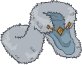ID: 3837**Elegant Snow Cloak (Grimm)**Now THIS is a fashion statement! ~Grimm  Buffs Grimm's Ultimate Attack Damage by 275%.<code>buff_ultimate,275</code>
                    
                    
                        **Golden Epic**
                        Elegant Snow Cloak
                        Grimm (Slot 5)
                    
                
            
        
        
            
                **Start Date**
            
            
                **End Date**
            
            
                **Exclusive Date**
            
        
        
            
                23 April 2025
            
            
                01 August 2025
            
            
                01 November 2025 (Guess)
            
        
    
    
        
            
                <a id="g4a" onclick="exclusiveToggleContent(`g4`)">
                    [show contents]
                </a>
                **B&G's Dragon Delves DM Vault Preorder Bonus** - B&G Dragon Delves Pack
            
        
        
            
                
                    
                        ID: 569**Dragon Hoard Beadle (Beadle)**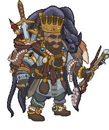
                    
                    
                        **Skin**
                        Dragon Hoard Beadle
                    
                
                
                    
                        ID: 570**Dragon Slayer Grimm (Grimm)**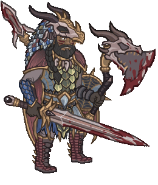
                    
                    
                        **Skin**
                        Dragon Slayer Grimm
                    
                
                
                    
                        ID: 269**Verdigrin the Baby Copper Dragon**Ready for a life full of wonder and possibility. 
                    
                    
                        **Familiar**
                        Verdigrin the Baby Copper Dragon
                    
                
            
        
        
            
                **Start Date**
            
            
                **End Date**
            
            
                **Exclusive Date**
            
        
        
            
                08 July 2025
            
            
                01 August 2025
            
            
                01 November 2025 (Guess)
            
        
    
    
        
            
                <a id="e12a" onclick="exclusiveToggleContent(`e12`)">
                    [show contents]
                </a>
                **Emergence 12** - Vecnae
            
        
        
            
                
                    
                        ID: 2218**Cantrip: Ascendant Shocking Grasp (Krond)**Few can survive the lightning strike of a rampaging kraken. I did. Let's see how you fare.  Krond gains the Control role and his base attack deals additional 1600% damage to the main target, and the target is stunned for 4 seconds.<code>krond_shocking_grasp,1600,4 change_base_attack,864 add_hero_tags,0,control</code>
                    
                    
                        **Feat**
                        Cantrip: Ascendant Shocking Grasp
                        Krond
                    
                
                
                    
                        ID: 2230**Discerning Taste (Kas)**Ah, such a rich vintage, with notes of fey. I must have more.  Increases the effect of Kas' Life Drain ability by 80%.<code>buff_upgrade,80,15621,0</code>
                    
                    
                        **Feat**
                        Discerning Taste
                        Kas
                    
                
                
                    
                        ID: 2231**Prodigal Leader (Tess)**I'm not always the best leader, but I truly believe that we're stronger together.  All Champions damage +50%.<code>global_dps_multiplier_mult,50</code>
                    
                    
                        **Feat**
                        Prodigal Leader
                        Tess
                    
                
                
                    
                        ID: 2229**Weapon Master (Windfall)**I've lost count of the number of lives I've taken with this blade.  Increases the damage of Windfall by 120%.<code>hero_dps_multiplier_mult,120</code>
                    
                    
                        **Feat**
                        Weapon Master
                        Windfall
                    
                
                
                    
                        ID: 584**Gentleman Jarlaxle (Jarlaxle)**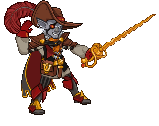
                    
                    
                        **Skin**
                        Gentleman Jarlaxle
                    
                
                
                    
                        ID: 581**Chosen of Vecna Blooshi (Blooshi)**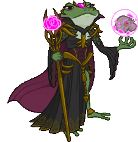
                    
                    
                        **Skin**
                        Chosen of Vecna Blooshi
                    
                
                
                    
                        ID: 2480**+1 Bow of Owlbear Slaying (NERDS)**After perfectly stalking their foe, it ends with a surprise attack!  Increases the effect of NERDS's Ranger ability by 275%.<code>buff_upgrade,275,6140</code>
                    
                    
                        **Golden Epic**
                        +1 Bow of Owlbear Slaying
                        NERDS (Slot 2)
                    
                
                
                    
                        ID: 2536**Fork of Regicide (Blooshi)**Everyone knows a fork is the best assassination tool. Good size for eyes.  Increases the effect of Blooshi's A Life Well Lived ability by 275%.<code>buff_upgrade,275,7520</code>
                    
                    
                        **Golden Epic**
                        Fork of Regicide
                        Blooshi (Slot 4)
                    
                
                
                    
                        ID: 3905**Trapfinder's Friend (Tess)**No trap is safe from me.  Increases the effect of Tess's Trap Expert ability by 275%.<code>buff_upgrade,275,17320</code>
                    
                    
                        **Golden Epic**
                        Trapfinder's Friend
                        Tess (Slot 4)
                    
                
            
        
        
            
                **Start Date**
            
            
                **End Date**
            
            
                **Exclusive Date**
            
        
        
            
                23 July 2025
            
            
                31 October 2025
            
            
                31 January 2026 (Guess)
            
        
    

# Old Exclusive Special Events

This is the list of recurring events that have had their exclusivity period end. This means their contents are available again. This list does not include platform giveaways.

 *Note: They're sorted by the date at which they stopped being exclusive - with the most recent at the bottom. Ties sort by start date.*

    
        
            
                <a id="s1a" onclick="exclusiveToggleContent(`s1`)">
                    [show contents]
                </a>
                **Season 1** - Heroes of Aerois
            
        
        
            
                
                    
                        ID: 879**Everything's a Nail (Aila)**I'm a delight.  Increases the effect of Aila's Aerois Synergy ability by 80%.<code>buff_upgrade,80,8783</code>
                    
                    
                        **Feat**
                        Everything's a Nail
                        Aila
                    
                
                
                    
                        ID: 913**Eye of the Storm (Qillek)**I see what was and is and will be.  Increases the effect of Qillek's Aerois Synergy ability by 80%.<code>buff_upgrade,80,8770</code>
                    
                    
                        **Feat**
                        Eye of the Storm
                        Qillek
                    
                
                
                    
                        ID: 937**Sentinel Prime (Sentry)**My new home will be protected.  Increases the effect of Sentry's Aerois Synergy ability by 80%.<code>buff_upgrade,80,8762</code>
                    
                    
                        **Feat**
                        Sentinel Prime
                        Sentry
                    
                
                
                    
                        ID: 896**Merry Crew (Nova)**If we all work together, what could go wrong?  Increases the effect of Nova's Aerois Synergy ability by 80%.<code>buff_upgrade,80,8752</code>
                    
                    
                        **Feat**
                        Merry Crew
                        Nova
                    
                
                
                    
                        ID: 939**Privileged Background (Lucius)**Can we just solve this with coin?  Increases the effect of Lucius's Aerois Synergy ability by 80%.<code>buff_upgrade,80,8730</code>
                    
                    
                        **Feat**
                        Privileged Background
                        Lucius
                    
                
                
                    
                        ID: 193**Champion of Aerois Aila (Aila)**
                    
                    
                        **Skin**
                        Champion of Aerois Aila
                    
                
                
                    
                        ID: 192**H'esper's Avatar Qillek (Qillek)**
                    
                    
                        **Skin**
                        H'esper's Avatar Qillek
                    
                
                
                    
                        ID: 190**Prime's Hope Sentry (Sentry)**
                    
                    
                        **Skin**
                        Prime's Hope Sentry
                    
                
                
                    
                        ID: 191**Tiangong Nova (Nova)**
                    
                    
                        **Skin**
                        Tiangong Nova
                    
                
                
                    
                        ID: 194**Prism Lucius (Lucius)**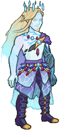
                    
                    
                        **Skin**
                        Prism Lucius
                    
                
                
                    
                        ID: 5**Aerois Core**A modron core to massively buff Aerois Champions
                    
                    
                        **Modron Core**
                        Aerois Core
                    
                
                
                    
                        ID: 112**Tiangong**All that you have done for us, we know. Thank you 
                    
                    
                        **Familiar**
                        Tiangong
                    
                
            
        
        
            
                **Start Date**
            
            
                **End Date**
            
            
                **Exclusive Date**
            
        
        
            
                14 September 2022
            
            
                23 November 2022
            
            
                23 May 2023
            
        
    
    
        
            
                <a id="s2a" onclick="exclusiveToggleContent(`s2`)">
                    [show contents]
                </a>
                **Season 2** - The Flayer Hunters
            
        
        
            
                
                    
                        ID: 1036**Judge of the Dead (Nerys)**Your existence is anathema, foul undead!  Increases the effect of Nerys's Sanctify ability by 80%.<code>buff_upgrade,80,9736</code>
                    
                    
                        **Feat**
                        Judge of the Dead
                        Nerys
                    
                
                
                    
                        ID: 1035**Second Wind (Shandie)**I could do this all day!  Decreases the time it takes Shandie's Dash ability to trigger from 30 seconds to 10 seconds.<code>change_upgrade_data,9728</code>
                    
                    
                        **Feat**
                        Second Wind
                        Shandie
                    
                
                
                    
                        ID: 1032**Prodigal Leader (Krydle)**You can trust me!  All Champions damage +50%.<code>global_dps_multiplier_mult,50</code>
                    
                    
                        **Feat**
                        Prodigal Leader
                        Krydle
                    
                
                
                    
                        ID: 1027**Thrill of the Hunt (Jaheira)**You won't escape me!  Increases the effect of Jaheira's Fierce Hunter ability by 80%.<code>buff_upgrade,80,9710</code>
                    
                    
                        **Feat**
                        Thrill of the Hunt
                        Jaheira
                    
                
                
                    
                        ID: 1024**The Grave Rejects You (Viconia)**Hordes of undead? I don't see a problem.  Increases the effect of Viconia's Yesterday's Undead ability by 150%.<code>buff_upgrade,150,9752</code>
                    
                    
                        **Feat**
                        The Grave Rejects You
                        Viconia
                    
                
                
                    
                        ID: 239**Flayer Hunter Nerys (Nerys)**
                    
                    
                        **Skin**
                        Flayer Hunter Nerys
                    
                
                
                    
                        ID: 238**Flayer Hunter Shandie (Shandie)**
                    
                    
                        **Skin**
                        Flayer Hunter Shandie
                    
                
                
                    
                        ID: 236**Flayer Hunter Krydle (Krydle)**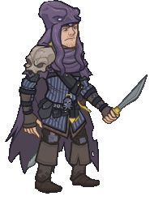
                    
                    
                        **Skin**
                        Flayer Hunter Krydle
                    
                
                
                    
                        ID: 235**Flayer Hunter Jaheira (Jaheira)**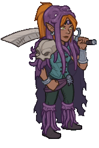
                    
                    
                        **Skin**
                        Flayer Hunter Jaheira
                    
                
                
                    
                        ID: 237**Flayer Hunter Viconia (Viconia)**
                    
                    
                        **Skin**
                        Flayer Hunter Viconia
                    
                
                
                    
                        ID: 1428**Cloak of The Blades (Krydle)**I ran with them for a while. It... didn't end well.  Increases the effect of Krydle's From The Shadows ability by 275%.<code>buff_upgrade,275,9629,0</code>
                    
                    
                        **Golden Epic**
                        Cloak of The Blades
                        Krydle (Slot 3)
                    
                
                
                    
                        ID: 115**Intellect Devourer**Feeding on intellect. 
                    
                    
                        **Familiar**
                        Intellect Devourer
                    
                
            
        
        
            
                **Start Date**
            
            
                **End Date**
            
            
                **Exclusive Date**
            
        
        
            
                21 December 2022
            
            
                01 March 2023
            
            
                01 September 2023
            
        
    
    
        
            
                <a id="e1a" onclick="exclusiveToggleContent(`e1`)">
                    [show contents]
                </a>
                **Emergence 1** - Red Wizards
            
        
        
            
                
                    
                        ID: 1193**Five Questions (Hitch)**You hold 'em, I'll drop 'em!  Increases the effect of Hitch's Ricochet ability by 80%.<code>buff_upgrade,80,3672</code>
                    
                    
                        **Feat**
                        Five Questions
                        Hitch
                    
                
                
                    
                        ID: 1086**Neverwinter Diversity (Hew Maan)**Greetings, fellow humans!  Increases the number of other champions counted by Hello, Fellow Humans by 3.<code>additional_fellow_humans,3</code>
                    
                    
                        **Feat**
                        Neverwinter Diversity
                        Hew Maan
                    
                
                
                    
                        ID: 1194**Wisened Friends (Fen)**If we put our heads together, we can overcome!  Increases the effect of Fen's I've Got You, Friends ability by 80%.<code>buff_upgrade,80,9759</code>
                    
                    
                        **Feat**
                        Wisened Friends
                        Fen
                    
                
                
                    
                        ID: 289**Red Wizard Calliope (Calliope)**
                    
                    
                        **Skin**
                        Red Wizard Calliope
                    
                
                
                    
                        ID: 288**Red Wizard Widdle (Widdle)**
                    
                    
                        **Skin**
                        Red Wizard Widdle
                    
                
                
                    
                        ID: 2889**High Sorcery Robes (Miria)**A mark of the respect and station I deserve.  Increases the effect of Miria's Mage of High Sorcery ability by 275%.<code>buff_upgrade,275,10665</code>
                    
                    
                        **Golden Epic**
                        High Sorcery Robes
                        Miria (Slot 2)
                    
                
            
        
        
            
                **Start Date**
            
            
                **End Date**
            
            
                **Exclusive Date**
            
        
        
            
                29 March 2023
            
            
                07 June 2023
            
            
                01 September 2023
            
        
    
    
        
            
                <a id="s3a" onclick="exclusiveToggleContent(`s3`)">
                    [show contents]
                </a>
                **Season 3** - Ancients and Lawbringers
            
        
        
            
                
                    
                        ID: 1164**Calm Under Pressure (Barrowin)**Clan Undurr does not back down!  Barrowin takes 10 more Enemies attacking to get overwhelmed.<code>overwhelm_start_increase,10</code>
                    
                    
                        **Feat**
                        Calm Under Pressure
                        Barrowin
                    
                
                
                    
                        ID: 1171**Athlete (Birdsong)**I've been sharpening my claws for days!  Increases the Strength score of Birdsong by 1.<code>increase_ability_score,str,1</code>
                    
                    
                        **Feat**
                        Athlete
                        Birdsong
                    
                
                
                    
                        ID: 1173**Extra Wasps (Spurt)**I call this bag the angries.  Increases the cooldown on Spurt's Ultimate Attack by 30 seconds.<code>increase_ultimate_cooldown,30</code>
                    
                    
                        **Feat**
                        Extra Wasps
                        Spurt
                    
                
                
                    
                        ID: 1182**Athlete (Turiel)**Strength of Bahamut, flow through me!  Increases the Strength score of Turiel by 1.<code>increase_ability_score,str,1</code>
                    
                    
                        **Feat**
                        Athlete
                        Turiel
                    
                
                
                    
                        ID: 1184**The Path Is Clear (Hew Maan)**Surprises around every corner! But not this one. I don't think. ~ Kleeb  Increases game speed by 10% when the formation is not under attack.<code>time_scale_when_not_attacked,10,2</code>
                    
                    
                        **Feat**
                        The Path Is Clear
                        Hew Maan
                    
                
                
                    
                        ID: 1163**Dwarven Tradition (Barrowin)**Undurr Ground. Get it?  Increases the effect of Barrowin's Blessed Hammer ability by 80%.<code>buff_upgrade,80,10684</code>
                    
                    
                        **Feat**
                        Dwarven Tradition
                        Barrowin
                    
                
                
                    
                        ID: 1169**Harmony (Birdsong)**Just keep it going!  Increases the effect of Birdsong's Crescendo ability by 80%. (Prestack)<code>buff_upgrade,80,10776</code>
                    
                    
                        **Feat**
                        Harmony
                        Birdsong
                    
                
                
                    
                        ID: 1172**Kobold Brethren (Spurt)**For Glory!  Increases the effect of Spurt's Pack Tactics ability by 80%.<code>buff_upgrade,80,10680</code>
                    
                    
                        **Feat**
                        Kobold Brethren
                        Spurt
                    
                
                
                    
                        ID: 1179**Shout Above The Din (Turiel)**The time for debate is over!  Increases the effect of all of Turiel's specialization choices by 80%.<code>buff_upgrades,80,10663,10664</code>
                    
                    
                        **Feat**
                        Shout Above The Din
                        Turiel
                    
                
                
                    
                        ID: 1183**Immolation (Hew Maan)**Kleeb prefers fire going in opposite direction! ~Kleeb  Hew Maan's attacks deal an additional 1 second of BUD damage every second for 5 seconds.<code>immolation,1,5</code>
                    
                    
                        **Feat**
                        Immolation
                        Hew Maan
                    
                
                
                    
                        ID: 283**Ancient Barrowin (Barrowin)**
                    
                    
                        **Skin**
                        Ancient Barrowin
                    
                
                
                    
                        ID: 284**Lawbringer Birdsong (Birdsong)**
                    
                    
                        **Skin**
                        Lawbringer Birdsong
                    
                
                
                    
                        ID: 286**Lawbringer Spurt (Spurt)**
                    
                    
                        **Skin**
                        Lawbringer Spurt
                    
                
                
                    
                        ID: 285**Ancient Turiel (Turiel)**
                    
                    
                        **Skin**
                        Ancient Turiel
                    
                
                
                    
                        ID: 287**Law Maan (Hew Maan)**
                    
                    
                        **Skin**
                        Law Maan
                    
                
                
                    
                        ID: 6**Unaffiliated Core**A modron core to massively buff Unaffiliated Champions
                    
                    
                        **Modron Core**
                        Unaffiliated Core
                    
                
                
                    
                        ID: 113**Baby Guenhwyvar**This panther from the astral plane is looking for her new best friend! 
                    
                    
                        **Familiar**
                        Baby Guenhwyvar
                    
                
            
        
        
            
                **Start Date**
            
            
                **End Date**
            
            
                **Exclusive Date**
            
        
        
            
                15 March 2023
            
            
                24 May 2023
            
            
                15 November 2023
            
        
    
    
        
            
                <a id="e2a" onclick="exclusiveToggleContent(`e2`)">
                    [show contents]
                </a>
                **Emergence 2** - Modrons
            
        
        
            
                
                    
                        ID: 1291**Entertainer (Nrakk)**Some have called my battle meditations... calming to watch.  Increases the Charisma score of Nrakk by 2.<code>increase_ability_score,cha,2</code>
                    
                    
                        **Feat**
                        Entertainer
                        Nrakk
                    
                
                
                    
                        ID: 290**Modron Antrius (Antrius)**
                    
                    
                        **Skin**
                        Modron Antrius
                    
                
                
                    
                        ID: 307**Modron Nixie (Nixie)**
                    
                    
                        **Skin**
                        Modron Nixie
                    
                
                
                    
                        ID: 1588**The Lost Friend (Dragonbait)**Dragonbait carries a drawing of Artus Cimber.  All Champions damage +230%.<code>global_dps_multiplier_mult,230</code>
                    
                    
                        **Golden Epic**
                        The Lost Friend
                        Dragonbait (Slot 1)
                    
                
                
                    
                        ID: 2961**Armor of Victory (Evandra)**Won this at a jousting tourney. No thanks to Dargle-bark.  Increases the health of Evandra by 100%.<code>health_mult,100</code>
                    
                    
                        **Golden Epic**
                        Armor of Victory
                        Evandra (Slot 2)
                    
                
            
        
        
            
                **Start Date**
            
            
                **End Date**
            
            
                **Exclusive Date**
            
        
        
            
                24 May 2023
            
            
                01 September 2023
            
            
                29 November 2023
            
        
    
    
        
            
                <a id="s4a" onclick="exclusiveToggleContent(`s4`)">
                    [show contents]
                </a>
                **Season 4** - Legends of Mithral Hall
            
        
        
            
                
                    
                        ID: 1315**Rest Awhile (Regis)**Relax -- there can't be a battle every day.  Additively increases Regis' Mithral Hall Stacks contribution by 1.<code>add_mithral_hall_stacks,1</code>
                    
                    
                        **Feat**
                        Rest Awhile
                        Regis
                    
                
                
                    
                        ID: 1313**Weapon Swap (Catti-brie)**Aye, I know how to use a warhammer.  Additively increases Catti-brie's Mithral Hall Stacks contribution by 1.<code>add_mithral_hall_stacks,1</code>
                    
                    
                        **Feat**
                        Weapon Swap
                        Catti-brie
                    
                
                
                    
                        ID: 1317**Imposing Build (Wulfgar)**They will think twice with me at your side.  Additively increases Wulfgar's Mithral Hall Stacks contribution by 1.<code>add_mithral_hall_stacks,1</code>
                    
                    
                        **Feat**
                        Imposing Build
                        Wulfgar
                    
                
                
                    
                        ID: 1319**Aggressive Stance (Pwent)**Think they got the point?  Additively increases Pwent's Mithral Hall Stacks contribution by 1.<code>add_mithral_hall_stacks,1</code>
                    
                    
                        **Feat**
                        Aggressive Stance
                        Pwent
                    
                
                
                    
                        ID: 1297**Battle Expertise (Artemis)**Their last thoughts will dismiss me as just a shadow.  Additively increases the Crit Chance of Artemis by 10%.<code>buff_base_crit_chance_add,10</code>
                    
                    
                        **Feat**
                        Battle Expertise
                        Artemis
                    
                
                
                    
                        ID: 1316**Advisor of the Hall (Regis)**We stick with Bruenor's plan!  Additively increases Regis' Mithral Hall Stacks contribution by 2.<code>add_mithral_hall_stacks,2</code>
                    
                    
                        **Feat**
                        Advisor of the Hall
                        Regis
                    
                
                
                    
                        ID: 1314**Speaker of the Hall (Catti-brie)**Behind you! I've got them!  Additively increases Catti-brie's Mithral Hall Stacks contribution by 2.<code>add_mithral_hall_stacks,2</code>
                    
                    
                        **Feat**
                        Speaker of the Hall
                        Catti-brie
                    
                
                
                    
                        ID: 1318**Aegis of the Hall (Wulfgar)**To me! Make haste!  Additively increases Wulfgar's Mithral Hall Stacks contribution by 2.<code>add_mithral_hall_stacks,2</code>
                    
                    
                        **Feat**
                        Aegis of the Hall
                        Wulfgar
                    
                
                
                    
                        ID: 1320**Vanguard of the Hall (Pwent)**Gutbusters! Are you ready?!  Additively increases Pwent's Mithral Hall Stacks contribution by 2.<code>add_mithral_hall_stacks,2</code>
                    
                    
                        **Feat**
                        Vanguard of the Hall
                        Pwent
                    
                
                
                    
                        ID: 1298**Vicious Damage (Artemis)**Your life essence belongs to me now.  Increases the damage of Artemis by 400%. Artemis's attacks prevent the target from healing for 10 seconds.<code>hero_dps_multiplier_mult,400 vicious_damage,10</code>
                    
                    
                        **Feat**
                        Vicious Damage
                        Artemis
                    
                
                
                    
                        ID: 323**Mythic Regis (Regis)**
                    
                    
                        **Skin**
                        Mythic Regis
                    
                
                
                    
                        ID: 308**Mythic Catti-brie (Catti-brie)**
                    
                    
                        **Skin**
                        Mythic Catti-brie
                    
                
                
                    
                        ID: 316**Mythic Wulfgar (Wulfgar)**
                    
                    
                        **Skin**
                        Mythic Wulfgar
                    
                
                
                    
                        ID: 314**Mythic Pwent (Pwent)**
                    
                    
                        **Skin**
                        Mythic Pwent
                    
                
                
                    
                        ID: 312**Mythic Artemis (Artemis)**
                    
                    
                        **Skin**
                        Mythic Artemis
                    
                
                
                    
                        ID: 1192**Helm of Clangeddin's Wrath (Pwent)**When a dwarf enters tha bloodrage, stand clear.  Increases the effect of Pwent's Gutbuster Recruits ability by 275%.<code>buff_upgrade,275,11494</code>
                    
                    
                        **Golden Epic**
                        Helm of Clangeddin's Wrath
                        Pwent (Slot 4)
                    
                
                
                    
                        ID: 150**Mythic Guenhwyvar**She says it looks better on her. 
                    
                    
                        **Familiar**
                        Mythic Guenhwyvar
                    
                
                
                    
                        ID: 5**Guenhwyvar's Strike**
                    
                    
                        **Click Damage Skin**
                        Guenhwyvar's Strike
                    
                
            
        
        
            
                **Start Date**
            
            
                **End Date**
            
            
                **Exclusive Date**
            
        
        
            
                21 June 2023
            
            
                30 August 2023
            
            
                14 February 2024
            
        
    
    
        
            
                <a id="e3a" onclick="exclusiveToggleContent(`e3`)">
                    [show contents]
                </a>
                **Emergence 3** - Mind Flayers
            
        
        
            
                
                    
                        ID: 1504**Illithid Tadpole (Nrakk)**They said it would be fine...  All Champions damage +25%. Additively increases Ceremorphosis Stacks by 1.<code>global_dps_multiplier_mult,25 add_global_ceremorphosis_stacks,1</code>
                    
                    
                        **Feat**
                        Illithid Tadpole
                        Nrakk
                    
                
                
                    
                        ID: 1424**Very Important Person (Valentine)**I had to put in an appearance.  Increases the effect of Valentine's Socialite ability by 80%.<code>buff_upgrade,80,8147</code>
                    
                    
                        **Feat**
                        Very Important Person
                        Valentine
                    
                
                
                    
                        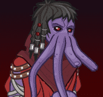ID: 334**Mind Flayer Jamilah (Jamilah)**
                    
                    
                        **Skin**
                        Mind Flayer Jamilah
                    
                
                
                    
                        ID: 335**Mind Flayer Nrakk (Nrakk)**
                    
                    
                        **Skin**
                        Mind Flayer Nrakk
                    
                
                
                    
                        ID: 2528**Endless Patron (Blooshi)**Whoever he is, I like the powers he gives me!  Increases the effect of Blooshi's Soul Gatherer ability by 275%.<code>buff_upgrade,275,7518</code>
                    
                    
                        **Golden Epic**
                        Endless Patron
                        Blooshi (Slot 2)
                    
                
                
                    
                        ID: 3061**Token of Vlaakith (Lae'zel)**The engraving on the back reads: 'Vlaakith'ka sivim hrath krash'ht'  Increases the effect of Lae'zel's Ceremorphosis ability by 275%. (Prestack)<code>buff_upgrade,275,12114</code>
                    
                    
                        **Golden Epic**
                        Token of Vlaakith
                        Lae'zel (Slot 3)
                    
                
            
        
        
            
                **Start Date**
            
            
                **End Date**
            
            
                **Exclusive Date**
            
        
        
            
                23 August 2023
            
            
                01 December 2023
            
            
                14 February 2024
            
        
    
    
        
            
                <a id="s5a" onclick="exclusiveToggleContent(`s5`)">
                    [show contents]
                </a>
                **Season 5** - Acquisitions Incorporated
            
        
        
            
                
                    
                        ID: 1444**Dead Friends (Strix)**Oh, you're alive again? That's good. I guess.  Increases the effect of Strix's Haunted ability by 40%.<code>buff_upgrade,40,12287</code>
                    
                    
                        **Feat**
                        Dead Friends
                        Strix
                    
                
                
                    
                        ID: 1443**Yay Lathander! (Evelyn)**Give me an L! Give me an A! Give me a --  Increases the effect of Evelyn's Channel Divinity ability by 40%.<code>buff_upgrade,40,12206</code>
                    
                    
                        **Feat**
                        Yay Lathander!
                        Evelyn
                    
                
                
                    
                        ID: 1228**Magic Tour Bus (Jim)**Get in, nerds -- we're doing magic.  Increases the effect of Jim's Magical Mystery Tour ability by 40%.<code>buff_upgrade,40,12130</code>
                    
                    
                        **Feat**
                        Magic Tour Bus
                        Jim
                    
                
                
                    
                        ID: 1442**Waterdeep Investors (Omin)**Q3 adventures are looking good!  Increases the effect of Omin's Well Funded ability by 40%.<code>buff_upgrade,40,12303</code>
                    
                    
                        **Feat**
                        Waterdeep Investors
                        Omin
                    
                
                
                    
                        ID: 1445**Sass for Days (Vi)**Honey, I can do this all day.  Increases the effect of Vi's I Can't Get No Sass-isfaction ability by 40%.<code>buff_upgrade,40,12315</code>
                    
                    
                        **Feat**
                        Sass for Days
                        Vi
                    
                
                
                    
                        ID: 1449**Friends? (Strix)**You want to be my friend? That sounds like a lot of work...  Increases the effect of Strix's The Power of Friendship (and Nose Plugs) ability by 80%.<code>buff_upgrade,80,12289,1</code>
                    
                    
                        **Feat**
                        Friends?
                        Strix
                    
                
                
                    
                        ID: 1448**Training Montage (Evelyn)**That was great! Now let's do that 400 more times, and it will be perfect!  Increases the effect of Evelyn's Lathander's Grace ability by 80%. (Prestack)<code>buff_upgrade,80,12209</code>
                    
                    
                        **Feat**
                        Training Montage
                        Evelyn
                    
                
                
                    
                        ID: 1229**Official Fan Club Card (Jim)**I'm Jim Darkmagic and YOUR NAME HERE is my #1 fan!  Increases the pre-stack effect of Jim's Fan Club ability by 80%. (Prestack)<code>buff_upgrade,80,12128,0</code>
                    
                    
                        **Feat**
                        Official Fan Club Card
                        Jim
                    
                
                
                    
                        ID: 1447**Motivational Keynote (Omin)**It's been proven that listening to me can make me richer.  Increases the effect of all Omin's Specializations by 80%.<code>buff_upgrades,80,12304,12305,12306</code>
                    
                    
                        **Feat**
                        Motivational Keynote
                        Omin
                    
                
                
                    
                        ID: 1450**Stand Off (Vi)**Honey, you've got to ask yourself one question...  Increases the chance that Vi activates her Catch and Release ability by 100%.<code>buff_upgrade,100,12313,0</code>
                    
                    
                        **Feat**
                        Stand Off
                        Vi
                    
                
                
                    
                        ID: 340**Venture Casual Strix (Strix)**
                    
                    
                        **Skin**
                        Venture Casual Strix
                    
                
                
                    
                        ID: 339**Venture Casual Evelyn (Evelyn)**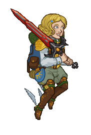
                    
                    
                        **Skin**
                        Venture Casual Evelyn
                    
                
                
                    
                        ID: 337**Venture Casual Jim (Jim)**
                    
                    
                        **Skin**
                        Venture Casual Jim
                    
                
                
                    
                        ID: 338**Venture Casual Omin (Omin)**
                    
                    
                        **Skin**
                        Venture Casual Omin
                    
                
                
                    
                        ID: 341**Venture Casual Vi (Vi)**
                    
                    
                        **Skin**
                        Venture Casual Vi
                    
                
                
                    
                        ID: 2216**Glamourous Neckwear (Vi)**I get this out for special occasions.  Increases the effect of Vi's A Good Example ability by 275%.<code>buff_upgrade,275,12312</code>
                    
                    
                        **Golden Epic**
                        Glamourous Neckwear
                        Vi (Slot 2)
                    
                
                
                    
                        ID: 164**Clone Jim**Clone Jim winks. 
                    
                    
                        **Familiar**
                        Clone Jim
                    
                
                
                    
                        ID: 6**Golden Sparks**
                    
                    
                        **Click Damage Skin**
                        Golden Sparks
                    
                
            
        
        
            
                **Start Date**
            
            
                **End Date**
            
            
                **Exclusive Date**
            
        
        
            
                30 August 2023
            
            
                08 November 2023
            
            
                08 May 2024
            
        
    
    
        
            
                <a id="e4a" onclick="exclusiveToggleContent(`e4`)">
                    [show contents]
                </a>
                **Emergence 4** - Glitches
            
        
        
            
                
                    
                        ID: 1594**Centaur Glitch (Hitch)**I am going to go SO FAST!  Hitch also counts as a Centaur.<code>add_hero_tags,0,centaur buff_upgrade_per_unique_race,20,390</code>
                    
                    
                        **Feat**
                        Centaur Glitch
                        Hitch
                    
                
                
                    
                        ID: 1524**Gibbous Script (Warden)**The words I utter have existed since time itself.  Increases the number of Hex stacks applied by Master of Hexes by 2 (additively).<code>buff_upgrade_add,2,13244</code>
                    
                    
                        **Feat**
                        Gibbous Script
                        Warden
                    
                
                
                    
                        ID: 1560**Specter of Aeons (Warden)**These are spirits of time itself.  Increases the max number of Accursed Specters by 2.<code>increase_warden_specter_max,2</code>
                    
                    
                        **Feat**
                        Specter of Aeons
                        Warden
                    
                
                
                    
                        ID: 1597**Half-Elf Glitch (Sentry)**I... I can still feel a connection to The Prime Matrix.  Sentry also counts as a Half-Elf.<code>add_hero_tags,0,half-elf buff_upgrade_per_any_tagged_crusader,20,8761,half-elf</code>
                    
                    
                        **Feat**
                        Half-Elf Glitch
                        Sentry
                    
                
                
                    
                        ID: 367**Centaur Glitch Hitch (Hitch)**
                    
                    
                        **Skin**
                        Centaur Glitch Hitch
                    
                
                
                    
                        ID: 368**Half-Elf Glitch Sentry (Sentry)**
                    
                    
                        **Skin**
                        Half-Elf Glitch Sentry
                    
                
                
                    
                        ID: 1364**Scimitar of Dendar (Sisaspia)**The Night Serpent waits...  Buffs Sisaspia's Ultimate Attack Damage by 275%.<code>buff_ultimate,275</code>
                    
                    
                        **Golden Epic**
                        Scimitar of Dendar
                        Sisaspia (Slot 5)
                    
                
                
                    
                        ID: 3333**Lunation (Jang Sao)**All of time and space, within your imagination  Increases the effect of Jang Sao's Wisdom of the Ages and Speed of Shooting Stars by 275%. (Prestack)<code>buff_upgrades,275,13261,13262</code>
                    
                    
                        **Golden Epic**
                        Lunation
                        Jang Sao (Slot 5)
                    
                
            
        
        
            
                **Start Date**
            
            
                **End Date**
            
            
                **Exclusive Date**
            
        
        
            
                22 November 2023
            
            
                02 February 2024
            
            
                08 May 2024
            
        
    
    
        
            
                <a id="s6a" onclick="exclusiveToggleContent(`s6`)">
                    [show contents]
                </a>
                **Season 6** - Elemental Rebirth
            
        
        
            
                
                    
                        ID: 1245**Research (Zorbu)**Not everything is learned in battle.  Increases the effect of Zorbu's Know Your Enemy ability by 40%.<code>buff_upgrade,40,12989</code>
                    
                    
                        **Feat**
                        Research
                        Zorbu
                    
                
                
                    
                        ID: 1253**Chosen of Gith (Nrakk)**In Gith's name, you will meet your end.  Increases the effect of Nrakk's Githzerai Focus and Githzerai Agility by 40%.<code>buff_upgrades,40,13005,13006</code>
                    
                    
                        **Feat**
                        Chosen of Gith
                        Nrakk
                    
                
                
                    
                        ID: 1561**Hunter's Hex (Warden)**My hex will follow you across the planes.  Increases monsters' max number of Hex Stacks by 2.<code>increase_max_hex_stacks,2</code>
                    
                    
                        **Feat**
                        Hunter's Hex
                        Warden
                    
                
                
                    
                        ID: 1549**Actor (Korth)**You want me to pretend to have emotions?  Increases the Charisma score of Korth by 1.<code>increase_ability_score,cha,1</code>
                    
                    
                        **Feat**
                        Actor
                        Korth
                    
                
                
                    
                        ID: 1222**Nimble (Sisaspia)**Sspeed is your ally.  Increases the Dexterity score of Sisaspia by 1.<code>increase_ability_score,dex,1</code>
                    
                    
                        **Feat**
                        Nimble
                        Sisaspia
                    
                
                
                    
                        ID: 1526**Wolf Pack (Zorbu)**A lone wolf is dangerous. A pack is lethal.  Increases the effect of Hunter's Pack by 400% and the DEX score of adjacent Champions by 1.<code>effect_def,1750</code>
                    
                    
                        **Feat**
                        Wolf Pack
                        Zorbu
                    
                
                
                    
                        ID: 1259**Centered (Nrakk)**There is no solution through rage.  Increases the effect of Nrakk's Ki Master ability by 80%. (Prestack)<code>buff_upgrade,80,13001</code>
                    
                    
                        **Feat**
                        Centered
                        Nrakk
                    
                
                
                    
                        ID: 1562**Beguiling Hex (Warden)**There is no escape from this.  Increases monsters' max number of Hex Stacks by 4.<code>increase_max_hex_stacks,4</code>
                    
                    
                        **Feat**
                        Beguiling Hex
                        Warden
                    
                
                
                    
                        ID: 1550**Iaido (Korth)**The battle will end before you even see me draw my blade.  Increases the base Dexterity score buff provided by Samurai Training by 1.<code>effect_def,1753</code>
                    
                    
                        **Feat**
                        Iaido
                        Korth
                    
                
                
                    
                        ID: 1223**Fungal Colony (Sisaspia)**Growth is our only method of ssurvival.  Increases Sisaspia's maximum spore reserve by 10.<code>increase_sisaspia_reserve_spore_max,10</code>
                    
                    
                        **Feat**
                        Fungal Colony
                        Sisaspia
                    
                
                
                    
                        ID: 361**Elemental Zorbu (Zorbu)**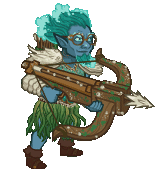
                    
                    
                        **Skin**
                        Elemental Zorbu
                    
                
                
                    
                        ID: 358**Elemental Nrakk (Nrakk)**
                    
                    
                        **Skin**
                        Elemental Nrakk
                    
                
                
                    
                        ID: 360**Elemental Warden (Warden)**
                    
                    
                        **Skin**
                        Elemental Warden
                    
                
                
                    
                        ID: 357**Elemental Korth (Korth)**
                    
                    
                        **Skin**
                        Elemental Korth
                    
                
                
                    
                        ID: 359**Elemental Sisaspia (Sisaspia)**
                    
                    
                        **Skin**
                        Elemental Sisaspia
                    
                
                
                    
                        ID: 556**Kensei Naginata of Illithid Slaying (Nrakk)**The force of this Naginata disrupts the Illithid's psionic field.  All Champions damage +230%.<code>global_dps_multiplier_mult,230</code>
                    
                    
                        **Golden Epic**
                        Kensei Naginata of Illithid Slaying
                        Nrakk (Slot 1)
                    
                
                
                    
                        ID: 7**Dexterous Core**A modron core to massively buff Dexterous Champions
                    
                    
                        **Modron Core**
                        Dexterous Core
                    
                
                
                    
                        ID: 181**Bash the Earth Elemental**I JUST GOTTA BASH IT! 
                    
                    
                        **Familiar**
                        Bash the Earth Elemental
                    
                
            
        
        
            
                **Start Date**
            
            
                **End Date**
            
            
                **Exclusive Date**
            
        
        
            
                08 November 2023
            
            
                03 January 2024
            
            
                05 June 2024
            
        
    
    
        
            
                <a id="e5a" onclick="exclusiveToggleContent(`e5`)">
                    [show contents]
                </a>
                **Emergence 5** - Astral Elves
            
        
        
            
                
                    
                        ID: 1616**Fields of Green (D'hani)**I think we need a bit more mossy colors.  Increase the chance of applying a Stroke of Green by 80%.<code>buff_upgrade,80,13714,0</code>
                    
                    
                        **Feat**
                        Fields of Green
                        D'hani
                    
                
                
                    
                        ID: 1665**Prodigal Leader (Gazrick)**Well, isn't that a kind thing to say!  All Champions damage +50%.<code>global_dps_multiplier_mult,50</code>
                    
                    
                        **Feat**
                        Prodigal Leader
                        Gazrick
                    
                
                
                    
                        ID: 1109**Caged Dreams (Miria)**Their power flows through me.  Increases the effect of Miria's Soul Cage ability by 80%.<code>buff_upgrade,80,10666</code>
                    
                    
                        **Feat**
                        Caged Dreams
                        Miria
                    
                
                
                    
                        ID: 1666**Fiery Tempest (Karlach)**Oh... You're going to regret that!  Increases the effect of Karlach's The Fury of Avernus ability by 80%.<code>buff_upgrade,80,13721</code>
                    
                    
                        **Feat**
                        Fiery Tempest
                        Karlach
                    
                
                
                    
                        ID: 372**Spelljammer Pilot Strix (Strix)**
                    
                    
                        **Skin**
                        Spelljammer Pilot Strix
                    
                
                
                    
                        ID: 373**Spelljammer Pilot Miria (Miria)**
                    
                    
                        **Skin**
                        Spelljammer Pilot Miria
                    
                
                
                    
                        ID: 2757**Thrilling Memoirs (Virgil)**All our adventures together are contained in this book. Well...most of them.  Increases the effect of Virgil's Rapid Fire ability by 100%.<code>buff_upgrade,100,9605</code>
                    
                    
                        **Golden Epic**
                        Thrilling Memoirs
                        Virgil (Slot 5)
                    
                
                
                    
                        ID: 3393**Helldusk Armour (Karlach)**I CAN FLY NOW?!  Increases the health of Karlach by 100%.<code>health_mult,100</code>
                    
                    
                        **Golden Epic**
                        Helldusk Armour
                        Karlach (Slot 2)
                    
                
            
        
        
            
                **Start Date**
            
            
                **End Date**
            
            
                **Exclusive Date**
            
        
        
            
                24 January 2024
            
            
                08 March 2024
            
            
                05 June 2024
            
        
    
    
        
            
                <a id="s7a" onclick="exclusiveToggleContent(`s7`)">
                    [show contents]
                </a>
                **Season 7** - The Rivals
            
        
        
            
                
                    
                        ID: 1433**Puzzling Answers (Shaka)**The answer you get may not be the answer you need.  Increases the effect of Shaka's Riddling Rivals ability by 40%. (Prestack)<code>buff_upgrade,40,13419</code>
                    
                    
                        **Feat**
                        Puzzling Answers
                        Shaka
                    
                
                
                    
                        ID: 1653**Fresh Palette (D'hani)**A refreshed fighter is a strong fighter.  Increase the effect of all D'hani's Specializations by 40%.<code>buff_upgrades,40,13717,13718,13719</code>
                    
                    
                        **Feat**
                        Fresh Palette
                        D'hani
                    
                
                
                    
                        ID: 1649**Darting Weapon (Kent)**Have at thee!  Reduces the cooldown on Kent's Base Attack by 0.5 seconds.<code>reduce_attack_cooldown,0.5</code>
                    
                    
                        **Feat**
                        Darting Weapon
                        Kent
                    
                
                
                    
                        ID: 1650**Form Up! (Virgil)**Kent, please don't say 'Roll Out' - no one knows what that means.  Increases the damage of all Champions by 20% for each Rivals of Waterdeep Champion in the formation.<code>global_dps_multiplier_mult,20</code>
                    
                    
                        **Feat**
                        Form Up!
                        Virgil
                    
                
                
                    
                        ID: 1635**Riddles Within Riddles (Shaka)**There is far more to this than you might think.  Increases the effect of Shaka's Riddling Rivals ability by 80%. (Prestack)<code>buff_upgrade,80,13419</code>
                    
                    
                        **Feat**
                        Riddles Within Riddles
                        Shaka
                    
                
                
                    
                        ID: 1434**Champion of Tyr (Selise)**Tyr, give me strength!  Increases the damage of Thunderous Smite by 100% and prevents roaming familiars from automatically activating Selise's ultimate attack.<code>buff_ultimate,100 disallow_roaming_familiar_ult_trigger</code>
                    
                    
                        **Feat**
                        Champion of Tyr
                        Selise
                    
                
                
                    
                        ID: 1648**Taunt (Selise)**I've killed Death. You're nothing compared to that.  All Champions damage +100%. Selise's attacks have a 50% chance to taunt enemies.<code>global_dps_multiplier_mult,100 taunt,50</code>
                    
                    
                        **Feat**
                        Taunt
                        Selise
                    
                
                
                    
                        ID: 1654**Color Theory (D'hani)**Fighting is like mixing paint. You need to know what works for a situation.  Increase the effect of all D'hani's Specializations by 80%.<code>buff_upgrades,80,13717,13718,13719</code>
                    
                    
                        **Feat**
                        Color Theory
                        D'hani
                    
                
                
                    
                        ID: 1651**Vicious Damage (Kent)**Now you're in for it!  Increases the damage of Kent by 400%. Kent's attacks prevent the target from healing for 10 seconds.<code>hero_dps_multiplier_mult,400 vicious_damage,10</code>
                    
                    
                        **Feat**
                        Vicious Damage
                        Kent
                    
                
                
                    
                        ID: 1652**It's time! (Virgil)**Why would I say 'morphing' in the middle of that, Kent? That doesn't make sense.  Increases the damage of all Champions by 40% for each Rivals of Waterdeep Champion in the formation.<code>global_dps_multiplier_mult,40</code>
                    
                    
                        **Feat**
                        It's time!
                        Virgil
                    
                
                
                    
                        ID: 383**Waterdhavian Shaka (Shaka)**
                    
                    
                        **Skin**
                        Waterdhavian Shaka
                    
                
                
                    
                        ID: 384**Waterdhavian Selise (Selise)**
                    
                    
                        **Skin**
                        Waterdhavian Selise
                    
                
                
                    
                        ID: 385**Waterdhavian D'hani (D'hani)**
                    
                    
                        **Skin**
                        Waterdhavian D'hani
                    
                
                
                    
                        ID: 386**Waterdhavian Kent (Kent)**
                    
                    
                        **Skin**
                        Waterdhavian Kent
                    
                
                
                    
                        ID: 387**Waterdhavian Virgil (Virgil)**
                    
                    
                        **Skin**
                        Waterdhavian Virgil
                    
                
                
                    
                        ID: 1892**Locket of the Rivals (Shaka)**It holds an image of my family.  Increases the effect of Shaka's Feast or Famine ability by 275%. (Prestack)<code>buff_upgrade,275,13418</code>
                    
                    
                        **Golden Epic**
                        Locket of the Rivals
                        Shaka (Slot 5)
                    
                
                
                    
                        ID: 171**The Hawk Man**A miniature form of one of the eight walking statues of Waterdeep! 
                    
                    
                        **Familiar**
                        The Hawk Man
                    
                
                
                    
                        ID: 7**Rivals Attack**
                    
                    
                        **Click Damage Skin**
                        Rivals Attack
                    
                
            
        
        
            
                **Start Date**
            
            
                **End Date**
            
            
                **Exclusive Date**
            
        
        
            
                03 January 2024
            
            
                28 February 2024
            
            
                28 August 2024
            
        
    
    
        
            
                <a id="e6a" onclick="exclusiveToggleContent(`e6`)">
                    [show contents]
                </a>
                **Emergence 6** - Illithids
            
        
        
            
                
                    
                        ID: 1714**Illithid Tadpole (Minsc)**This smells of EVIL! But I trust you. I just put it in my eye?  All Champions damage +25%. Additively increases Ceremorphosis Stacks by 1.<code>global_dps_multiplier_mult,25 add_global_ceremorphosis_stacks,1</code>
                    
                    
                        **Feat**
                        Illithid Tadpole
                        Minsc
                    
                
                
                    
                        ID: 1713**Prodigal Leader (Solaak)**Trust me, we've got this.  All Champions damage +50%.<code>global_dps_multiplier_mult,50</code>
                    
                    
                        **Feat**
                        Prodigal Leader
                        Solaak
                    
                
                
                    
                        ID: 1689**Tenacious (Presto)**I won't give up! No matter what Venger throws at us!  Increases the Constitution score of Presto by 2.<code>increase_ability_score,con,2</code>
                    
                    
                        **Feat**
                        Tenacious
                        Presto
                    
                
                
                    
                        ID: 1712**Illithid Tadpole (Dynaheir)**You want me to put what in my brain?  All Champions damage +25%. Additively increases Ceremorphosis Stacks by 1.<code>global_dps_multiplier_mult,25 add_global_ceremorphosis_stacks,1</code>
                    
                    
                        **Feat**
                        Illithid Tadpole
                        Dynaheir
                    
                
                
                    
                        ID: 423**Mind Flayer Celeste (Celeste)**
                    
                    
                        **Skin**
                        Mind Flayer Celeste
                    
                
                
                    
                        ID: 424**Mind Flayer Dynaheir (Dynaheir)**
                    
                    
                        **Skin**
                        Mind Flayer Dynaheir
                    
                
                
                    
                        ID: 2476**Ornamental Weaponry (NERDS)**Fighters are masters of weaponry and martial skill.  Increases the effect of NERDS's Fighter ability by 275%.<code>buff_upgrade,275,6139</code>
                    
                    
                        **Golden Epic**
                        Ornamental Weaponry
                        NERDS (Slot 1)
                    
                
                
                    
                        ID: 3453**Old Empires Fire Wine (Dynaheir)**The decanter is for Minsc. The glass is all I require.  Increases the effect of Dynaheir's specializations by 100%. (Prestack)<code>buff_upgrades,100,13879,13880,13881</code>
                    
                    
                        **Golden Epic**
                        Old Empires Fire Wine
                        Dynaheir (Slot 5)
                    
                
            
        
        
            
                **Start Date**
            
            
                **End Date**
            
            
                **Exclusive Date**
            
        
        
            
                28 February 2024
            
            
                31 May 2024
            
            
                28 August 2024
            
        
    
    
        
            
                <a id="e7a" onclick="exclusiveToggleContent(`e7`)">
                    [show contents]
                </a>
                **Emergence 7** - Vecna Cultists
            
        
        
            
                
                    
                        ID: 1304**Courage in Battle (Drizzt)**Hope is the ally of all courageous people.  Additively increases Drizzt's Mithral Hall Stacks contribution by 1.<code>add_mithral_hall_stacks,1</code>
                    
                    
                        **Feat**
                        Courage in Battle
                        Drizzt
                    
                
                
                    
                        ID: 1471**Quick Friends (Evelyn)**Did you heal me? OH! Yay! We're best friends now!  Increases the effect of Evelyn's Conduit of the Light ability by 80%.<code>buff_upgrade,80,12208</code>
                    
                    
                        **Feat**
                        Quick Friends
                        Evelyn
                    
                
                
                    
                        ID: 1797**Heavily Armored (Krydle)**You want me to hide in this?! Do you have a barn?  Increases the health of Krydle by 60%.<code>health_mult,60</code>
                    
                    
                        **Feat**
                        Heavily Armored
                        Krydle
                    
                
                
                    
                        ID: 1775**Scholar (Diana)**I've got a 4.0 GPA.  Increases the Intelligence score of Diana by 2.<code>increase_ability_score,int,2</code>
                    
                    
                        **Feat**
                        Scholar
                        Diana
                    
                
                
                    
                        ID: 430**Pirate Azaka (Azaka)**
                    
                    
                        **Skin**
                        Pirate Azaka
                    
                
                
                    
                        ID: 431**Pirate Diana (Diana)**
                    
                    
                        **Skin**
                        Pirate Diana
                    
                
                
                    
                        ID: 708**Magical Coin Pack (Azaka)**It always has more room!  Increases the effect of Azaka's Guiding Hand ability by 275%.<code>buff_upgrade,275,1233</code>
                    
                    
                        **Golden Epic**
                        Magical Coin Pack
                        Azaka (Slot 3)
                    
                
                
                    
                        ID: 3525**Weavebound Staff (Diana)**Dungeon Master told me the Weave itself flows through this...  Buffs Diana's Ultimate Attack Damage by 275%.<code>buff_ultimate,275</code>
                    
                    
                        **Golden Epic**
                        Weavebound Staff
                        Diana (Slot 5)
                    
                
            
        
        
            
                **Start Date**
            
            
                **End Date**
            
            
                **Exclusive Date**
            
        
        
            
                22 May 2024
            
            
                02 August 2024
            
            
                30 October 2024
            
        
    
    
        
            
                <a id="e8a" onclick="exclusiveToggleContent(`e8`)">
                    [show contents]
                </a>
                **Emergence 8** - Planescape
            
        
        
            
                
                    
                        ID: 1873**Better Every Day (Ulkoria)**You should do something every day to get you closer to your next goal!  Increases the positional formation buff of Watchful Order by 80%.<code>buff_upgrade,80,4347,2</code>
                    
                    
                        **Feat**
                        Better Every Day
                        Ulkoria
                    
                
                
                    
                        ID: 1867**Air Genasi Glitch (Valentine)**Huh. Well, at least I still look good in black.  Valentine also counts as Air Genasi.<code>add_hero_tags,0,genasi change_hero_alignment_tag,chaotic,evil</code>
                    
                    
                        **Feat**
                        Air Genasi Glitch
                        Valentine
                    
                
                
                    
                        ID: 1814**Heart of Battle (Ravengard)**Let hope strengthen your blades and deliver us victory!  Ravengard's Critical Teamwork keeps 40% of its stacks when they would be reset.<code>persist_effect_stacks,40,15030</code>
                    
                    
                        **Feat**
                        Heart of Battle
                        Ravengard
                    
                
                
                    
                        ID: 1848**Woken the Hive (Umberto)**You've done it now!  Increases the damage of Umberto's bees by 80%.<code>buff_upgrade,80,15049,0</code>
                    
                    
                        **Feat**
                        Woken the Hive
                        Umberto
                    
                
                
                    
                        ID: 452**Tabaxi Glitch Shandie (Shandie)**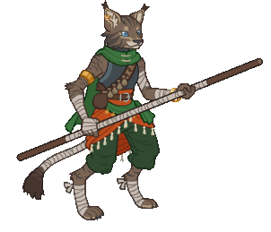
                    
                    
                        **Skin**
                        Tabaxi Glitch Shandie
                    
                
                
                    
                        ID: 451**Secret Agent Maan (Hew Maan)**
                    
                    
                        **Skin**
                        Secret Agent Maan
                    
                
                
                    
                        ID: 1616**Volo's Guide to the Weave (Ulkoria)**I'm writing a review for the Sentinel, nothing more.  All Champions damage +230%.<code>global_dps_multiplier_mult,230</code>
                    
                    
                        **Golden Epic**
                        Volo's Guide to the Weave
                        Ulkoria (Slot 2)
                    
                
                
                    
                        ID: 3565**Bigby's Beneficent Bracelet (Aeon)**A recent gift from back home. Somewhere I haven't been in a long, long time.  Increases the effect of Aeon's Uncover Weakness ability by 275%. (Prestack)<code>buff_upgrade,275,15197,0</code>
                    
                    
                        **Golden Epic**
                        Bigby's Beneficent Bracelet
                        Aeon (Slot 3)
                    
                
            
        
        
            
                **Start Date**
            
            
                **End Date**
            
            
                **Exclusive Date**
            
        
        
            
                24 July 2024
            
            
                01 November 2024
            
            
                29 January 2025
            
        
    
    
        
            
                <a id="e9a" onclick="exclusiveToggleContent(`e9`)">
                    [show contents]
                </a>
                **Emergence 9** - Vampires
            
        
        
            
                
                    
                        ID: 2004**Strategic Stride (Briv)**Mine mighty legs could go farther, but there is wisdom in restraint.  Caps Briv's Unnatural Haste ability at 100% chance to skip 9 areas.<code>cap_upgrade,25600,3452</code>
                    
                    
                        **Feat**
                        Strategic Stride
                        Briv
                    
                
                
                    
                        ID: 1880**Gem (Ellywick)**Spread the wealth.  Ellywick stacks the deck to always draw a Gem card, unless she already has one in her hand.<code>ellywick_gem_prioritized</code>
                    
                    
                        **Feat**
                        Gem
                        Ellywick
                    
                
                
                    
                        ID: 1894**Make Undead (Widdle)**HUNGRY!  Widdle also counts as Undead.<code>add_hero_tags,0,undead buff_upgrade,160,6905 appear_dead</code>
                    
                    
                        **Feat**
                        Make Undead
                        Widdle
                    
                
                
                    
                        ID: 1893**Make Undead (Nahara)**I feel stronger...  Nahara also counts as Undead.<code>add_hero_tags,0,undead hero_dps_multiplier_mult,400 appear_dead</code>
                    
                    
                        **Feat**
                        Make Undead
                        Nahara
                    
                
                
                    
                        ID: 1723**Prodigal Leader (Voronika)**Do as I say - you'll live longer.  All Champions damage +50%.<code>global_dps_multiplier_mult,50</code>
                    
                    
                        **Feat**
                        Prodigal Leader
                        Voronika
                    
                
                
                    
                        ID: 461**Nosferatu Widdle (Widdle)**
                    
                    
                        **Skin**
                        Nosferatu Widdle
                    
                
                
                    
                        ID: 462**Vampire Nahara (Nahara)**
                    
                    
                        **Skin**
                        Vampire Nahara
                    
                
                
                    
                        ID: 3225**Muskets of Precision (Krux)**Won these in a game at Infinity's. That celestial was not happy with me...  Increases the effect of Krux's All Hands On Deck! ability by 275%.<code>buff_upgrade,275,11653</code>
                    
                    
                        **Golden Epic**
                        Muskets of Precision
                        Krux (Slot 2)
                    
                
                
                    
                        ID: 3637**Eye of Vecna (Kas)**Sometimes I feel as if he can still see me through it...  Increases the effect of Kas' Life Drain ability by 100%.<code>buff_upgrade,100,15621,0</code>
                    
                    
                        **Golden Epic**
                        Eye of Vecna
                        Kas (Slot 3)
                    
                
            
        
        
            
                **Start Date**
            
            
                **End Date**
            
            
                **Exclusive Date**
            
        
        
            
                23 October 2024
            
            
                31 January 2025
            
            
                30 April 2025
            
        
    
    
        
            
                <a id="e10a" onclick="exclusiveToggleContent(`e10`)">
                    [show contents]
                </a>
                **Emergence 10** - Constructs
            
        
        
            
                
                    
                        ID: 2007**Shar's Veil (Shadowheart)**Lady Shar demands my heart, and I give it to her freely.  Changes Hero Alignment to Lawful Evil for Shadowheart.<code>change_hero_alignment_tag,lawful,evil</code>
                    
                    
                        **Feat**
                        Shar's Veil
                        Shadowheart
                    
                
                
                    
                        ID: 2012**Tenacious (Bobby)**Heroes never say die!  Increases the Constitution score of Bobby by 2.<code>increase_ability_score,con,2</code>
                    
                    
                        **Feat**
                        Tenacious
                        Bobby
                    
                
                
                    
                        ID: 2011**Weapon Master (Kas)**I've practiced the blade for centuries. You are nothing before me.  Increases the damage of Kas by 120%.<code>hero_dps_multiplier_mult,120</code>
                    
                    
                        **Feat**
                        Weapon Master
                        Kas
                    
                
                
                    
                        ID: 2034**Prolonged Push (Eric)**You guys handle the fighting. I'll stay back here and hold them off!  Increases the duration of Eric's Keep Away ability by 80%.<code>buff_upgrade,80,16132,0</code>
                    
                    
                        **Feat**
                        Prolonged Push
                        Eric
                    
                
                
                    
                        ID: 514**Modron Ellywick (Ellywick)**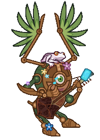
                    
                    
                        **Skin**
                        Modron Ellywick
                    
                
                
                    
                        ID: 515**Modron Vin Ursa (Vin Ursa)**
                    
                    
                        **Skin**
                        Modron Vin Ursa
                    
                
                
                    
                        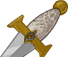ID: 2500**Blade of the Ages (Xerophon)**A reminder of a time and place I've left behind. I doubt Ythyrn's dead will mind.  All Champions damage +230%.<code>global_dps_multiplier_mult,230</code>
                    
                    
                        **Golden Epic**
                        Blade of the Ages
                        Xerophon (Slot 1)
                    
                
                
                    
                        ID: 3729**Cavalier's Breastplate (Eric)**Not even Tiamat can melt this metal!  Increases the health of Eric by 100%.<code>health_mult,100</code>
                    
                    
                        **Golden Epic**
                        Cavalier's Breastplate
                        Eric (Slot 2)
                    
                
            
        
        
            
                **Start Date**
            
            
                **End Date**
            
            
                **Exclusive Date**
            
        
        
            
                22 January 2025
            
            
                02 May 2025
            
            
                30 July 2025
            
        
    

 

{::nomarkdown}

{:/nomarkdown}

{::nomarkdown}
<input onClick="setHash('featsTab')" type="radio" class="tabsRadio" name="rosterTabs" id="featsTab"><label for="featsTab" class="tabsLabel">Recent Feats</label>

{:/nomarkdown}

# Recent Feats

A list of feats that have left their exclusivity period within the last three months and are now available for gems.

For a list of feats still in exclusivity - see the Exclusivities tab.

 *Note: The most recently available are at the top.*

    
        
            **Champion**
        
        
            **Feat**
        
        
            **Effect**
        
        
            **Source**
        
        
            **Date**
        
    
    
        
            Wyll
        
        
            ID: 2141**Duke's Pride (Wyll)**He is our shield, as I am his blade. Together, we protect the people of Baldur's Gate.  Increases the effect of Wyll's Folk Hero ability by 80%. (Prestack)<code>buff_upgrade,80,13429</code>Duke's Pride
        
        
            Increases the effect of Wyll's Folk Hero ability by 80%. (Prestack)
        
        
            50,000 Gems
        
        
            28 Aug 2025
        
    
    
        
            Yorven
        
        
            ID: 2019**Motley Crew (Yorven)**With friends like these, I'll never be lost again.  Increases the effect of Yorven's Rag Tag Team ability by 80%. (Prestack)<code>buff_upgrade,80,17063</code>Motley Crew
        
        
            Increases the effect of Yorven's Rag Tag Team ability by 80%. (Prestack)
        
        
            50,000 Gems
        
        
            14 Aug 2025
        
    
    
        
            Melf
        
        
            ID: 2138**Prodigal Leader (Melf)**Rally to me, friends. We will survive this, and glory shall be ours.  All Champions damage +50%.<code>global_dps_multiplier_mult,50</code>Prodigal Leader
        
        
            All Champions damage +50%.
        
        
            50,000 Gems
        
        
            14 Aug 2025
        
    
    
        
            Evelyn
        
        
            ID: 1472**Under Pressure (Evelyn)**Uh oh -- more enemies! Everyone get behind me!  Increases the effect of Evelyn's Steadfast Might ability by 80%.<code>buff_upgrade,80,12207</code>Under Pressure
        
        
            Increases the effect of Evelyn's Steadfast Might ability by 80%.
        
        
            50,000 Gems
        
        
            14 Aug 2025
        
    
    
        
            Vlithryn
        
        
            ID: 2167**Making Waves (Vlithryn)**A tidal wave? It's a bit much.  Increases the effect of Vlithryn's Pantheon of Blessings ability by 80%. (Prestack)<code>buff_upgrade,80,16897,0</code>Making Waves
        
        
            Increases the effect of Vlithryn's Pantheon of Blessings ability by 80%. (Prestack)
        
        
            50,000 Gems
        
        
            07 Aug 2025
        
    
    
        
            Nixie
        
        
            ID: 2139**Burning Beauty (Nixie)**Can't spell charm without harm!  Increases the effect of Nixie's Infernal Impact, Flawed Force and Anarchy Amplified by 80%.<code>buff_upgrades,80,10890,10891,10892</code>Burning Beauty
        
        
            Increases the effect of Nixie's Infernal Impact, Flawed Force and Anarchy Amplified by 80%.
        
        
            50,000 Gems
        
        
            07 Aug 2025
        
    
    
        
            Jaheira
        
        
            ID: 2136**Sylvan Calling (Jaheira)**I'm getting in touch with my roots.  Increase the effect of Jaheira's Class Act ability by 80%.<code>buff_upgrades,80,9714,9715,9716,9717</code>Sylvan Calling
        
        
            Increase the effect of Jaheira's Class Act ability by 80%.
        
        
            50,000 Gems
        
        
            07 Aug 2025
        
    
    
        
            Evandra
        
        
            ID: 2137**Regimented Fury (Evandra)**Classy, sassy, and about to kick your --  Increases the effect of Evandra's Powerful Allies, Fighting Force and Carnival Crew by 80%.<code>buff_upgrades,80,11299,11300,11301</code>Regimented Fury
        
        
            Increases the effect of Evandra's Powerful Allies, Fighting Force and Carnival Crew by 80%.
        
        
            50,000 Gems
        
        
            07 Aug 2025
        
    
    
        
            Minthara
        
        
            ID: 1967**Unrelenting Strife (Minthara)**If somebody causes me sorrow, I remove their ability to do so again.  Increases the maximum number of Soul Branding stacks by 2.<code>minthara_increase_max_stacks,2</code>Unrelenting Strife
        
        
            Increases the maximum number of Soul Branding stacks by 2.
        
        
            50,000 Gems
        
        
            30 Jul 2025
        
    
    
        
            Halsin
        
        
            ID: 2135**Verdant Vow (Halsin)**I give my all to serve the Oak Father. No sacrifice is too great.  Increases the pre-stack effect of Halsin's Archdruid of Emerald Grove ability by 80%. (Prestack)<code>buff_upgrade,80,15962,0</code>Verdant Vow
        
        
            Increases the pre-stack effect of Halsin's Archdruid of Emerald Grove ability by 80%. (Prestack)
        
        
            50,000 Gems
        
        
            30 Jul 2025
        
    
    
        
            Reya
        
        
            ID: 2133**Zariel's Chosen (Reya)**I am her mercy. I am her wrath. I am all that she was, is, and will be.  Increases the pre-stack bonus of Echoes of Zariel by 80%.<code>buff_upgrade,80,5457,0</code>Zariel's Chosen
        
        
            Increases the pre-stack bonus of Echoes of Zariel by 80%.
        
        
            50,000 Gems
        
        
            23 Jul 2025
        
    
    
        
            Briv
        
        
            ID: 2131**Thunder Step (Briv)**Mine mighty footfalls shalt resoundeth throughout all the land!  When Steelbones stacks convert to Sprint stacks upon reset, you gain 20% more Sprint stacks, rounded down.<code>steelbones_sprint_conversion_inc,20</code>Thunder Step
        
        
            When Steelbones stacks convert to Sprint stacks upon reset, you gain 20% more Sprint stacks, rounded down.
        
        
            50,000 Gems
        
        
            16 Jul 2025
        
    
    
        
            Strix
        
        
            ID: 2132**Giant Stench (Strix)**Do you smell burning trash? Yeah? Okay, good.  Increases the effect of Strix's Aura of Unclean ability by 80%.<code>buff_upgrade,80,12285</code>Giant Stench
        
        
            Increases the effect of Strix's Aura of Unclean ability by 80%.
        
        
            50,000 Gems
        
        
            16 Jul 2025
        
    
    
        
            Catti-brie
        
        
            ID: 1355**Archer's Perception (Catti-brie)**I'll know them when I see them. Attack on my signal.  Increases the effect of Catti-brie's Mark for Death ability by 80%.<code>buff_upgrade,80,11308</code>Archer's Perception
        
        
            Increases the effect of Catti-brie's Mark for Death ability by 80%.
        
        
            50,000 Gems
        
        
            09 Jul 2025
        
    
    
        
            Dark Urge
        
        
            ID: 2129**Blazing Blood (Dark Urge)**The hells themselves will quake at your passing, milord!  Increases the effect of Dark Urge's Ceremorphosis ability by 80%. (Prestack)<code>buff_upgrade,80,14380</code>Blazing Blood
        
        
            Increases the effect of Dark Urge's Ceremorphosis ability by 80%. (Prestack)
        
        
            50,000 Gems
        
        
            09 Jul 2025
        
    
    
        
            Grimm
        
        
            ID: 2154**Gloves Off (Grimm)**Let's settle this, one on one. No potions, blades only, neutral ground. ~Grimm  Increases the damage of Grimm's ultimate attack by 100% and prevents roaming familiars from automatically activating Grimm's ultimate attack.<code>buff_ultimate,100 disallow_roaming_familiar_ult_trigger</code>Gloves Off
        
        
            Increases the damage of Grimm's ultimate attack by 100% and prevents roaming familiars from automatically activating Grimm's ultimate attack.
        
        
            50,000 Gems
        
        
            02 Jul 2025
        
    
    
        
            Beadle
        
        
            ID: 2128**Show Off (Beadle)**Sneak attacks are a bit easier when you can teleport! ~Beadle  Increases the damage of Beadle's ultimate attack by 100% and prevents roaming familiars from automatically activating Beadle's ultimate attack.<code>buff_ultimate,100 disallow_roaming_familiar_ult_trigger</code>Show Off
        
        
            Increases the damage of Beadle's ultimate attack by 100% and prevents roaming familiars from automatically activating Beadle's ultimate attack.
        
        
            50,000 Gems
        
        
            02 Jul 2025
        
    
    
        
            Makos
        
        
            ID: 2108**Immolation (Makos)**I call upon the Flames of Phlegethos!  Makos's attacks deal an additional 1 second of BUD damage every second for 5 seconds.<code>immolation,1,5</code>Immolation
        
        
            Makos's attacks deal an additional 1 second of BUD damage every second for 5 seconds.
        
        
            50,000 Gems
        
        
            26 Jun 2025
        
    
    
        
            Blooshi
        
        
            ID: 2107**Nine Lives (Blooshi)**It's actually way more, I think. I just stopped counting.  Increases the effect of Blooshi's A Life Well Lived ability by 80%.<code>buff_upgrade,80,7520</code>Nine Lives
        
        
            Increases the effect of Blooshi's A Life Well Lived ability by 80%.
        
        
            50,000 Gems
        
        
            26 Jun 2025
        
    
    
        
            Sisaspia
        
        
            ID: 2092**Evolved Contagion (Sisaspia)**Thisss isn't even itsss final form.  Increases the effect of Sisaspia's Symbiotic Infection ability by 80%.<code>buff_upgrade,80,13251</code>Evolved Contagion
        
        
            Increases the effect of Sisaspia's Symbiotic Infection ability by 80%.
        
        
            50,000 Gems
        
        
            19 Jun 2025
        
    
    
        
            Nrakk
        
        
            ID: 2093**Enlightened (Nrakk)**Mind, heart, body, and soul in perfect balance, as all things should be.  Increases the effect of Nrakk's Githzerai Focus and Githzerai Agility by 80%.<code>buff_upgrades,80,13005,13006</code>Enlightened
        
        
            Increases the effect of Nrakk's Githzerai Focus and Githzerai Agility by 80%.
        
        
            50,000 Gems
        
        
            19 Jun 2025
        
    
    
        
            Sheila
        
        
            ID: 2113**Heart of Gold (Sheila)**Well, I lost us a chance to get home, but gained a friend!  Increases the effect of Sheila's Kind Heart ability by 80%.<code>buff_upgrade,80,16538</code>Heart of Gold
        
        
            Increases the effect of Sheila's Kind Heart ability by 80%.
        
        
            50,000 Gems
        
        
            12 Jun 2025
        
    
    
        
            Orkira
        
        
            ID: 2091**Immolation (Orkira)**Friends are like marshmallows, flammable and sweet.  Orkira's attacks deal an additional 1 second of BUD damage every second for 5 seconds.<code>immolation,1,5</code>Immolation
        
        
            Orkira's attacks deal an additional 1 second of BUD damage every second for 5 seconds.
        
        
            50,000 Gems
        
        
            12 Jun 2025
        
    
    
        
            Volo
        
        
            ID: 2159**Illithid Tadpole (Volo)**I've simply the worst headache today. Bah! I'm certain it's nothing serious.  All Champions damage +25%. Additively increases Ceremorphosis Stacks by 1.<code>global_dps_multiplier_mult,25 add_global_ceremorphosis_stacks,1</code>Illithid Tadpole
        
        
            All Champions damage +25%. Additively increases Ceremorphosis Stacks by 1.
        
        
            50,000 Gems
        
        
            12 Jun 2025
        
    
    
        
            Volo
        
        
            ID: 2098**Volo's Expanded Expertise (Volo)**I've had an epiphany! If I raise my voice, more willing ears might hear me!  Increases the number of columns buffed by Volo's Guide to Combat by +1.<code>change_upgrade_data,16550,0</code>Volo's Expanded Expertise
        
        
            Increases the number of columns buffed by Volo's Guide to Combat by +1.
        
        
            50,000 Gems
        
        
            05 Jun 2025
        
    
    
        
            Gale
        
        
            ID: 2090**Dark Academia (Gale)**If Mystra will not hear my pleas, I shall seek succor elsewhere.  Increases the effect of Gale's An Experienced Sage ability by 80%.<code>buff_upgrade,80,14573</code>Dark Academia
        
        
            Increases the effect of Gale's An Experienced Sage ability by 80%.
        
        
            50,000 Gems
        
        
            05 Jun 2025
        
    

 

{::nomarkdown}

{:/nomarkdown}

{::nomarkdown}

{:/nomarkdown}

 

[Back to Top](#top)

*Last Modified: {{ site.time }}*

